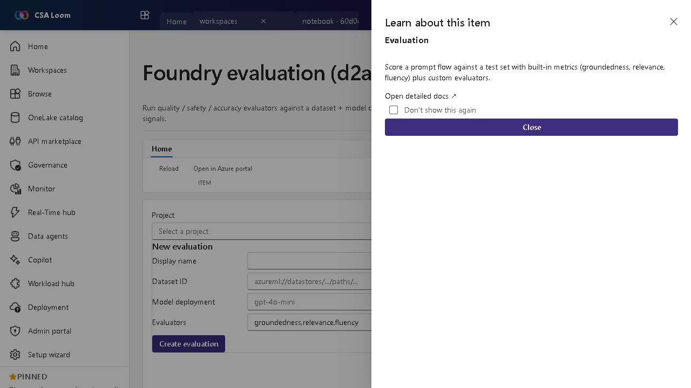

<!-- auto-generated by tools/uat-report.mjs — edits below this line are preserved on re-gen -->
# Tutorial: Foundry evaluation editor

> CSA Loom `evaluation` editor — verified working against a live console by the UAT harness on 2026-07-01.

## Open the editor

1. Sign in to your **CSA Loom Console** (for example `https://<your-console-host>`).
2. Open or create a workspace from the **Workspaces** page.
3. Click **+ New item** and choose **Foundry evaluation** from the catalog.
4. The editor opens at `/items/evaluation/<id>`:

## What this editor does

A Foundry evaluation runs quality/safety/accuracy evaluators against a dataset plus a model deployment, surfacing metric tables and pass/fail signals. In Loom it is wired to the Foundry BFF route.

## Getting started

1. **Pick a dataset** — Select the test dataset to evaluate against.
2. **Choose evaluators** — Add built-in evaluators (groundedness, relevance, fluency) plus any custom ones.
3. **Run the evaluation** — Run against the model deployment to produce metric tables.
4. **Read pass/fail** — Review pass/fail signals to decide whether to promote the deployment.

## Learn more

- Microsoft Learn reference: [https://learn.microsoft.com/azure/ai-studio/how-to/evaluate-generative-ai-app](https://learn.microsoft.com/azure/ai-studio/how-to/evaluate-generative-ai-app)

## Verified by the UAT harness

- Tested at: `2026-05-26T13:54:31.006Z`
- Verdict: **A** (renders cleanly, real backend responded)
- Test source: [`apps/fiab-console/e2e/editors.uat.ts`](https://github.com/fgarofalo56/csa-inabox/blob/main/apps/fiab-console/e2e/editors.uat.ts)

<!-- end auto-generated -->