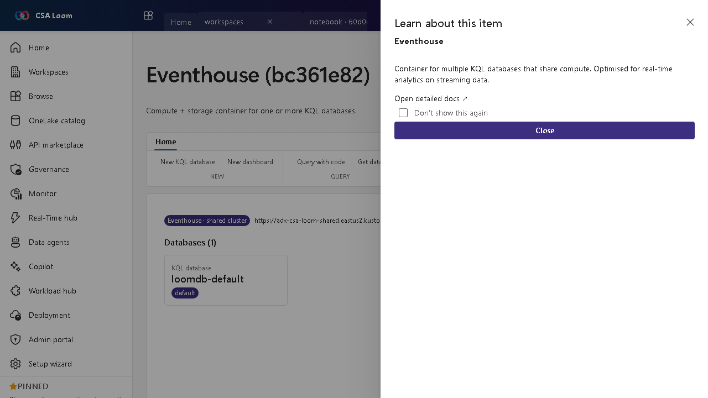

<!-- auto-generated by tools/uat-report.mjs — edits below this line are preserved on re-gen -->
# Tutorial: Eventhouse editor

> CSA Loom `eventhouse` editor — verified working against a live console by the UAT harness on 2026-07-01.

## Open the editor

1. Sign in to your **CSA Loom Console** (for example `https://<your-console-host>`).
2. Open or create a workspace from the **Workspaces** page.
3. Click **+ New item** and choose **Eventhouse** from the catalog.
4. The editor opens at `/items/eventhouse/<id>`:

## What this editor does

An Eventhouse is a compute-plus-storage container for one or more KQL databases that share compute. In Loom it is wired against the shared Loom ADX cluster. Use it as the home for real-time analytics on streaming telemetry.

## Getting started

1. **Create KQL databases** — Add one or more KQL databases under the eventhouse; they share the eventhouse compute.
2. **Ingest streaming data** — Feed data in from an Eventstream, Event Hubs, or direct REST ingestion.
3. **Query with KQL** — Open a KQL queryset to run interactive Kusto queries across the databases.
4. **Make data available as Delta** — Configure ADX continuous export (or an external table) to land the KQL data as Delta in ADLS Gen2, so it's queryable alongside lakehouses — no Fabric or OneLake needed.

## Learn more

- Microsoft Learn reference: [https://learn.microsoft.com/fabric/real-time-intelligence/eventhouse](https://learn.microsoft.com/fabric/real-time-intelligence/eventhouse)

## Verified by the UAT harness

- Tested at: `2026-05-26T13:51:20.484Z`
- Verdict: **A** (renders cleanly, real backend responded)
- Test source: [`apps/fiab-console/e2e/editors.uat.ts`](https://github.com/fgarofalo56/csa-inabox/blob/main/apps/fiab-console/e2e/editors.uat.ts)

<!-- end auto-generated -->