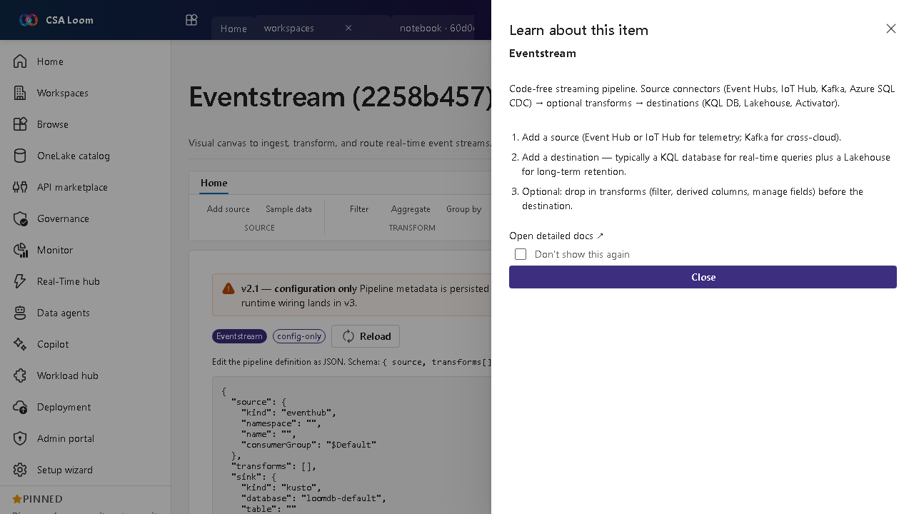

<!-- auto-generated by tools/uat-report.mjs — edits below this line are preserved on re-gen -->
# Tutorial: Eventstream editor

> CSA Loom `eventstream` editor — verified working against a live console by the UAT harness on 2026-07-01.

## Open the editor

1. Sign in to your **CSA Loom Console** (for example `https://<your-console-host>`).
2. Open or create a workspace from the **Workspaces** page.
3. Click **+ New item** and choose **Eventstream** from the catalog.
4. The editor opens at `/items/eventstream/<id>`:

## What this editor does

An Eventstream is a code-free visual canvas to ingest, transform, and route real-time event streams. In Loom you wire source connectors (Event Hubs, IoT Hub, Kafka, Azure SQL CDC) through operators to destinations, then **Provision to Azure** to stand up a real Event Hub (transport) + Stream Analytics job (transforms) — Azure-native, no Fabric required. The editor has four tabs: **Visual designer** (the canvas), **Operators** (the guided operator builder), **SQL operator**, and a read-only **Definition** view.

## Getting started

1. **Add a source** — Use Event Hub or IoT Hub for telemetry, or Kafka for cross-cloud streams, on the visual canvas.
2. **Add operators** — Drop in operators between source and destination — **Filter, Manage fields, Aggregate, Group by, Expand, Union, and Join** — on the canvas or the guided Operators builder. **Validate** runs the real Stream Analytics compiler and **Apply to ASA** pushes the compiled query to the live streaming job.
3. **Add destinations** — Route to a KQL database for real-time queries, a Lakehouse for long-term retention, an Activator to fire actions on conditions, a derived stream, or a **Spark notebook sink** (structured streaming over the stream's Event Hub / ADLS landing).
4. **Pause and resume** — Pause a derived stream to exclude it from the running topology and Resume it later; the paused state persists and is honored when you Provision to Azure.
5. **Review the Definition** — The read-only **Definition** tab shows the canonical topology JSON. The canvas and Operators builder are the source of truth — the JSON view is for inspection, not editing.

## Learn more

- Microsoft Learn reference: [https://learn.microsoft.com/fabric/real-time-intelligence/event-streams/overview](https://learn.microsoft.com/fabric/real-time-intelligence/event-streams/overview)

## Verified by the UAT harness

- Tested at: `2026-05-26T13:51:36.477Z`
- Verdict: **A** (renders cleanly, real backend responded)
- Test source: [`apps/fiab-console/e2e/editors.uat.ts`](https://github.com/fgarofalo56/csa-inabox/blob/main/apps/fiab-console/e2e/editors.uat.ts)

<!-- end auto-generated -->