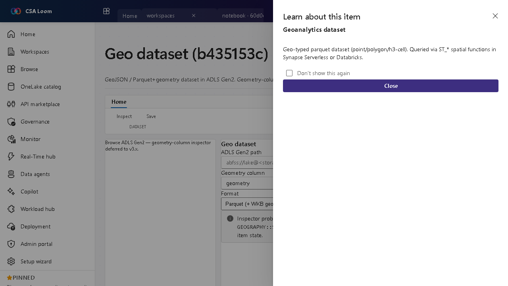

<!-- auto-generated by tools/uat-report.mjs — edits below this line are preserved on re-gen -->
# Tutorial: Geo dataset editor

> CSA Loom `geo-dataset` editor — verified working against a live console by the UAT harness on 2026-07-01.

## Open the editor

1. Sign in to your **CSA Loom Console** (for example `https://<your-console-host>`).
2. Open or create a workspace from the **Workspaces** page.
3. Click **+ New item** and choose **Geo dataset** from the catalog.
4. The editor opens at `/items/geo-dataset/<id>`:

## What this editor does

A Geo dataset is a GeoJSON or Parquet+geometry dataset in ADLS Gen2. In Loom the geometry-column inspector runs a sample T-SQL OPENROWSET against Synapse Serverless via the existing query route so you can preview the data.

## Getting started

1. **Point at an ADLS path** — Set the ADLS Gen2 path to your GeoJSON or Parquet+geometry data.
2. **Inspect geometry** — The inspector runs a sample OPENROWSET to Synapse Serverless to surface the geometry column.
3. **Preview rows** — Review a sample to confirm the geometry type (point/polygon/H3 cell).
4. **Use downstream** — Reference the dataset from geo maps, queries, and pipelines.

## Learn more

- Microsoft Learn reference: [https://learn.microsoft.com/azure/synapse-analytics/sql/query-parquet-files](https://learn.microsoft.com/azure/synapse-analytics/sql/query-parquet-files)

## Verified by the UAT harness

- Tested at: `2026-05-26T13:56:27.256Z`
- Verdict: **A** (renders cleanly, real backend responded)
- Test source: [`apps/fiab-console/e2e/editors.uat.ts`](https://github.com/fgarofalo56/csa-inabox/blob/main/apps/fiab-console/e2e/editors.uat.ts)

<!-- end auto-generated -->