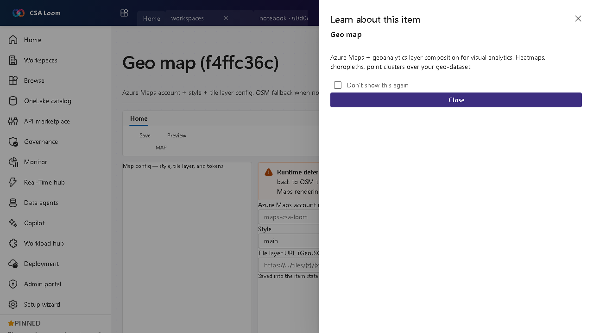

<!-- auto-generated by tools/uat-report.mjs — edits below this line are preserved on re-gen -->
# Tutorial: Geo map editor

> CSA Loom `geo-map` editor — verified working against a live console by the UAT harness on 2026-07-01.

## Open the editor

1. Sign in to your **CSA Loom Console** (for example `https://<your-console-host>`).
2. Open or create a workspace from the **Workspaces** page.
3. Click **+ New item** and choose **Geo map** from the catalog.
4. The editor opens at `/items/geo-map/<id>`:

## What this editor does

A Geo map composes an Azure Maps account, style, and tile layer. In Loom it lists Azure Maps accounts via ARM when available and falls back to OSM tiles with a MessageBar when no Maps account is deployed. Map config is saved to item state.

## Getting started

1. **Pick a Maps account** — Loom lists Azure Maps accounts via ARM; if none exist it falls back to OSM tiles and says so.
2. **Choose a style** — Select the base map style and tile layer.
3. **Save the config** — Save persists the map configuration to item state.
4. **Layer your data** — Compose the map over a geo-dataset for heatmaps and choropleths.

## Learn more

- Microsoft Learn reference: [https://learn.microsoft.com/azure/azure-maps/about-azure-maps](https://learn.microsoft.com/azure/azure-maps/about-azure-maps)

## Verified by the UAT harness

- Tested at: `2026-05-26T13:56:23.207Z`
- Verdict: **A** (renders cleanly, real backend responded)
- Test source: [`apps/fiab-console/e2e/editors.uat.ts`](https://github.com/fgarofalo56/csa-inabox/blob/main/apps/fiab-console/e2e/editors.uat.ts)

<!-- end auto-generated -->