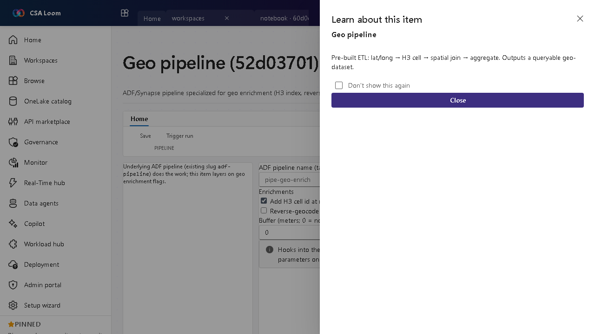

<!-- auto-generated by tools/uat-report.mjs — edits below this line are preserved on re-gen -->
# Tutorial: Geo pipeline editor

> CSA Loom `geo-pipeline` editor — verified working against a live console by the UAT harness on 2026-07-01.

## Open the editor

1. Sign in to your **CSA Loom Console** (for example `https://<your-console-host>`).
2. Open or create a workspace from the **Workspaces** page.
3. Click **+ New item** and choose **Geo pipeline** from the catalog.
4. The editor opens at `/items/geo-pipeline/<id>`:

## What this editor does

A Geo pipeline is a Data-pipeline TEMPLATE for geo enrichment. On instantiate it builds a REAL Azure Data Factory pipeline whose activities are already wired — H3 indexing, reverse geocode against Azure Maps, and buffer generation — with parameters (enrichH3, reverseGeocode, bufferMeters) you can tune; it runs as-is on the Azure-native ADF runtime, no empty seeded pipeline. Newly created geo pipelines instantiate the geo-enrich template into a Data pipeline (runtime ADF) and run via the unified run path; already-created geo items keep their existing route and run unchanged.

## Getting started

1. **Tune the enrichment parameters** — Set the template parameters: enrichH3 (add an H3 spatial index), reverseGeocode (resolve coordinates to addresses via Azure Maps), and bufferMeters (generate a buffer polygon).
2. **Instantiate the template** — Creating a Geo pipeline materializes the geo-enrich template into a real Data pipeline (ADF runtime) with the H3, reverse-geocode, and buffer activities already wired — no empty seeded pipeline.
3. **Run it** — Trigger run fires a real ADF createRun on the instantiated pipeline via the unified run path and returns a live run id; the wired enrichment activities execute against ADF + Azure Maps.
4. **Output a geo-dataset** — The pipeline writes an enriched, queryable geo-dataset.

## Learn more

- Microsoft Learn reference: [https://learn.microsoft.com/azure/data-factory/concepts-pipelines-activities](https://learn.microsoft.com/azure/data-factory/concepts-pipelines-activities)

## Verified by the UAT harness

- Tested at: `2026-05-26T13:56:35.269Z`
- Verdict: **A** (renders cleanly, real backend responded)
- Test source: [`apps/fiab-console/e2e/editors.uat.ts`](https://github.com/fgarofalo56/csa-inabox/blob/main/apps/fiab-console/e2e/editors.uat.ts)

<!-- end auto-generated -->