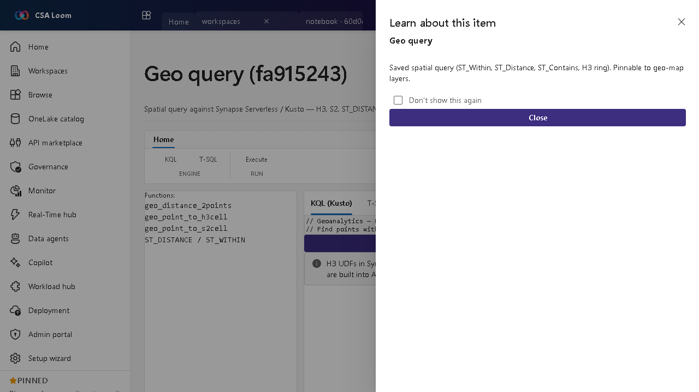

<!-- auto-generated by tools/uat-report.mjs — edits below this line are preserved on re-gen -->
# Tutorial: Geo query editor

> CSA Loom `geo-query` editor — verified working against a live console by the UAT harness on 2026-07-01.

## Open the editor

1. Sign in to your **CSA Loom Console** (for example `https://<your-console-host>`).
2. Open or create a workspace from the **Workspaces** page.
3. Click **+ New item** and choose **Geo query** from the catalog.
4. The editor opens at `/items/geo-query/<id>`:

## What this editor does

A Geo query is a spatial query against Synapse Serverless or Kusto — H3, S2, ST_DISTANCE, ST_WITHIN. In Loom a KQL-or-TSQL toggle pre-populates H3 and ST examples and submits to Kusto or Synapse Serverless.

## Getting started

1. **Toggle KQL or T-SQL** — Pick the backend; the editor pre-populates H3 and ST examples for that dialect.
2. **Write the spatial query** — Use ST_DISTANCE, ST_WITHIN, or H3/S2 functions over your geo-dataset.
3. **Submit** — Run against Kusto or Synapse Serverless via the existing query route.
4. **Pin results** — Pin a saved query to a geo-map layer for visualization.

## Learn more

- Microsoft Learn reference: [https://learn.microsoft.com/azure/synapse-analytics/sql/query-parquet-files](https://learn.microsoft.com/azure/synapse-analytics/sql/query-parquet-files)

## Verified by the UAT harness

- Tested at: `2026-05-26T13:56:31.224Z`
- Verdict: **A** (renders cleanly, real backend responded)
- Test source: [`apps/fiab-console/e2e/editors.uat.ts`](https://github.com/fgarofalo56/csa-inabox/blob/main/apps/fiab-console/e2e/editors.uat.ts)

<!-- end auto-generated -->