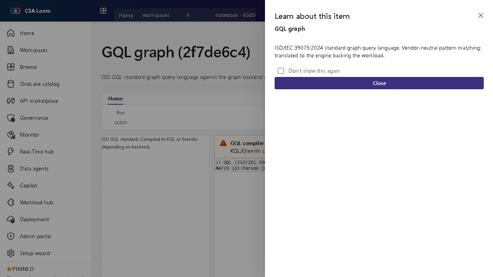

<!-- auto-generated by tools/uat-report.mjs — edits below this line are preserved on re-gen -->
# Tutorial: GQL graph editor

> CSA Loom `gql-graph` editor — verified working against a live console by the UAT harness on 2026-07-01.

## Open the editor

1. Sign in to your **CSA Loom Console** (for example `https://<your-console-host>`).
2. Open or create a workspace from the **Workspaces** page.
3. Click **+ New item** and choose **GQL graph** from the catalog.
4. The editor opens at `/items/gql-graph/<id>`:

## What this editor does

A GQL graph uses the ISO/IEC 39075:2024 standard graph query language — vendor-neutral pattern matching. In Loom it is dispatched to the graph backend of record (ADX graph operators via the KQL query route).

## Getting started

1. **Write GQL patterns** — Author standard GQL MATCH patterns against your graph.
2. **Dispatch to backend** — Loom routes the query to the graph backend of record (ADX graph via the KQL route).
3. **Inspect results** — Results render in the force-directed graph view.
4. **Know the standard** — GQL is the ISO standard; use it when you want engine-neutral graph queries.

## Learn more

- Microsoft Learn reference: [https://learn.microsoft.com/azure/data-explorer/kusto/query/graph-operators](https://learn.microsoft.com/azure/data-explorer/kusto/query/graph-operators)

## Verified by the UAT harness

- Tested at: `2026-05-26T13:56:47.665Z`
- Verdict: **A** (renders cleanly, real backend responded)
- Test source: [`apps/fiab-console/e2e/editors.uat.ts`](https://github.com/fgarofalo56/csa-inabox/blob/main/apps/fiab-console/e2e/editors.uat.ts)

<!-- end auto-generated -->