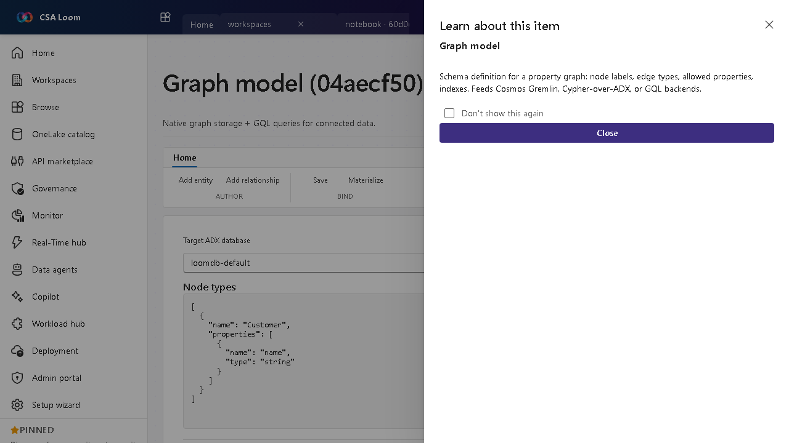

<!-- auto-generated by tools/uat-report.mjs — edits below this line are preserved on re-gen -->
# Tutorial: Graph model editor

> CSA Loom `graph-model` editor — verified working against a live console by the UAT harness on 2026-07-01.

## Open the editor

1. Sign in to your **CSA Loom Console** (for example `https://<your-console-host>`).
2. Open or create a workspace from the **Workspaces** page.
3. Click **+ New item** and choose **Graph model** from the catalog.
4. The editor opens at `/items/graph-model/<id>`:

## What this editor does

A Graph model is the schema definition for a property graph — node labels, edge types, allowed properties, indexes (preview). In Loom you author it on an interactive schema canvas and query it with GQL/openCypher translated to the ADX graph engine (`make-graph` / `graph-match`) — Cosmos Gremlin and GQL backends are also supported. No Microsoft Fabric required.

## Getting started

1. **Model on the schema canvas** — Add entities (node labels) on the interactive canvas — drag to arrange, double-click an entity to edit its properties in the side panel, and drag between two entities to add a relationship (edge type) pre-filled with from/to.
2. **Declare properties and indexes** — Give each node label and edge type typed properties, and specify indexes on key properties to speed up traversals.
3. **Bind a backend** — Map the model onto the ADX graph (GQL/openCypher over `make-graph`), Cosmos Gremlin, or a GQL backend.
4. **Query with the builder** — Use the no-code query builder — pick a start entity, relationship, target, property filters, and returns — or write GQL/openCypher directly; both run the same translate-to-KQL path and render results as **Table**, **Card**, or **Diagram**.

## Learn more

- Microsoft Learn reference: [https://learn.microsoft.com/fabric/fundamentals/fabric-iq](https://learn.microsoft.com/fabric/fundamentals/fabric-iq)

## Verified by the UAT harness

- Tested at: `2026-05-26T13:52:38.392Z`
- Verdict: **A** (renders cleanly, real backend responded)
- Test source: [`apps/fiab-console/e2e/editors.uat.ts`](https://github.com/fgarofalo56/csa-inabox/blob/main/apps/fiab-console/e2e/editors.uat.ts)

<!-- end auto-generated -->