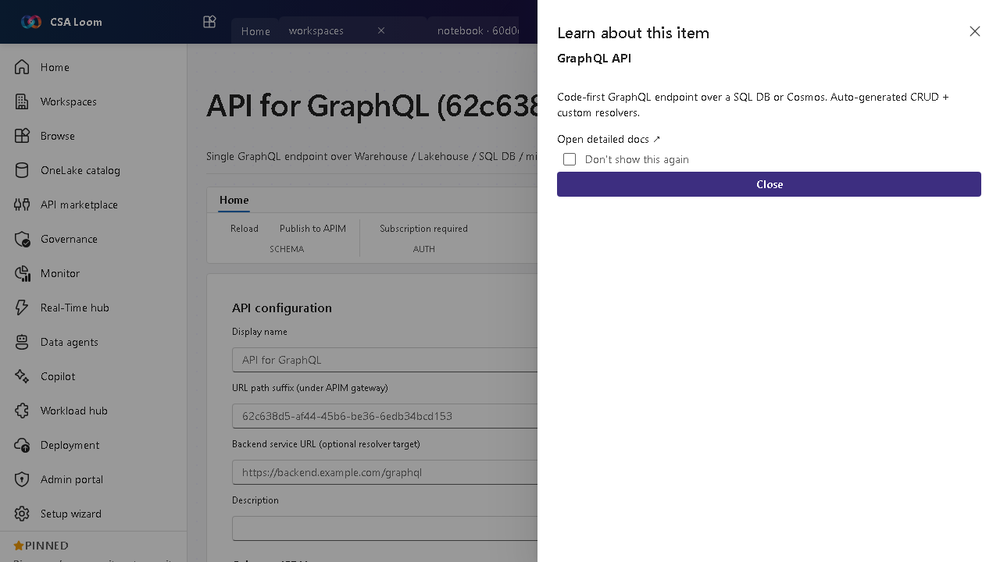

<!-- auto-generated by tools/uat-report.mjs — edits below this line are preserved on re-gen -->
# Tutorial: API for GraphQL editor

> CSA Loom `graphql-api` editor — verified working against a live console by the UAT harness on 2026-07-01.

## Open the editor

1. Sign in to your **CSA Loom Console** (for example `https://<your-console-host>`).
2. Open or create a workspace from the **Workspaces** page.
3. Click **+ New item** and choose **API for GraphQL** from the catalog.
4. The editor opens at `/items/graphql-api/<id>`:

## What this editor does

An API for GraphQL exposes a single GraphQL endpoint over Warehouse, Lakehouse, SQL DB, or mirrored databases. In Loom it auto-generates CRUD plus custom resolvers. Use it to give app developers one typed endpoint over your data.

## Getting started

1. **Pick a data source** — Point the API at a Warehouse, Lakehouse SQL endpoint, SQL DB, or mirrored database.
2. **Expose types** — Select tables/views to expose; CRUD operations are auto-generated as a schema.
3. **Test in the explorer** — Run queries and mutations against the endpoint to validate the schema.
4. **Secure access** — Front the endpoint through APIM for auth, rate limiting, and observability.

## Learn more

- Microsoft Learn reference: [https://learn.microsoft.com/fabric/data-engineering/api-graphql-overview](https://learn.microsoft.com/fabric/data-engineering/api-graphql-overview)

## Verified by the UAT harness

- Tested at: `2026-05-26T13:52:22.621Z`
- Verdict: **A** (renders cleanly, real backend responded)
- Test source: [`apps/fiab-console/e2e/editors.uat.ts`](https://github.com/fgarofalo56/csa-inabox/blob/main/apps/fiab-console/e2e/editors.uat.ts)

<!-- end auto-generated -->