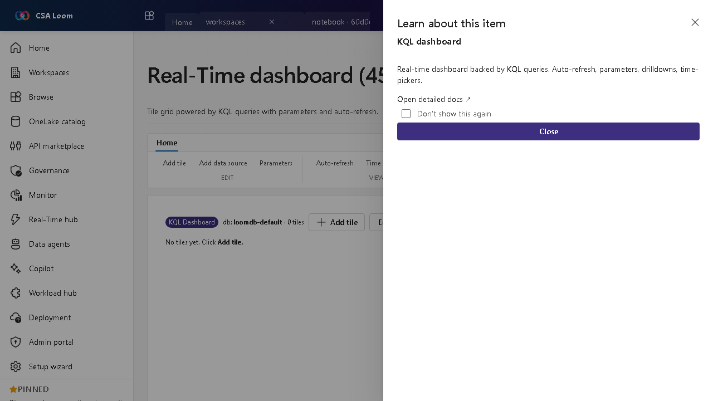

<!-- auto-generated by tools/uat-report.mjs — edits below this line are preserved on re-gen -->
# Tutorial: Real-Time dashboard editor

> CSA Loom `kql-dashboard` editor — verified working against a live console by the UAT harness on 2026-07-01.

## Open the editor

1. Sign in to your **CSA Loom Console** (for example `https://<your-console-host>`).
2. Open or create a workspace from the **Workspaces** page.
3. Click **+ New item** and choose **Real-Time dashboard** from the catalog.
4. The editor opens at `/items/kql-dashboard/<id>`:

## What this editor does

A Real-Time dashboard is a tile grid powered by KQL queries with parameters and auto-refresh. In Loom tiles render from the shared ADX cluster. Use it to monitor live telemetry with drilldowns and time-pickers.

## Getting started

1. **Add tiles** — Each tile is backed by a KQL query against a KQL database.
2. **Add parameters** — Define parameters (time range, dimension filters) that cascade across tiles.
3. **Set auto-refresh** — Configure the refresh interval so tiles stay current with the stream.
4. **Enable drilldowns** — Wire drilldowns and time-pickers so viewers can pivot without editing KQL.

## Learn more

- Microsoft Learn reference: [https://learn.microsoft.com/fabric/real-time-intelligence/dashboard-real-time-create](https://learn.microsoft.com/fabric/real-time-intelligence/dashboard-real-time-create)

## Verified by the UAT harness

- Tested at: `2026-05-26T13:51:32.556Z`
- Verdict: **A** (renders cleanly, real backend responded)
- Test source: [`apps/fiab-console/e2e/editors.uat.ts`](https://github.com/fgarofalo56/csa-inabox/blob/main/apps/fiab-console/e2e/editors.uat.ts)

<!-- end auto-generated -->