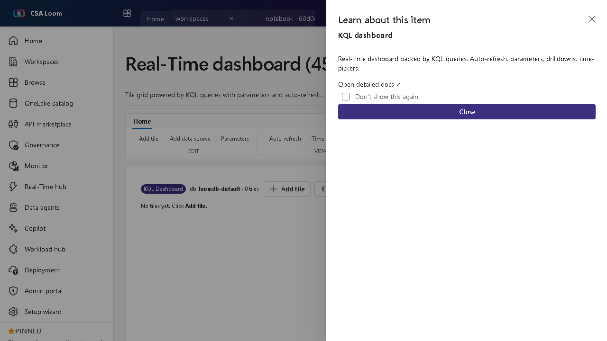

<!-- auto-generated by tools/uat-report.mjs — this block is REGENERATED from the item's catalog `learnContent`; hand-written sections BELOW the end marker are preserved -->
# Tutorial: Real-Time dashboard editor

> CSA Loom `kql-dashboard` editor — verified working against a live console by the UAT harness on 2026-07-01.

## Open the editor

1. Sign in to your **CSA Loom Console** (for example `https://<your-console-host>`).
2. Open or create a workspace from the **Workspaces** page.
3. Click **+ New item** and choose **Real-Time dashboard** from the catalog.
4. The editor opens at `/items/kql-dashboard/<id>`:

## What this editor does

A Real-Time dashboard is a tile grid powered by KQL queries. Azure-native by default: every tile executes against the deployment's Azure Data Explorer cluster — no Fabric capacity or workspace is involved. Tiles are either query visuals or markdown text; dashboard parameters cross-filter the whole grid, drill-through injects a clicked value into a parameter (optionally jumping to another page), and an auto-refresh interval keeps the grid live.

## Getting started

1. **Add tiles** — Add tile creates a query tile — bind it to a data source (a KQL database on the ADX cluster), write the KQL, and pick a visual. Add text tile creates a markdown tile that renders content and is never executed. Add tile with Copilot writes the KQL for you from a prompt.
2. **Add parameters** — Parameters opens the parameter editor: freetext, fixed, multi-select, query-backed (values loaded from KQL), data-source, and duration types. They render in the filter bar above the grid and substitute into every tile's KQL, so changing one cross-filters the whole dashboard.
3. **Organize into pages** — Add page creates a named tile-container page and the page strip switches between them. A dashboard with no authored pages stays a single canvas; the FIRST Add page materializes two pages — Page 1 holding the existing tiles plus the new Page 2 — and each later click appends one. Rename is inline, and deleting a page moves its tiles to the first remaining page rather than destroying them.
4. **Set the time range and auto-refresh** — The Time button cycles the dashboard time range and the Auto-refresh selector sets the interval (off, 5s, 30s, 1m, 5m, 30m, 1h). While auto-refresh is on, a live pill shows the last refresh time; Refresh all re-runs every tile on demand.
5. **Wire drill-through and alerts** — In a tile's settings pick a drill-through column, the parameter to set from the clicked value, and an optional target page — clicking a data point applies the value and re-runs the grid. The bell on a tile opens Set alert, which links a backing Activator item and mints a real ADX-evaluated rule (plus an Azure Monitor scheduled-query rule when LOOM_ADX_ALERT_SCOPE is provisioned).

## Learn more

- Microsoft Learn reference: [https://learn.microsoft.com/azure/data-explorer/azure-data-explorer-dashboards](https://learn.microsoft.com/azure/data-explorer/azure-data-explorer-dashboards)

## Verified by the UAT harness

- Tested at: `2026-05-26T13:51:32.556Z`
- Verdict: **A** (renders cleanly, real backend responded)
- Test source: [`apps/fiab-console/e2e/editors.uat.ts`](https://github.com/fgarofalo56/csa-inabox/blob/main/apps/fiab-console/e2e/editors.uat.ts)

<!-- end auto-generated -->

## Pages, text tiles, and drill-through

The editor's toolbar and **Home** ribbon carry the depth controls:

**Pages.** **Add page** materializes a named tile-container page; the page strip
above the grid switches between pages and shows each page's tile count. A
dashboard that has never had a second page keeps rendering as one canvas — the
strip shows a single implicit **Page 1** tab. The first **Add page** click on
such a dashboard creates TWO page records — **Page 1** (which adopts the
existing tiles) and the new **Page 2**, which becomes active; every later click
appends one page. Rename is inline (click the
rename glyph, type, press Enter). **Delete** moves that page's tiles to the
first remaining page; no tile is destroyed. Pages persist in the dashboard's
Cosmos model, and a tile whose `pageId` is missing or unknown resolves to the
first page.

**Text tiles.** **Add text tile** creates a markdown tile. You author it in the
tile flyout with a Monaco editor and a live preview; it renders a GFM subset
(HTML-escaped first, so content cannot inject markup). A text tile is never
executed — **Refresh all** and the run route both skip it, so it costs nothing
against the ADX cluster.

**Drill-through.** Per tile you configure three things: the result **column** to
drill on, the dashboard **parameter** that receives the clicked value, and an
optional **target page**. Clicking a data point in the tile injects the value
into that parameter, switches to the target page when one is set, and re-runs
every tile — so the whole grid cross-filters on the value you clicked. Leaving
the parameter empty (`(none — disable drill-through)`) turns it off.

Drill-through needs at least one dashboard parameter to exist; until you add
one, the tile settings say so instead of offering an unusable picker.

### Kill-switch

The pages / text-tile / page-targeted drill-through surface is behind the
default-ON runtime flag `u8-kql-dashboard-depth` (Admin → Runtime flags).
Turning it OFF reverts the editor to the pre-U8 single-page canvas on the next
load. **Nothing is deleted**: saved pages and text tiles survive (every tile
renders on one canvas, text tiles keep rendering their content) and
drill-through falls back to same-page cross-filtering.

## The Azure backend it rides on

- **Query:** the deployment's Azure Data Explorer cluster (`kusto-client`).
  Tiles bind to a KQL database through the **Data sources** panel; parameters,
  base queries, and the time range are substituted into the tile KQL
  server-side.
- **Model:** the dashboard (tiles, pages, parameters, base queries, refresh
  interval) persists to Cosmos via `PUT /api/items/kql-dashboard/<id>`.
- **Alerts:** `POST /api/items/kql-dashboard/<id>/activator` links a backing
  Activator item and creates a real ADX-evaluated rule; with
  `LOOM_ADX_ALERT_SCOPE` provisioned it also mints an Azure Monitor
  scheduled-query rule.

## No Fabric required

Tiles run against ADX. There is no Fabric capacity, workspace, or Real-Time
Intelligence dependency on this path. The Fabric Real-Time Dashboard docs are
the parity reference only:
<https://learn.microsoft.com/fabric/real-time-intelligence/dashboard-real-time-create>
