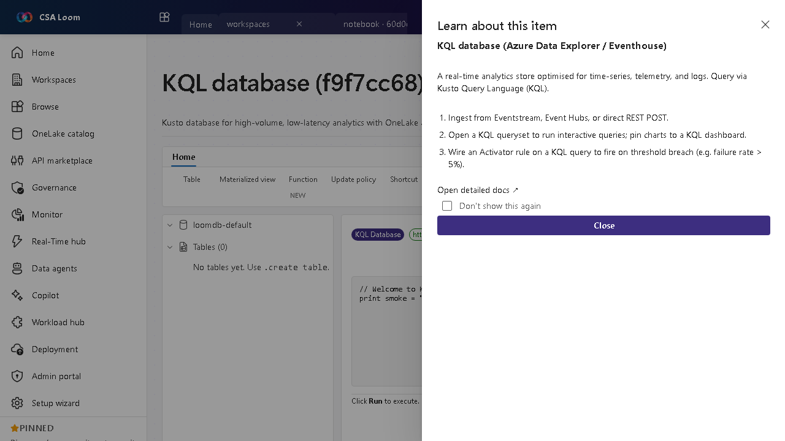

<!-- auto-generated by tools/uat-report.mjs — edits below this line are preserved on re-gen -->
# Tutorial: KQL database editor

> CSA Loom `kql-database` editor — verified working against a live console by the UAT harness on 2026-07-01.

## Open the editor

1. Sign in to your **CSA Loom Console** (for example `https://<your-console-host>`).
2. Open or create a workspace from the **Workspaces** page.
3. Click **+ New item** and choose **KQL database** from the catalog.
4. The editor opens at `/items/kql-database/<id>`:

## What this editor does

A KQL database is a Kusto store for high-volume, low-latency analytics over time-series, telemetry, and logs. In Loom it is Azure-native: it runs on the shared Loom Azure Data Explorer (ADX) cluster and is queried with KQL — no Microsoft Fabric or OneLake required.

## Getting started

1. **Ingest data** — Bring data in from an Eventstream, Event Hubs, or a direct REST POST.
2. **Query with KQL** — Open a KQL queryset to run interactive queries and pin charts to a Real-Time dashboard.
3. **Wire an Activator rule** — Attach an Activator on a KQL query to fire on a threshold breach such as failure rate over 5 percent.
4. **Make data available as Delta** — Configure ADX continuous export (or an external table) to land the same data as Delta in ADLS Gen2, so it's queryable alongside lakehouses — no OneLake needed.

## Learn more

- Microsoft Learn reference: [https://learn.microsoft.com/azure/data-explorer/data-explorer-overview](https://learn.microsoft.com/azure/data-explorer/data-explorer-overview)

## Verified by the UAT harness

- Tested at: `2026-05-26T13:51:24.555Z`
- Verdict: **A** (renders cleanly, real backend responded)
- Test source: [`apps/fiab-console/e2e/editors.uat.ts`](https://github.com/fgarofalo56/csa-inabox/blob/main/apps/fiab-console/e2e/editors.uat.ts)

<!-- end auto-generated -->