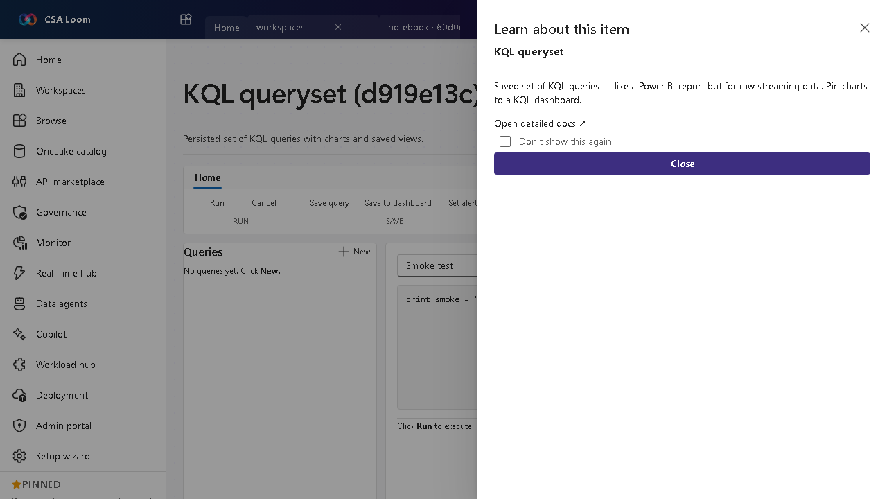

<!-- auto-generated by tools/uat-report.mjs — edits below this line are preserved on re-gen -->
# Tutorial: KQL queryset editor

> CSA Loom `kql-queryset` editor — verified working against a live console by the UAT harness on 2026-07-01.

## Open the editor

1. Sign in to your **CSA Loom Console** (for example `https://<your-console-host>`).
2. Open or create a workspace from the **Workspaces** page.
3. Click **+ New item** and choose **KQL queryset** from the catalog.
4. The editor opens at `/items/kql-queryset/<id>`:

## What this editor does

A KQL queryset is a persisted set of KQL queries with charts and saved views — like a report for raw streaming data. In Loom it runs against the shared ADX cluster and feeds Real-Time dashboards.

## Getting started

1. **Pick a KQL database** — Bind the queryset to the KQL database you want to explore.
2. **Author queries** — Write KQL, run it, and visualize results inline with charts.
3. **Save views** — Persist named queries so teammates reuse the same definitions.
4. **Pin to a dashboard** — Pin a chart to a Real-Time dashboard tile for monitoring.

## Learn more

- Microsoft Learn reference: [https://learn.microsoft.com/fabric/real-time-intelligence/kusto-query-set](https://learn.microsoft.com/fabric/real-time-intelligence/kusto-query-set)

## Verified by the UAT harness

- Tested at: `2026-05-26T13:51:28.587Z`
- Verdict: **A** (renders cleanly, real backend responded)
- Test source: [`apps/fiab-console/e2e/editors.uat.ts`](https://github.com/fgarofalo56/csa-inabox/blob/main/apps/fiab-console/e2e/editors.uat.ts)

<!-- end auto-generated -->