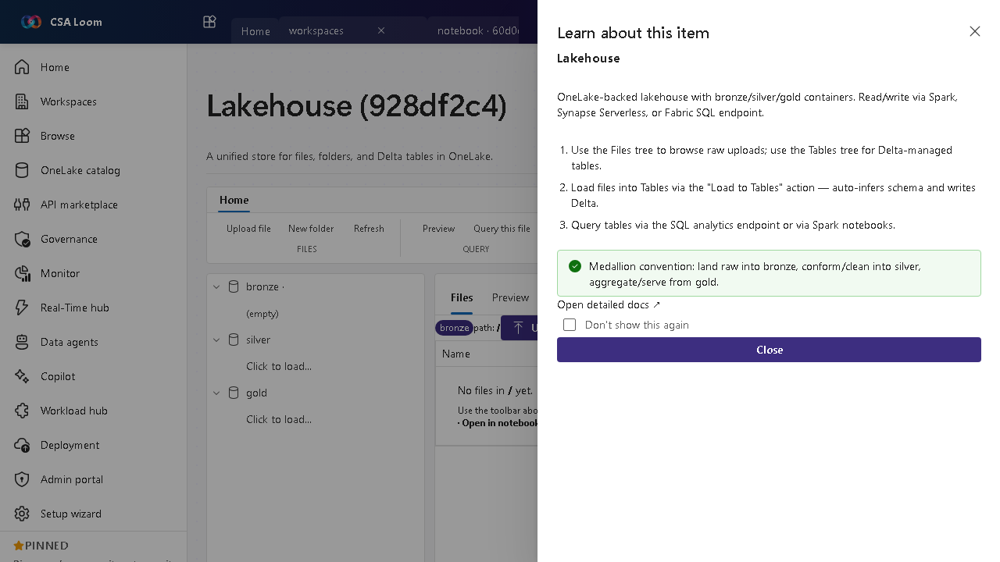

<!-- auto-generated by tools/uat-report.mjs — edits below this line are preserved on re-gen -->
# Tutorial: Lakehouse editor

> CSA Loom `lakehouse` editor — verified working against a live console by the UAT harness on 2026-07-01.

## Open the editor

1. Sign in to your **CSA Loom Console** (for example `https://<your-console-host>`).
2. Open or create a workspace from the **Workspaces** page.
3. Click **+ New item** and choose **Lakehouse** from the catalog.
4. The editor opens at `/items/lakehouse/<id>`:

## What this editor does

A Lakehouse is the unified store for files and Delta tables. In Loom it is Azure-native: storage rides on ADLS Gen2 (Delta) with a Synapse serverless SQL analytics endpoint and Spark for query — no Microsoft Fabric or OneLake required. Use it as the bronze/silver/gold landing zone for any analytics workload. (An OneLake-backed lakehouse is opt-in only, never the default.)

## Getting started

1. **Browse Files vs Tables** — The Files tree shows raw uploads on ADLS Gen2; the Tables tree shows Delta-managed tables. Drop raw data into Files, then promote it into Tables.
2. **Load files to tables** — Use the Load to Tables action to auto-infer schema and write a managed Delta table — no DDL required.
3. **Query via SQL or Spark** — Hit the SQL analytics endpoint for T-SQL, or read Delta directly from a Notebook with spark.read.format('delta').
4. **Follow the medallion convention** — Land raw into bronze, conform and clean into silver, aggregate and serve from gold so downstream items have a stable contract.

## Learn more

- Microsoft Learn reference: [https://learn.microsoft.com/fabric/data-engineering/lakehouse-overview](https://learn.microsoft.com/fabric/data-engineering/lakehouse-overview)

## Verified by the UAT harness

- Tested at: `2026-05-26T13:50:36.908Z`
- Verdict: **A** (renders cleanly, real backend responded)
- Test source: [`apps/fiab-console/e2e/editors.uat.ts`](https://github.com/fgarofalo56/csa-inabox/blob/main/apps/fiab-console/e2e/editors.uat.ts)

<!-- end auto-generated -->