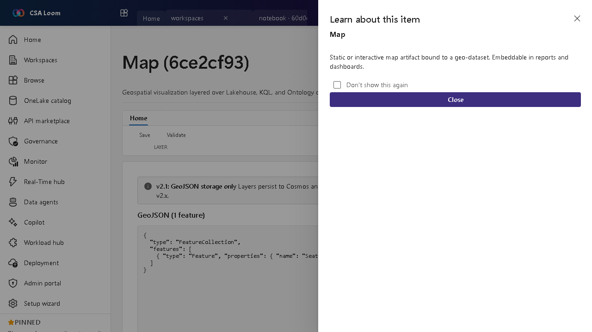

<!-- auto-generated by tools/uat-report.mjs — edits below this line are preserved on re-gen -->
# Tutorial: Map editor

> CSA Loom `map` editor — verified working against a live console by the UAT harness on 2026-07-01.

## Open the editor

1. Sign in to your **CSA Loom Console** (for example `https://<your-console-host>`).
2. Open or create a workspace from the **Workspaces** page.
3. Click **+ New item** and choose **Map** from the catalog.
4. The editor opens at `/items/map/<id>`:

## What this editor does

A Map is a geospatial visualization layered over Lakehouse, KQL, and Ontology data. In Loom the map binds to a live Azure-native source — a Synapse Serverless table (Lakehouse), an Azure Data Explorer KQL query, or a Weave Ontology entity — and renders point, heatmap, cluster, and choropleth layers over the returned geo rows. No Power BI / Fabric required; the vector overlay renders offline and an optional Azure Maps raster basemap layers behind it.

## Getting started

1. **Bind a geo-dataset** — On the Data binding tab, pick Lakehouse / KQL / Ontology, map the lat/lon (and optional value/label) columns, and Run binding — Loom queries the real backend and folds the rows into the map.
2. **Add layers** — Compose point, heatmap, cluster, or choropleth layers over the bound data; each can be weighted by a numeric value column/property.
3. **Style and color** — Set color ramps and symbology so the geography reads clearly.
4. **Draw and measure** — Toggle **Draw / measure** to sketch points, lines, polygons, rectangles, and circles directly on the map with a live spherical distance / area readout; drawn annotations persist with the map.
5. **Geocode addresses** — Paste addresses (one per line) in the **Geocode addresses** box on the Data binding tab and **Geocode & plot** — Loom resolves them to lat/lon via Azure Maps Search and plots the points (use *Use bound labels* to geocode an address column you already bound). Requires the Azure Maps account wiring; a missing account surfaces an honest gate.
6. **Embed it** — Embed the map in a report or dashboard for consumers.

## Learn more

- Microsoft Learn reference: [https://learn.microsoft.com/fabric/fundamentals/fabric-iq](https://learn.microsoft.com/fabric/fundamentals/fabric-iq)

## Verified by the UAT harness

- Tested at: `2026-05-26T13:52:46.860Z`
- Verdict: **A** (renders cleanly, real backend responded)
- Test source: [`apps/fiab-console/e2e/editors.uat.ts`](https://github.com/fgarofalo56/csa-inabox/blob/main/apps/fiab-console/e2e/editors.uat.ts)

<!-- end auto-generated -->