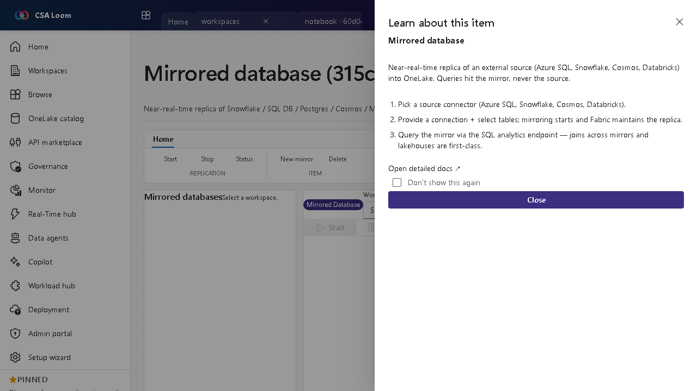

<!-- auto-generated by tools/uat-report.mjs — edits below this line are preserved on re-gen -->
# Tutorial: Mirrored database editor

> CSA Loom `mirrored-database` editor — verified working against a live console by the UAT harness on 2026-07-01.

## Open the editor

1. Sign in to your **CSA Loom Console** (for example `https://<your-console-host>`).
2. Open or create a workspace from the **Workspaces** page.
3. Click **+ New item** and choose **Mirrored database** from the catalog.
4. The editor opens at `/items/mirrored-database/<id>`:

## What this editor does

A Mirrored database is a near-real-time replica of an external source (Azure SQL, Snowflake, Cosmos, Databricks, Postgres) into ADLS Bronze as Delta — Azure-native CDC (ADF / Synapse Link), no Fabric or OneLake required. Queries hit the mirror, never the source. Use it to join external data with lakehouses without re-ingesting.

## Getting started

1. **Pick a source connector** — Choose Azure SQL, Snowflake, Cosmos, or Databricks as the replication source.
2. **Connect and select tables** — Provide a connection and pick tables; Loom's ADF CDC / Synapse Link replicator starts and maintains the replica into ADLS Bronze Delta automatically.
3. **Query the mirror** — Read via the SQL analytics endpoint — joins across mirrors and lakehouses are first-class.
4. **Monitor replication** — Watch mirror status to confirm the replica is keeping pace with the source.

## Learn more

- Microsoft Learn reference: [https://learn.microsoft.com/fabric/database/mirrored-database/overview](https://learn.microsoft.com/fabric/database/mirrored-database/overview)

## Verified by the UAT harness

- Tested at: `2026-05-26T13:50:53.361Z`
- Verdict: **A** (renders cleanly, real backend responded)
- Test source: [`apps/fiab-console/e2e/editors.uat.ts`](https://github.com/fgarofalo56/csa-inabox/blob/main/apps/fiab-console/e2e/editors.uat.ts)

<!-- end auto-generated -->