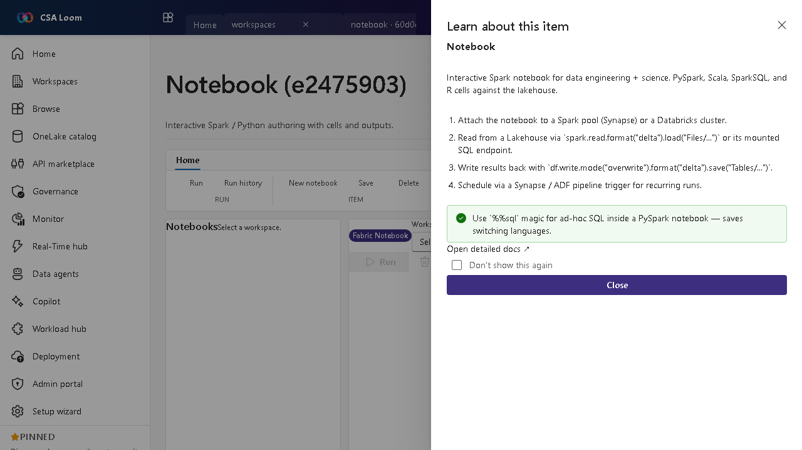

<!-- auto-generated by tools/uat-report.mjs — edits below this line are preserved on re-gen -->
# Tutorial: Notebook editor

> CSA Loom `notebook` editor — verified working against a live console by the UAT harness on 2026-07-01.

## Open the editor

1. Sign in to your **CSA Loom Console** (for example `https://<your-console-host>`).
2. Open or create a workspace from the **Workspaces** page.
3. Click **+ New item** and choose **Notebook** from the catalog.
4. The editor opens at `/items/notebook/<id>`:

## What this editor does

A Notebook is interactive Spark/Python authoring with cells and outputs. In Loom it attaches to a Synapse Spark pool or a Databricks cluster and reads/writes Lakehouse Delta tables. Use it for data engineering and data science work that needs code.

## Getting started

1. **Attach compute** — Attach the notebook to a Synapse Spark pool or a Databricks cluster before running a cell — Loom shows the attach state in the chrome.
2. **Read from a Lakehouse** — Read Delta with spark.read.format('delta').load('Files/...') or query the mounted SQL endpoint.
3. **Write results back** — Persist with df.write.mode('overwrite').format('delta').save('Tables/...') so the output lands as a managed table.
4. **Schedule recurring runs** — Wire the notebook into a Data pipeline or Synapse pipeline trigger for scheduled execution.

## Learn more

- Microsoft Learn reference: [https://learn.microsoft.com/fabric/data-engineering/lakehouse-notebook-explore](https://learn.microsoft.com/fabric/data-engineering/lakehouse-notebook-explore)

## Verified by the UAT harness

- Tested at: `2026-05-26T13:50:41.144Z`
- Verdict: **A** (renders cleanly, real backend responded)
- Test source: [`apps/fiab-console/e2e/editors.uat.ts`](https://github.com/fgarofalo56/csa-inabox/blob/main/apps/fiab-console/e2e/editors.uat.ts)

<!-- end auto-generated -->