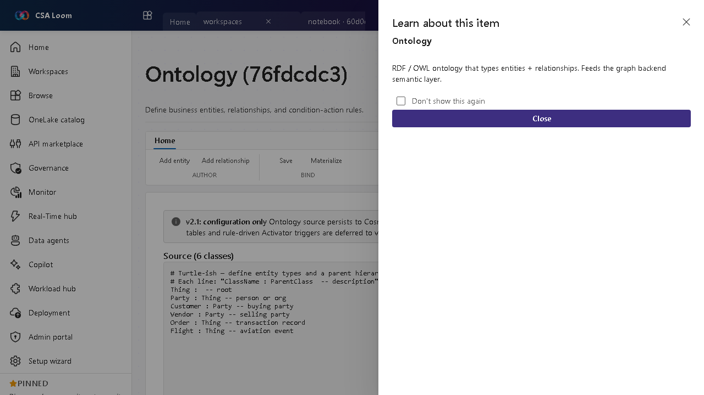

<!-- auto-generated by tools/uat-report.mjs — edits below this line are preserved on re-gen -->
# Tutorial: Ontology editor

> CSA Loom `ontology` editor — verified working against a live console by the UAT harness on 2026-07-01.

## Open the editor

1. Sign in to your **CSA Loom Console** (for example `https://<your-console-host>`).
2. Open or create a workspace from the **Workspaces** page.
3. Click **+ New item** and choose **Ontology** from the catalog.
4. The editor opens at `/items/ontology/<id>`:

## What this editor does

An Ontology defines business entities, relationships, and condition-action rules (preview). In Loom it types entities and feeds the graph backend semantic layer. Use it to give connected data a shared vocabulary.

## Getting started

1. **Define entities** — Declare the business entity types and their key properties.
2. **Define relationships** — Connect entities with typed relationships to model the domain graph.
3. **Add rules** — Author condition-action rules that fire when entity state changes.
4. **Mind the preview gate** — Fabric IQ ontology is preview; if the graph backend isn't provisioned the editor discloses what's required.

## Learn more

- Microsoft Learn reference: [https://learn.microsoft.com/fabric/fundamentals/fabric-iq](https://learn.microsoft.com/fabric/fundamentals/fabric-iq)

## Verified by the UAT harness

- Tested at: `2026-05-26T13:52:34.479Z`
- Verdict: **A** (renders cleanly, real backend responded)
- Test source: [`apps/fiab-console/e2e/editors.uat.ts`](https://github.com/fgarofalo56/csa-inabox/blob/main/apps/fiab-console/e2e/editors.uat.ts)

<!-- end auto-generated -->