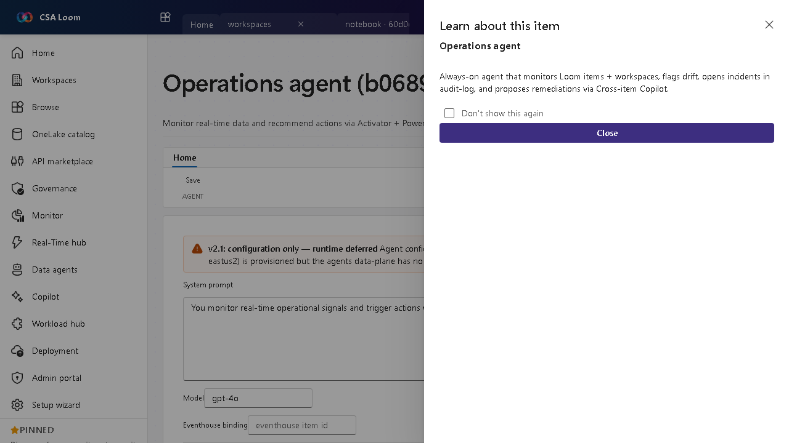

<!-- auto-generated by tools/uat-report.mjs — edits below this line are preserved on re-gen -->
# Tutorial: Operations agent editor

> CSA Loom `operations-agent` editor — verified working against a live console by the UAT harness on 2026-07-01.

## Open the editor

1. Sign in to your **CSA Loom Console** (for example `https://<your-console-host>`).
2. Open or create a workspace from the **Workspaces** page.
3. Click **+ New item** and choose **Operations agent** from the catalog.
4. The editor opens at `/items/operations-agent/<id>`:

## What this editor does

An Operations agent is an AI agent that watches your real-time operational data and proposes actions (preview). In Loom it is Azure-native: the agent's instructions, model, and tools are configured in the editor, it grounds on a bound **Eventhouse** (Azure Data Explorer) and **Ontology**, runs live test questions with tool traces, evaluates time / data-change triggers as real Azure Monitor rules, and drafts human-in-the-loop remediation proposals. The editor has four tabs: **Configure**, **Test / Run**, **Triggers**, and **Proposals** — no Microsoft Fabric required.

## Getting started

1. **Configure the agent** — On the **Configure** tab set the instructions and model, and bind the Eventhouse (ADX) and Ontology the agent grounds on — dropdown pickers, no freeform ids. **Deploy to Foundry** optionally publishes the definition to the Azure AI Foundry Agent Service.
2. **Test / Run** — Ask the agent a live operational question on the **Test / Run** tab; it queries the bound Eventhouse and Ontology and shows the per-tool run trace alongside the answer.
3. **Create triggers** — On the **Triggers** tab wire time-based and data-change triggers — real Azure Monitor scheduled-query rules over the bound data — so the agent runs hands-off.
4. **Review proposals** — The **Proposals** tab is human-in-the-loop: the agent drafts operational actions and you approve or reject each one before anything executes.

## Learn more

- Microsoft Learn reference: [https://learn.microsoft.com/azure/ai-services/agents/overview](https://learn.microsoft.com/azure/ai-services/agents/overview)

## Verified by the UAT harness

- Tested at: `2026-05-26T13:52:51.430Z`
- Verdict: **A** (renders cleanly, real backend responded)
- Test source: [`apps/fiab-console/e2e/editors.uat.ts`](https://github.com/fgarofalo56/csa-inabox/blob/main/apps/fiab-console/e2e/editors.uat.ts)

<!-- end auto-generated -->