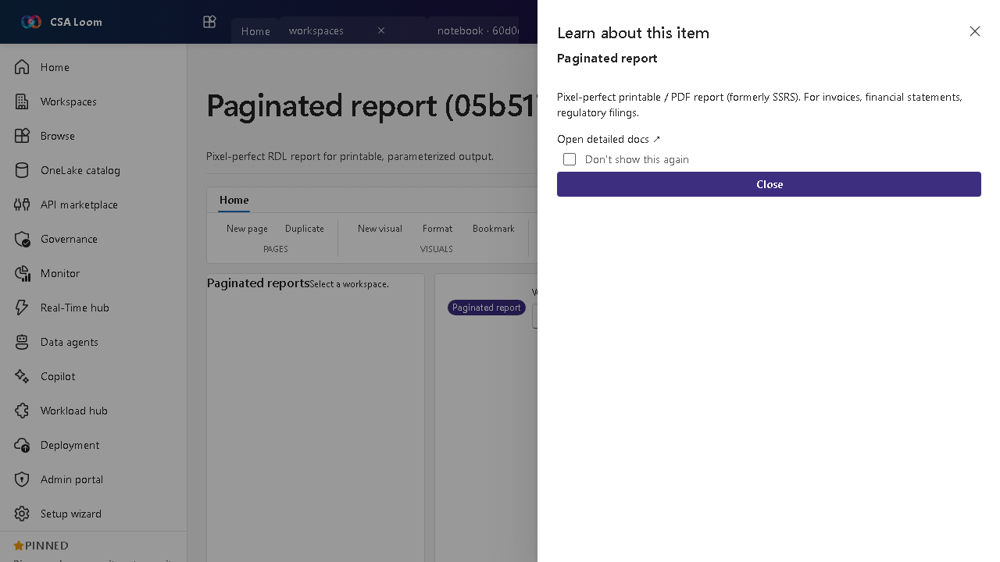

<!-- auto-generated by tools/uat-report.mjs — edits below this line are preserved on re-gen -->
# Tutorial: Paginated report editor

> CSA Loom `paginated-report` editor — verified working against a live console by the UAT harness on 2026-07-01.

## Open the editor

1. Sign in to your **CSA Loom Console** (for example `https://<your-console-host>`).
2. Open or create a workspace from the **Workspaces** page.
3. Click **+ New item** and choose **Paginated report** from the catalog.
4. The editor opens at `/items/paginated-report/<id>`:

## What this editor does

A Paginated report is a pixel-perfect RDL report for printable, parameterized output (formerly SSRS) — invoices, financial statements, regulatory filings. In Loom it is wired against live Power BI REST via the Console UAMI.

## Getting started

1. **Bind a data source** — The RDL report queries a semantic model or direct SQL source.
2. **Set parameters** — Define report parameters so consumers run it for a specific scope (date range, entity).
3. **Render and view** — Loom embeds the rendered report for review.
4. **Export to PDF** — Export pixel-perfect output via Power BI REST; tenant 401/403 surfaces a remediation hint.

## Learn more

- Microsoft Learn reference: [https://learn.microsoft.com/power-bi/paginated-reports/paginated-reports-report-builder-power-bi](https://learn.microsoft.com/power-bi/paginated-reports/paginated-reports-report-builder-power-bi)

## Verified by the UAT harness

- Tested at: `2026-05-26T13:52:01.282Z`
- Verdict: **A** (renders cleanly, real backend responded)
- Test source: [`apps/fiab-console/e2e/editors.uat.ts`](https://github.com/fgarofalo56/csa-inabox/blob/main/apps/fiab-console/e2e/editors.uat.ts)

<!-- end auto-generated -->