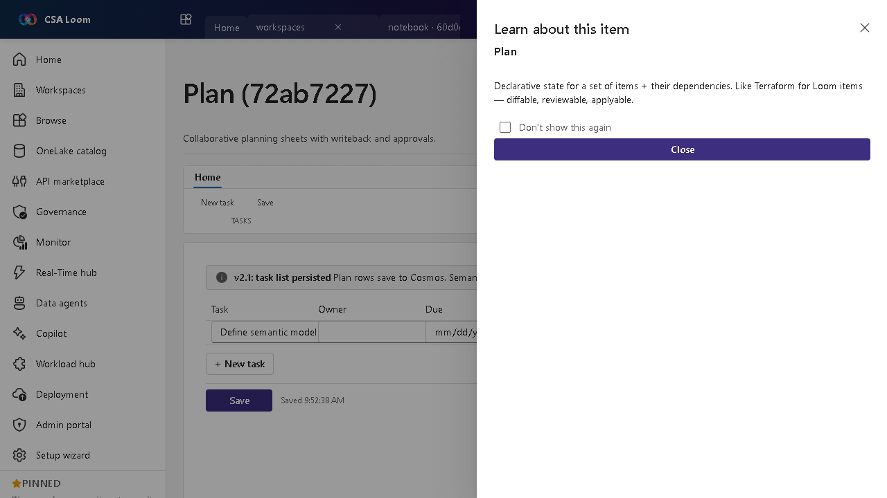

<!-- auto-generated by tools/uat-report.mjs — edits below this line are preserved on re-gen -->
# Tutorial: Plan editor

> CSA Loom `plan` editor — verified working against a live console by the UAT harness on 2026-07-01.

## Open the editor

1. Sign in to your **CSA Loom Console** (for example `https://<your-console-host>`).
2. Open or create a workspace from the **Workspaces** page.
3. Click **+ New item** and choose **Plan** from the catalog.
4. The editor opens at `/items/plan/<id>`:

## What this editor does

A Plan (preview) is the Fabric IQ EPM/CPM item: build budgets and forecasts across periods, branch what-if scenarios, and compare plan vs actuals. In Loom it is Azure-native — planning cells persist to Cosmos and write back to an Azure SQL database; actuals come from a bound semantic model. No Microsoft Fabric capacity required.

## Getting started

1. **Add line items and periods** — Define budget/forecast line items on the Planning sheet and the periods (months, quarters) to plan across.
2. **Branch scenarios** — Create baseline, optimistic, pessimistic, and custom scenarios; each branch clones the source assumptions so you can model what-ifs side by side.
3. **Spread and breakback** — On a roll-up parent cell, **Spread evenly / by growth % / by weight** allocates a total down to the child cells (with a preview table), and **Breakback (edit total)** edits the parent's total and pushes the change proportionally back into the children.
4. **Flag driver rows** — Mark assumption rows (headcount, price, growth rate) as **Drivers** — they sort first in the Formula builder's picker and the dependency-ordered recompute evaluates drivers before the formulas that consume them.
5. **Ask Plan Copilot** — Open the **Plan Copilot** rail to explain a variance, draft a forecast, or sanity-check the budget — it grounds an Azure OpenAI chat on this plan's cells, variance, and model.
6. **Compare plan vs actuals** — Turn on the variance overlay to see Δ and Δ% against actuals from the bound semantic model (or entered manually).
7. **Write back to Azure SQL** — Configure a backing Azure SQL database in Settings, then Write back to MERGE planning cells into dbo.loom_plan_cells for governed, queryable storage.

## Learn more

- Microsoft Learn reference: [https://learn.microsoft.com/fabric/iq/plan/overview](https://learn.microsoft.com/fabric/iq/plan/overview)

## Verified by the UAT harness

- Tested at: `2026-05-26T13:52:42.688Z`
- Verdict: **A** (renders cleanly, real backend responded)
- Test source: [`apps/fiab-console/e2e/editors.uat.ts`](https://github.com/fgarofalo56/csa-inabox/blob/main/apps/fiab-console/e2e/editors.uat.ts)

<!-- end auto-generated -->