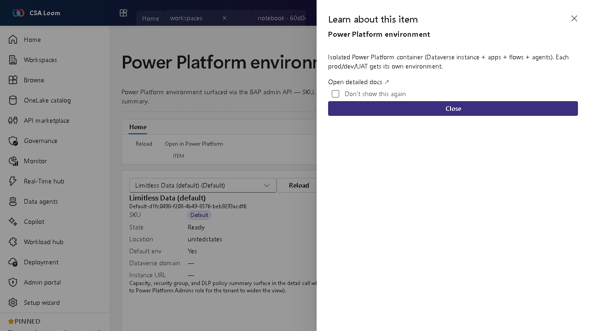

<!-- auto-generated by tools/uat-report.mjs — edits below this line are preserved on re-gen -->
# Tutorial: Power Platform environment editor

> CSA Loom `powerplatform-environment` editor — verified working against a live console by the UAT harness on 2026-07-01.

## Open the editor

1. Sign in to your **CSA Loom Console** (for example `https://<your-console-host>`).
2. Open or create a workspace from the **Workspaces** page.
3. Click **+ New item** and choose **Power Platform environment** from the catalog.
4. The editor opens at `/items/powerplatform-environment/<id>`:

## What this editor does

A Power Platform environment is surfaced via the BAP admin API — SKU, region, Dataverse domain, security group, and DLP summary. In Loom it is read live via /api/powerplatform/environments. Each prod/dev/UAT gets its own environment.

## Getting started

1. **List environments** — The editor reads environments live from the BAP admin API.
2. **Inspect details** — Review SKU, region, Dataverse domain, and security group.
3. **Check DLP** — Read the DLP policy summary that governs connectors in the environment.
4. **Use as a scope** — Pick an environment to scope Dataverse tables, apps, flows, and agents.

## Learn more

- Microsoft Learn reference: [https://learn.microsoft.com/power-platform/admin/environments-overview](https://learn.microsoft.com/power-platform/admin/environments-overview)

## Verified by the UAT harness

- Tested at: `2026-05-26T13:55:31.984Z`
- Verdict: **A** (renders cleanly, real backend responded)
- Test source: [`apps/fiab-console/e2e/editors.uat.ts`](https://github.com/fgarofalo56/csa-inabox/blob/main/apps/fiab-console/e2e/editors.uat.ts)

<!-- end auto-generated -->