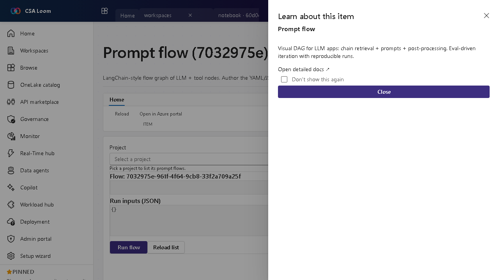

<!-- auto-generated by tools/uat-report.mjs — edits below this line are preserved on re-gen -->
# Tutorial: Prompt flow editor

> CSA Loom `prompt-flow` editor — verified working against a live console by the UAT harness on 2026-07-01.

## Open the editor

1. Sign in to your **CSA Loom Console** (for example `https://<your-console-host>`).
2. Open or create a workspace from the **Workspaces** page.
3. Click **+ New item** and choose **Prompt flow** from the catalog.
4. The editor opens at `/items/prompt-flow/<id>`:

## What this editor does

A Prompt flow is a LangChain-style graph of LLM and tool nodes. In Loom you author the YAML/JSON definition, run it with inputs, and view run history via the Foundry BFF route.

## Getting started

1. **Author the flow** — Define the node graph (retrieval, LLM, post-processing) in YAML/JSON.
2. **Run with inputs** — Provide sample inputs and run to see node outputs end-to-end.
3. **View run history** — Inspect prior runs for reproducibility and debugging.
4. **Evaluate** — Pair with a Foundry evaluation to score the flow before promoting it.

## Learn more

- Microsoft Learn reference: [https://learn.microsoft.com/azure/ai-studio/how-to/prompt-flow](https://learn.microsoft.com/azure/ai-studio/how-to/prompt-flow)

## Verified by the UAT harness

- Tested at: `2026-05-26T13:54:26.294Z`
- Verdict: **A** (renders cleanly, real backend responded)
- Test source: [`apps/fiab-console/e2e/editors.uat.ts`](https://github.com/fgarofalo56/csa-inabox/blob/main/apps/fiab-console/e2e/editors.uat.ts)

<!-- end auto-generated -->