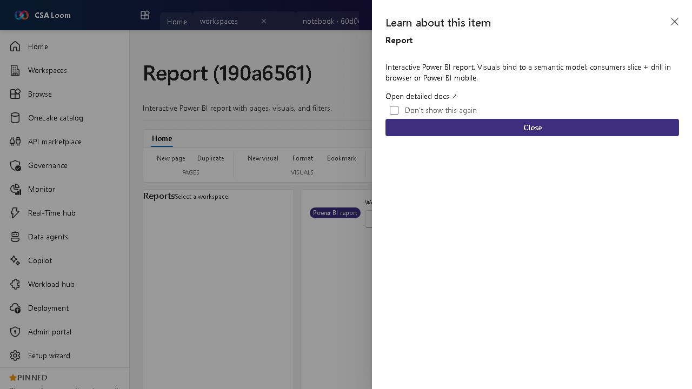

<!-- auto-generated by tools/uat-report.mjs — edits below this line are preserved on re-gen -->
# Tutorial: Report editor

> CSA Loom `report` editor — verified working against a live console by the UAT harness on 2026-07-01.

## Open the editor

1. Sign in to your **CSA Loom Console** (for example `https://<your-console-host>`).
2. Open or create a workspace from the **Workspaces** page.
3. Click **+ New item** and choose **Report** from the catalog.
4. The editor opens at `/items/report/<id>`:

## What this editor does

A Report is an interactive Power BI report with pages, visuals, and filters bound to a semantic model. In Loom it is reframed around embed, refresh, and export against live Power BI REST via the Console UAMI.

## Getting started

1. **Bind a semantic model** — The report's visuals read from a semantic model in the same workspace.
2. **Embed and view** — Loom embeds the report so you can slice and drill in-console.
3. **Refresh underlying data** — Refresh the bound semantic model to update the visuals.
4. **Export** — Export to PDF/PPTX via the Power BI REST export-to-file flow; 401/403 surfaces a remediation hint.

## Learn more

- Microsoft Learn reference: [https://learn.microsoft.com/power-bi/create-reports/](https://learn.microsoft.com/power-bi/create-reports/)

## Verified by the UAT harness

- Tested at: `2026-05-26T13:51:53.281Z`
- Verdict: **A** (renders cleanly, real backend responded)
- Test source: [`apps/fiab-console/e2e/editors.uat.ts`](https://github.com/fgarofalo56/csa-inabox/blob/main/apps/fiab-console/e2e/editors.uat.ts)

<!-- end auto-generated -->