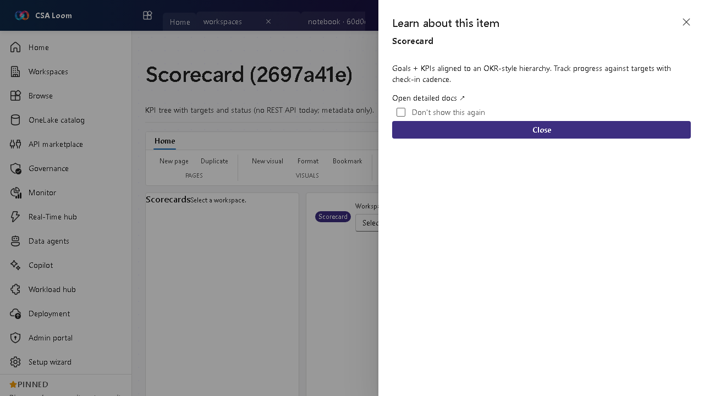

<!-- auto-generated by tools/uat-report.mjs — edits below this line are preserved on re-gen -->
# Tutorial: Scorecard editor

> CSA Loom `scorecard` editor — verified working against a live console by the UAT harness on 2026-07-01.

## Open the editor

1. Sign in to your **CSA Loom Console** (for example `https://<your-console-host>`).
2. Open or create a workspace from the **Workspaces** page.
3. Click **+ New item** and choose **Scorecard** from the catalog.
4. The editor opens at `/items/scorecard/<id>`:

## What this editor does

A Scorecard is a KPI tree with targets and status (OKR-style). There is no Fabric REST API for scorecards today, so in Loom this is metadata-only — the editor persists the KPI hierarchy and discloses the API limitation honestly.

## Getting started

1. **Define goals** — Create the top-level goals and their owners.
2. **Add KPIs** — Nest KPIs under goals with targets and current values.
3. **Set status and cadence** — Track progress against targets with a check-in cadence.
4. **Know the API limit** — No scorecard REST API exists today, so this surface stores metadata only and says so in a MessageBar rather than faking live values.

## Learn more

- Microsoft Learn reference: [https://learn.microsoft.com/power-bi/consumer/metrics/metrics-get-started](https://learn.microsoft.com/power-bi/consumer/metrics/metrics-get-started)

## Verified by the UAT harness

- Tested at: `2026-05-26T13:52:05.458Z`
- Verdict: **A** (renders cleanly, real backend responded)
- Test source: [`apps/fiab-console/e2e/editors.uat.ts`](https://github.com/fgarofalo56/csa-inabox/blob/main/apps/fiab-console/e2e/editors.uat.ts)

<!-- end auto-generated -->