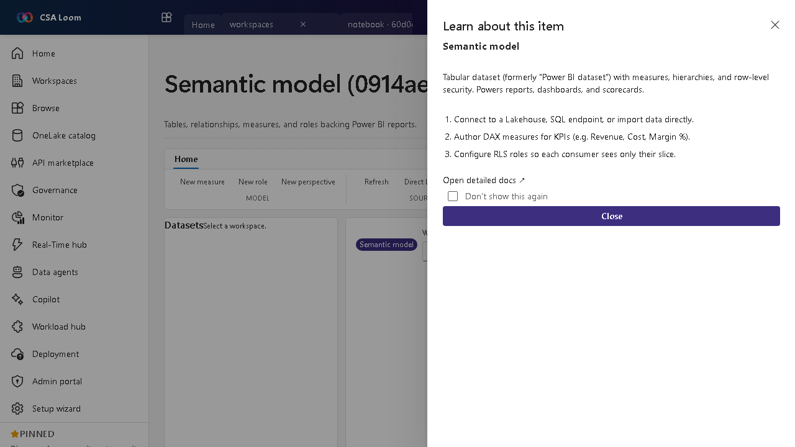

<!-- auto-generated by tools/uat-report.mjs — edits below this line are preserved on re-gen -->
# Tutorial: Semantic model editor

> CSA Loom `semantic-model` editor — verified working against a live console by the UAT harness on 2026-07-01.

## Open the editor

1. Sign in to your **CSA Loom Console** (for example `https://<your-console-host>`).
2. Open or create a workspace from the **Workspaces** page.
3. Click **+ New item** and choose **Semantic model** from the catalog.
4. The editor opens at `/items/semantic-model/<id>`:

## What this editor does

A Semantic model holds the tables, relationships, measures, and roles backing Power BI reports. In Loom it is wired against live Power BI REST via the Console UAMI. Use it as the shared business layer for reports, dashboards, and scorecards.

## Getting started

1. **Connect data** — Connect to a Lakehouse, warehouse SQL endpoint, or import data directly.
2. **Author DAX measures** — Write measures for KPIs such as Revenue, Cost, and Margin percent.
3. **Configure RLS** — Define row-level security roles so each consumer sees only their slice.
4. **Refresh the model** — Trigger or schedule a refresh; the editor calls live Power BI REST and surfaces 401/403 with a hint if the UAMI isn't yet a workspace member.

## Learn more

- Microsoft Learn reference: [https://learn.microsoft.com/power-bi/transform-model/datasets/dataset-modes-understand](https://learn.microsoft.com/power-bi/transform-model/datasets/dataset-modes-understand)

## Verified by the UAT harness

- Tested at: `2026-05-26T13:51:49.302Z`
- Verdict: **A** (renders cleanly, real backend responded)
- Test source: [`apps/fiab-console/e2e/editors.uat.ts`](https://github.com/fgarofalo56/csa-inabox/blob/main/apps/fiab-console/e2e/editors.uat.ts)

<!-- end auto-generated -->