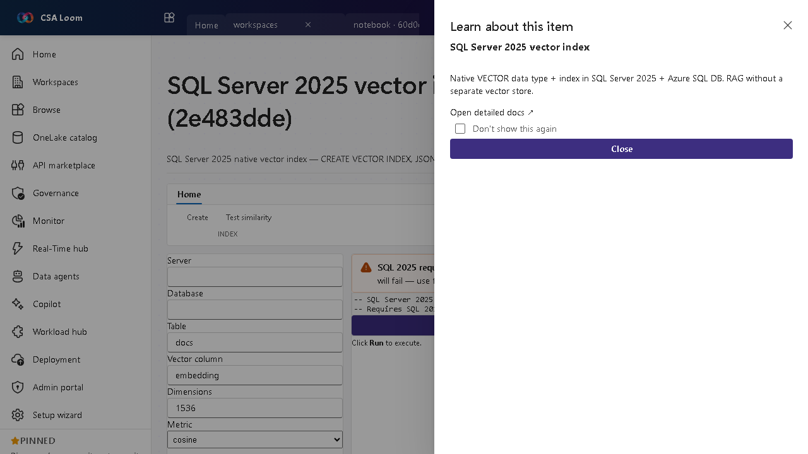

<!-- auto-generated by tools/uat-report.mjs — edits below this line are preserved on re-gen -->
# Tutorial: SQL Server 2025 vector index editor

> CSA Loom `sql-server-2025-vector-index` editor — verified working against a live console by the UAT harness on 2026-07-01.

## Open the editor

1. Sign in to your **CSA Loom Console** (for example `https://<your-console-host>`).
2. Open or create a workspace from the **Workspaces** page.
3. Click **+ New item** and choose **SQL Server 2025 vector index** from the catalog.
4. The editor opens at `/items/sql-server-2025-vector-index/<id>`:

## What this editor does

A SQL Server 2025 vector index is the native VECTOR type and index — CREATE VECTOR INDEX, JSON_AGG, regex, similarity search — for RAG without a separate vector store. In Loom it probes the SQL Server 2025 features against the target database.

## Getting started

1. **Confirm support** — The editor probes the database for SQL Server 2025 vector feature availability.
2. **Create a vector index** — Run CREATE VECTOR INDEX over a VECTOR column.
3. **Store embeddings** — Insert embedding vectors alongside your relational data.
4. **Similarity search** — Query nearest neighbors for RAG grounding without a separate store.

## Learn more

- Microsoft Learn reference: [https://learn.microsoft.com/sql/relational-databases/vectors/vectors-sql-server](https://learn.microsoft.com/sql/relational-databases/vectors/vectors-sql-server)

## Verified by the UAT harness

- Tested at: `2026-05-26T13:56:18.992Z`
- Verdict: **A** (renders cleanly, real backend responded)
- Test source: [`apps/fiab-console/e2e/editors.uat.ts`](https://github.com/fgarofalo56/csa-inabox/blob/main/apps/fiab-console/e2e/editors.uat.ts)

<!-- end auto-generated -->