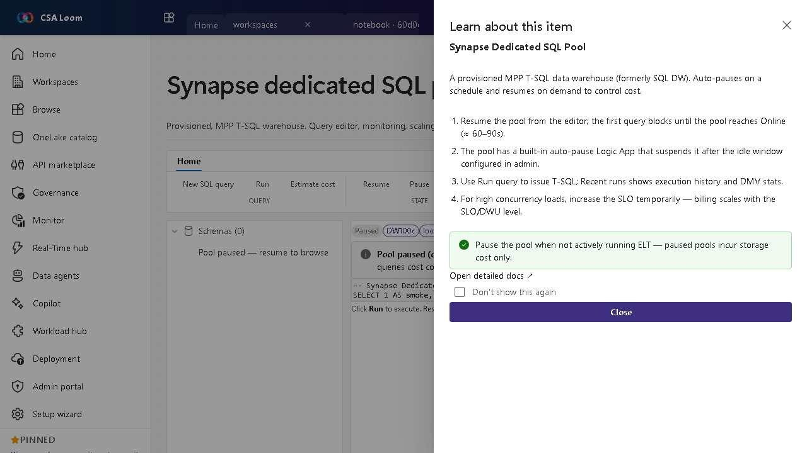

<!-- auto-generated by tools/uat-report.mjs — edits below this line are preserved on re-gen -->
# Tutorial: Synapse dedicated SQL pool editor

> CSA Loom `synapse-dedicated-sql-pool` editor — verified working against a live console by the UAT harness on 2026-07-01.

## Open the editor

1. Sign in to your **CSA Loom Console** (for example `https://<your-console-host>`).
2. Open or create a workspace from the **Workspaces** page.
3. Click **+ New item** and choose **Synapse dedicated SQL pool** from the catalog.
4. The editor opens at `/items/synapse-dedicated-sql-pool/<id>`:

## What this editor does

A Synapse dedicated SQL pool is a provisioned MPP T-SQL warehouse (formerly SQL DW). In Loom it is wired via ARM REST for pause/resume and TDS query on workspace.sql.azuresynapse.net through the Console MI. It auto-pauses to control cost.

## Getting started

1. **Resume the pool** — Resume from the editor; the first query blocks until the pool reaches Online (about 60-90 seconds).
2. **Run T-SQL** — Use Run query to issue T-SQL; Recent runs shows execution history and DMV stats.
3. **Scale for load** — Raise the SLO/DWU level temporarily for high-concurrency loads — billing scales with the SLO.
4. **Pause when idle** — Pause the pool when not running ELT; paused pools incur storage cost only, and a built-in auto-pause Logic App suspends it after the idle window.

## Learn more

- Microsoft Learn reference: [https://learn.microsoft.com/azure/synapse-analytics/sql-data-warehouse/sql-data-warehouse-overview-what-is](https://learn.microsoft.com/azure/synapse-analytics/sql-data-warehouse/sql-data-warehouse-overview-what-is)

## Verified by the UAT harness

- Tested at: `2026-05-26T13:53:00.070Z`
- Verdict: **A** (renders cleanly, real backend responded)
- Test source: [`apps/fiab-console/e2e/editors.uat.ts`](https://github.com/fgarofalo56/csa-inabox/blob/main/apps/fiab-console/e2e/editors.uat.ts)

<!-- end auto-generated -->