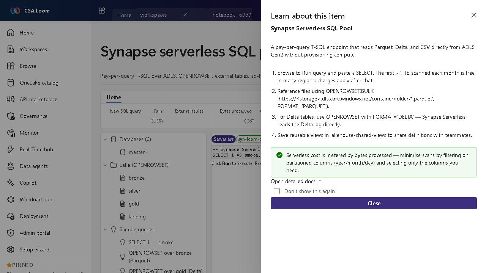

<!-- auto-generated by tools/uat-report.mjs — edits below this line are preserved on re-gen -->
# Tutorial: Synapse serverless SQL pool editor

> CSA Loom `synapse-serverless-sql-pool` editor — verified working against a live console by the UAT harness on 2026-07-01.

## Open the editor

1. Sign in to your **CSA Loom Console** (for example `https://<your-console-host>`).
2. Open or create a workspace from the **Workspaces** page.
3. Click **+ New item** and choose **Synapse serverless SQL pool** from the catalog.
4. The editor opens at `/items/synapse-serverless-sql-pool/<id>`:

## What this editor does

A Synapse serverless SQL pool is a pay-per-query T-SQL endpoint over ADLS — OPENROWSET, external tables, ad-hoc analytics, no compute to provision. In Loom it queries workspace-ondemand.sql.azuresynapse.net via the Console MI over a private endpoint.

## Getting started

1. **Run a SELECT** — Browse to Run query and paste a SELECT; cost is metered by bytes scanned.
2. **Query files with OPENROWSET** — Read Parquet with OPENROWSET(BULK '...', FORMAT='PARQUET'); for Delta use FORMAT='DELTA'.
3. **Save shared views** — Persist reusable views to share definitions with teammates.
4. **Minimize scans** — Filter on partitioned columns (year/month/day) and select only needed columns to cut cost.

## Learn more

- Microsoft Learn reference: [https://learn.microsoft.com/azure/synapse-analytics/sql/on-demand-workspace-overview](https://learn.microsoft.com/azure/synapse-analytics/sql/on-demand-workspace-overview)

## Verified by the UAT harness

- Tested at: `2026-05-26T13:53:04.485Z`
- Verdict: **A** (renders cleanly, real backend responded)
- Test source: [`apps/fiab-console/e2e/editors.uat.ts`](https://github.com/fgarofalo56/csa-inabox/blob/main/apps/fiab-console/e2e/editors.uat.ts)

<!-- end auto-generated -->