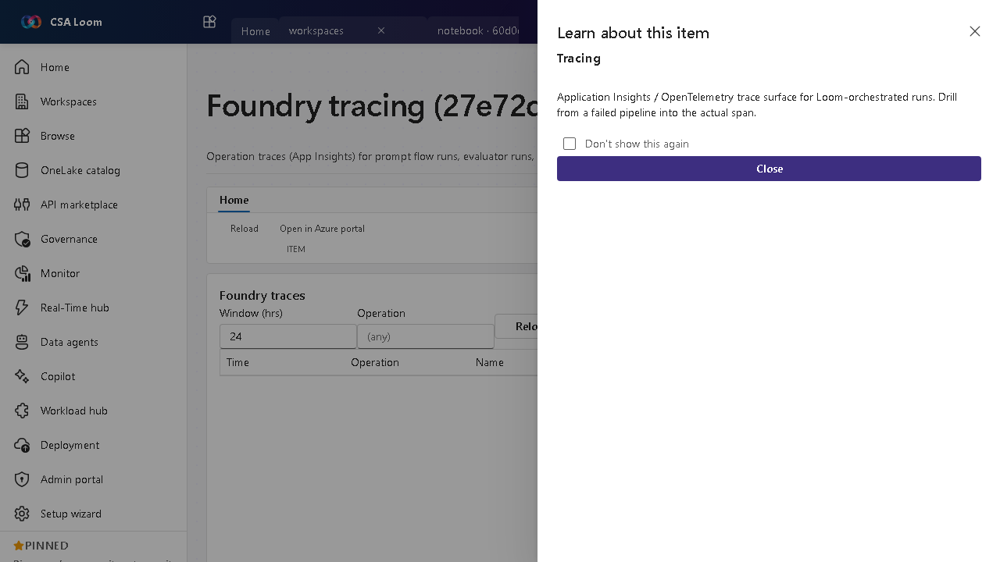

<!-- auto-generated by tools/uat-report.mjs — edits below this line are preserved on re-gen -->
# Tutorial: Foundry tracing editor

> CSA Loom `tracing` editor — verified working against a live console by the UAT harness on 2026-07-01.

## Open the editor

1. Sign in to your **CSA Loom Console** (for example `https://<your-console-host>`).
2. Open or create a workspace from the **Workspaces** page.
3. Click **+ New item** and choose **Foundry tracing** from the catalog.
4. The editor opens at `/items/tracing/<id>`:

## What this editor does

Foundry tracing surfaces operation traces (Application Insights) for prompt flow runs, evaluator runs, and endpoint calls. In Loom you filter by operation and time window to drill from a failed run into the actual span.

## Getting started

1. **Pick an operation** — Filter traces by operation type (flow run, evaluator, endpoint call).
2. **Set a window** — Choose the time window to scope the trace list.
3. **Open a span** — Drill into a span to see latency, tokens, and errors for the call.
4. **Diagnose failures** — Use traces to find the failing node or call behind a bad run.

## Learn more

- Microsoft Learn reference: [https://learn.microsoft.com/azure/ai-studio/concepts/trace](https://learn.microsoft.com/azure/ai-studio/concepts/trace)

## Verified by the UAT harness

- Tested at: `2026-05-26T13:54:39.961Z`
- Verdict: **A** (renders cleanly, real backend responded)
- Test source: [`apps/fiab-console/e2e/editors.uat.ts`](https://github.com/fgarofalo56/csa-inabox/blob/main/apps/fiab-console/e2e/editors.uat.ts)

<!-- end auto-generated -->