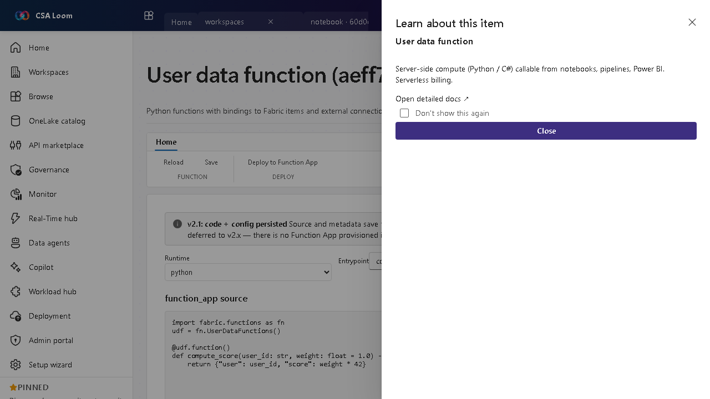

<!-- auto-generated by tools/uat-report.mjs — edits below this line are preserved on re-gen -->
# Tutorial: User data function editor

> CSA Loom `user-data-function` editor — verified working against a live console by the UAT harness on 2026-07-01.

## Open the editor

1. Sign in to your **CSA Loom Console** (for example `https://<your-console-host>`).
2. Open or create a workspace from the **Workspaces** page.
3. Click **+ New item** and choose **User data function** from the catalog.
4. The editor opens at `/items/user-data-function/<id>`:

## What this editor does

A User data function is Python (or C#) server-side compute — Azure-native on Azure Functions — with bindings to Loom items and external connections, callable from notebooks, pipelines, and reports. In Loom it runs serverless with per-call billing; no Microsoft Fabric required.

## Getting started

1. **Write the function** — Author a Python function with input/output bindings to Loom items (lakehouses, warehouses, SQL) via Azure Functions bindings.
2. **Add connections** — Bind external connections the function needs (databases, APIs).
3. **Test invoke** — Run the function with sample inputs to validate behavior.
4. **Call from items** — Invoke it from notebooks, pipelines, or reports; billing is serverless per call.

## Learn more

- Microsoft Learn reference: [https://learn.microsoft.com/fabric/data-engineering/user-data-functions/user-data-functions-overview](https://learn.microsoft.com/fabric/data-engineering/user-data-functions/user-data-functions-overview)

## Verified by the UAT harness

- Tested at: `2026-05-26T13:52:26.669Z`
- Verdict: **A** (renders cleanly, real backend responded)
- Test source: [`apps/fiab-console/e2e/editors.uat.ts`](https://github.com/fgarofalo56/csa-inabox/blob/main/apps/fiab-console/e2e/editors.uat.ts)

<!-- end auto-generated -->