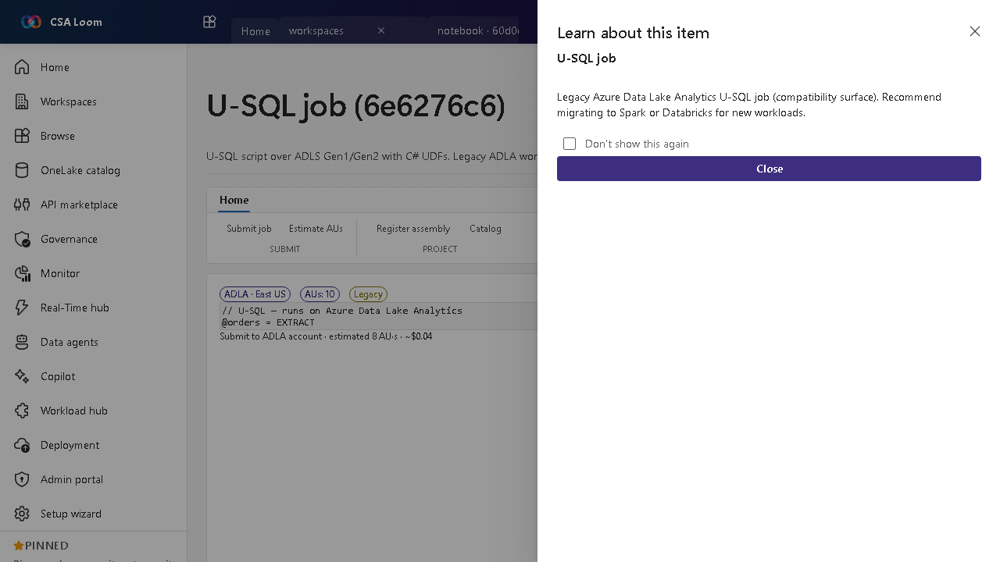

<!-- auto-generated by tools/uat-report.mjs — edits below this line are preserved on re-gen -->
# Tutorial: U-SQL job editor

> CSA Loom `usql-job` editor — verified working against a live console by the UAT harness on 2026-07-01.

## Open the editor

1. Sign in to your **CSA Loom Console** (for example `https://<your-console-host>`).
2. Open or create a workspace from the **Workspaces** page.
3. Click **+ New item** and choose **U-SQL job** from the catalog.
4. The editor opens at `/items/usql-job/<id>`:

## What this editor does

Legacy Azure Data Lake Analytics U-SQL job (compatibility surface). Recommend migrating to Spark or Databricks for new workloads.

## Verified by the UAT harness

- Tested at: `2026-05-26T13:53:54.105Z`
- Verdict: **A** (renders cleanly, real backend responded)
- Test source: [`apps/fiab-console/e2e/editors.uat.ts`](https://github.com/fgarofalo56/csa-inabox/blob/main/apps/fiab-console/e2e/editors.uat.ts)

<!-- end auto-generated -->