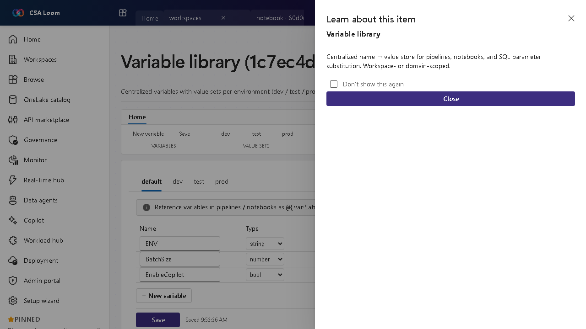

<!-- auto-generated by tools/uat-report.mjs — edits below this line are preserved on re-gen -->
# Tutorial: Variable library editor

> CSA Loom `variable-library` editor — verified working against a live console by the UAT harness on 2026-07-01.

## Open the editor

1. Sign in to your **CSA Loom Console** (for example `https://<your-console-host>`).
2. Open or create a workspace from the **Workspaces** page.
3. Click **+ New item** and choose **Variable library** from the catalog.
4. The editor opens at `/items/variable-library/<id>`:

## What this editor does

A Variable library is a centralized name-to-value store with value sets per environment (dev/test/prod). In Loom it is workspace- or domain-scoped and used for pipeline, notebook, and SQL parameter substitution.

## Getting started

1. **Define variables** — Add named variables with a default value.
2. **Add value sets** — Create per-environment value sets (dev/test/prod) that override defaults.
3. **Reference from items** — Use variables in pipelines, notebooks, and SQL via parameter substitution.
4. **Promote across stages** — Switch the active value set when deploying between environments.

## Learn more

- Microsoft Learn reference: [https://learn.microsoft.com/fabric/cicd/variable-library/variable-library-overview](https://learn.microsoft.com/fabric/cicd/variable-library/variable-library-overview)

## Verified by the UAT harness

- Tested at: `2026-05-26T13:52:30.633Z`
- Verdict: **A** (renders cleanly, real backend responded)
- Test source: [`apps/fiab-console/e2e/editors.uat.ts`](https://github.com/fgarofalo56/csa-inabox/blob/main/apps/fiab-console/e2e/editors.uat.ts)

<!-- end auto-generated -->