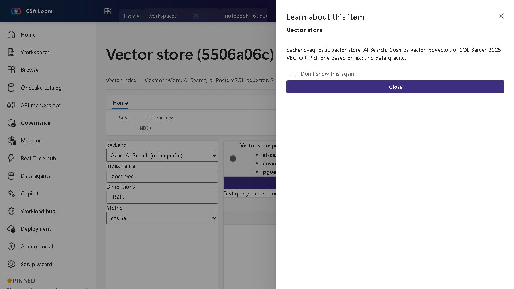

<!-- auto-generated by tools/uat-report.mjs — edits below this line are preserved on re-gen -->
# Tutorial: Vector store editor

> CSA Loom `vector-store` editor — verified working against a live console by the UAT harness on 2026-07-01.

## Open the editor

1. Sign in to your **CSA Loom Console** (for example `https://<your-console-host>`).
2. Open or create a workspace from the **Workspaces** page.
3. Click **+ New item** and choose **Vector store** from the catalog.
4. The editor opens at `/items/vector-store/<id>`:

## What this editor does

A Vector store is a backend-agnostic vector index — Cosmos vCore, AI Search, or PostgreSQL pgvector — for similarity search and RAG grounding. In Loom you pick a backend and define an index spec, which persists to item state; a live similarity test is deferred to v3.x.

## Getting started

1. **Pick a backend** — Choose Cosmos vCore, AI Search, or pgvector based on existing data gravity.
2. **Define the index** — Set dimensions, distance metric, and fields in the create-index form.
3. **Save the spec** — Save persists the index spec to item state; live similarity test is deferred to v3.x and disclosed.
4. **Ground RAG** — Use the store for similarity search behind a prompt flow or data agent.

## Learn more

- Microsoft Learn reference: [https://learn.microsoft.com/azure/cosmos-db/vector-database](https://learn.microsoft.com/azure/cosmos-db/vector-database)

## Verified by the UAT harness

- Tested at: `2026-05-26T13:56:51.508Z`
- Verdict: **A** (renders cleanly, real backend responded)
- Test source: [`apps/fiab-console/e2e/editors.uat.ts`](https://github.com/fgarofalo56/csa-inabox/blob/main/apps/fiab-console/e2e/editors.uat.ts)

<!-- end auto-generated -->