# Direct Lake-Replacement Pattern

> **Comparative positioning note.** This document is written from the
> perspective of Microsoft Azure, Cloud Scale Analytics, and CSA Loom. Any
> description of third-party or competing products, services, pricing, or
> capabilities is derived from **publicly available documentation and sources**
> believed accurate at the time of writing, and is provided for **general
> comparison only**. We do not claim expertise in, or authority over, any
> non-Microsoft product or service; the respective vendor's official
> documentation is the authoritative source for their offerings, which may
> change over time. Nothing here is intended to disparage any vendor — where a
> competing product has genuine advantages, we aim to note them honestly.
> Verify all third-party details against the vendor's current official
> documentation before making decisions.


Customers migrating from a third-party BI platform or on-prem Power BI
Report Server use the CSA Loom **Direct-Lake-Shim warm-cache materializer
pattern** to get Power BI Premium semantic models with framed-like
freshness (5-30 s) — without waiting for Fabric Gov GA.

## When this pattern fits

- Customer has aging on-prem BI server (a third-party BI server
  / Power BI Report Server)
- Customer wants to modernize to Power BI cloud + lakehouse
- Customer's audit boundary blocks Fabric / Direct Lake
- Customer has Power BI Premium F-SKU (GCC-H / IL5) or P-SKU (GCC;
  no Direct Lake parity available)
- Workload characteristics: aggregate analytics + interactive
  dashboards; not sub-second-required

## Architecture

```mermaid
flowchart LR
    classDef source fill:#5C2D91,stroke:#fff,color:#fff,stroke-width:2px
    classDef bronze fill:#cd7f32,stroke:#fff,color:#fff,stroke-width:2px
    classDef silver fill:#A8A9AD,stroke:#fff,color:#fff,stroke-width:2px
    classDef gold fill:#D4AF37,stroke:#fff,color:#fff,stroke-width:2px
    classDef shim fill:#D83B01,stroke:#fff,color:#fff,stroke-width:2px
    classDef bi fill:#0078D4,stroke:#fff,color:#fff,stroke-width:2px

    subgraph Sources["Operational sources (DB / files / streams)"]
        direction TB
        DB["DB"]:::source
        Files["Files"]:::source
        Streams["Streams"]:::source
    end

    subgraph Lake["Loom lakehouse (ADLS Gen2)"]
        direction TB
        Bronze["Bronze table"]:::bronze
        Silver["Silver table"]:::silver
        Gold["Gold table"]:::gold
        Bronze --> Silver --> Gold
    end

    subgraph Shim["Direct-Lake-Shim refresh pipeline"]
        direction TB
        EventGrid["Storage Event Grid"]:::shim
        ShimSvc["Loom Direct-Lake-Shim"]:::shim
        TOM["TOM partition refresh<br/>on Power BI Premium model"]:::shim
        EventGrid --> ShimSvc --> TOM
    end

    subgraph BI["BI surface (Power BI Premium)"]
        direction TB
        Model["Semantic Model<br/>(Premium Import)<br/>Authored in TMDL<br/>Deployed via TOM"]:::bi
        Reports["Power BI Reports<br/>(refresh on every<br/>model refresh)"]:::bi
        Model --> Reports
    end

    Sources -- "Loom Mirroring" --> Bronze
    Gold -- "commit event" --> EventGrid
    Gold -- "refresh" --> Model
    TOM --> Model
```



## Migration playbook

### Step 1 — Inventory the source BI estate

- Catalogue all third-party BI workbooks / apps / on-prem PBI reports
- Identify primary data sources (databases, files, cubes)
- Map dashboards to underlying data models
- Prioritize: top 20% of dashboards cover 80% of usage

### Step 2 — Stand up Loom

Per [Quick Start](../deployment/quickstart.md).

### Step 3 — Migrate sources to Bronze

For each source:
- Database sources → Loom Mirroring Engine (Debezium / Cosmos
  connector)
- File sources → Azure Data Factory copy → ADLS Gen2 Bronze
- Stream sources → Azure Stream Analytics → ADX (cross-engine to
  Bronze if needed)

### Step 4 — Build Silver + Gold via Databricks notebooks

- Cleanse + conform in Silver
- Business semantics + star schemas in Gold
- Partition Gold tables by date (or appropriate dimension) so
  partition-refresh works

### Step 5 — Re-author semantic models in Power BI Desktop

For each priority dashboard:
- Open original (third-party BI tool / PBI Report Server)
- Re-author the semantic model in Power BI Desktop targeting the
  Gold tables
- Use TMDL format (Power BI Project / .pbip)
- Commit `.pbip` to Git

### Step 6 — Configure Direct-Lake-Shim refresh policy

Per [Tutorial 03](../tutorials/03-direct-lake-parity.md):

```bash
loom-dl-shim configure \
  --semantic-model <model-id> \
  --table <gold-table-name> \
  --refresh-policy partition \
  --partition-column date
```

### Step 7 — Build Power BI reports

- Re-create dashboards in Power BI Desktop against the new semantic
  models
- Publish to Power BI Premium workspace
- Verify visual parity with original

### Step 8 — Cutover

- Open new Power BI report URLs to a pilot user group
- Validate report performance + freshness (5-30 s should be
  acceptable for most analytical workloads)
- Migrate users in cohorts
- Decommission original BI server after parallel-run period

## Expected outcomes

- Self-service Power BI authoring (vs a centralized third-party BI
  admin model)
- 5-30 s freshness on partition-refresh (vs daily / hourly on legacy
  BI servers)
- Modern data lake foundation (Loom lakehouse) supports additional
  workloads beyond BI
- When Fabric Gov GA arrives: re-author semantic models for native
  Direct Lake on OneLake → sub-second freshness without rewriting
  the underlying analytics

## Cost comparison (typical)

| Item | Legacy on-prem BI server | Loom + Power BI Premium |
|---|---|---|
| BI server licenses | $$$$ annual | $0 (Power BI Premium consumption) |
| Server hardware + maintenance | $$$ annual | $0 (cloud-managed) |
| Storage | $$ annual | $$$ (Azure ADLS Gen2 + Power BI workspace storage) |
| Compute (ETL) | $$$ annual | $$ (Databricks DBU usage-based) |
| Refresh latency | hours to nightly | 5-30 seconds |
| Self-service authoring | Limited | Yes (Power BI Desktop) |

Typical net savings: 40-60% TCO + step-function improvement in
freshness + self-service.

## Honest gap

This pattern delivers **5-30 second freshness**. Fabric's native
Direct Lake gives sub-second. For workloads requiring sub-second:
- Wait for Fabric Gov GA
- Or use Databricks SQL Warehouse + DirectQuery (Commercial only;
  always live but slower DAX engine)
- Or use Power BI DirectQuery against Synapse Serverless (slower
  per-query)

For most analytical workloads (monthly / quarterly / yearly aggregates
+ daily refresh), 5-30 s is **better than what the legacy BI server
delivered** and acceptable for the user's experience.

## Related

- [Direct Lake parity workload](../workloads/direct-lake-parity.md)
- [Direct-Lake Shim service](../services/direct-lake-shim.md)
- [Tutorial 03 — Direct Lake parity](../tutorials/03-direct-lake-parity.md)
- Existing migration: [Tableau to Power BI migration](../../migrations/tableau-to-powerbi/index.md)
