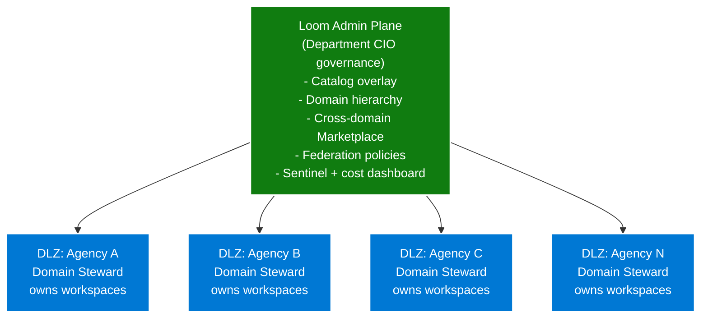

# Federal Data Mesh on CSA Loom

A federal department running multiple agencies as autonomous domains,
each with their own data products + analytics — federated under a
central governance plane.

## Pattern

## Why this works for federal

- **Per-domain sub isolation** — each agency owns its DLZ
  subscription; per-domain cost reporting; per-domain RBAC
- **Federated governance** — Department CIO sets tenant-level policies
  (data classification scheme, sensitivity-label taxonomy, mandatory
  catalog tags); Domain Stewards override per-agency where appropriate
- **Cross-domain Marketplace** — agencies publish data products to a
  central Marketplace; other agencies request access; Domain Steward
  approves
- **Compliance per domain** — different agencies may have different
  audit boundaries (some FedRAMP H; some IL4; some IL5 once v1.1) —
  Loom's per-boundary `.bicepparam` supports the mix

## Roles

| Role | Scope | Permissions |
|---|---|---|
| Department CIO | Org-level | Reads everything; sets tenant-level policy |
| Department CDO | Org-level | Catalog governance; cross-domain data product approval |
| Loom Admins (department-wide) | Org-level | Deploy + manage Admin Plane |
| Domain Stewards (per-agency) | Per-DLZ | Manage agency's DLZ; approve cross-domain access requests |
| Workspace Admins (per-workspace) | Per-workspace | Manage individual analytics workspaces |
| Workspace Members | Per-workspace | RW within their workspace |

## Onboarding a new agency

Per [DLZ onboard new domain runbook](../runbooks/dlz-onboard-new-domain.md):

1. Department provisions a new Azure Government subscription for the
   agency under the same Entra tenant
2. Department CIO opens Loom Console → Setup Wizard
3. Wizard interviews: agency name, region, capacity SKU, Domain
   Steward Entra group
4. Wizard renders `.bicepparam` live; MCP deploys DLZ in ~30 min
5. New DLZ appears in Console; Domain Steward takes ownership
6. Agency begins creating workspaces + workloads

## Cross-domain data product example

| Step | Actor |
|---|---|
| Agency A publishes "Agency Performance Metrics" data product to Marketplace | Agency A Domain Steward |
| Agency B requests access (use case: "Cross-agency dashboards") | Agency B Workspace Admin |
| Agency A reviews + approves with 90-day window | Agency A Domain Steward |
| Delta Sharing grant created; Agency B's catalog adapter picks it up within 5 min | Automatic |
| Agency B Power BI reports query the shared data product | Automatic |
| Audit log entry: cross-DLZ access by Agency B user X | Automatic → Sentinel |

## Sensitivity-label propagation

- Department CDO authors MIP labels in Purview (`Restricted-PII`,
  `Restricted-PHI`, `CUI`, `CUI-NSS`)
- Domain Stewards apply labels to their domain's data assets
- Labels propagate to Power BI semantic models → reports →
  Excel/PowerPoint exports
- Sentinel rules detect label-violation patterns (e.g., user
  downloading large volumes of `Restricted-PII`-labeled data)

## Forward migration

When Fabric reaches the department's audit boundary:
- Each DLZ migrates independently per its agency's cadence
- Forward-migration plan documented per agency
- Cross-domain data products: Delta Sharing grants port to Fabric's
  cross-tenant sharing protocol

## Costs

Per-DLZ Azure consumption billed to each agency's subscription. The
Department CIO sees aggregated cost via the Loom Admin Plane
"Monitoring → Cost" pane (cross-DLZ rollup).

Department-level pre-purchased Azure consumption commit (MACC) can be
allocated across agencies.

## Related

- [Multi-Agency Onboarding use case](multi-agency-onboarding.md)
- [Hybrid topology use case](hybrid-topology.md)
- [Tenancy model ADR](../adr/0011-tenancy-model.md)
- [Marketplace tutorial](../tutorials/07-marketplace-data-product.md)
- Existing parent: [Government Data Analytics on Azure](../../use-cases/government-data-analytics.md)
