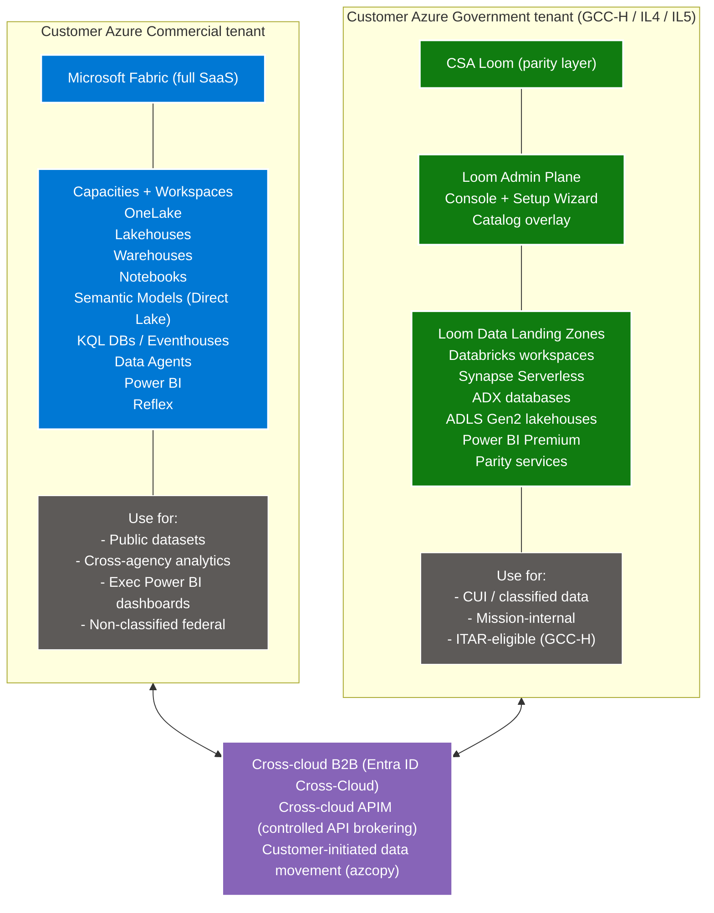

# Hybrid Fabric Commercial + CSA Loom Gov

{ .architecture-hero loading="eager" }

The most common federal customer pattern: Microsoft Fabric in
Commercial + CSA Loom in Gov, running side-by-side with bridging.

## Pattern

## When this fits

- Federal customer has **both** Commercial + Gov Azure estates
- Some workloads are non-classified (public data, cross-agency
  metrics, exec dashboards) → fit Fabric Commercial naturally
- Some workloads are CUI / classified / ITAR → require Loom Gov
- Customer values Microsoft strategic alignment (both platforms are
  Microsoft-first)

## What lives where

| Data / workload | Pattern |
|---|---|
| Public reference datasets (NOAA / Census / etc.) | Fabric Commercial |
| Cross-agency aggregate metrics | Fabric Commercial |
| Exec Power BI dashboards (M365 commercial identity) | Fabric Commercial |
| Demo / training environments | Fabric Commercial |
| Mission CUI data | Loom Gov |
| Agency-internal classified analytics | Loom Gov |
| ITAR-eligible workloads | Loom Gov (GCC-H specifically) |
| HHS / VHA clinical CUI | Loom Gov (HIPAA-aligned) |

## Cross-cloud B2B identity

Per [Entra ID Cross-Cloud B2B](https://learn.microsoft.com/entra/external-id/cross-cloud-settings):

- Each side enables cross-cloud trust (Commercial ↔ Gov)
- Users invited as guests across cloud boundary
- Conditional Access policies on both sides honor partner-tenant
  MFA + compliance + hybrid-join claims
- User in Commercial tenant invited to Loom Gov workspace → can sign
  in from Commercial identity, access approved Gov resources

For ITAR-scoped workloads, **disable cross-cloud B2B** for that DLZ
entirely (no foreign-person collaboration risk).

## Cross-cloud APIM bridge

For controlled cross-cloud API calls (rare; non-data-movement
patterns):

- APIM Premium v2 in Commercial (forward-proxy)
- APIM Premium in Gov (reverse-proxy)
- Peered via APIM federation policies
- Customer-defined allow-list of approved API endpoints
- Audit log: every cross-cloud call

## Customer-controlled data movement

When data needs to move (rare; only with explicit customer policy):
- **Commercial → Gov**: customer downloads from Fabric Commercial,
  uploads to Loom Gov via approved data-loading channel
- **Gov → Commercial**: rare; only for non-classified aggregates;
  audit-heavy
- **Never automatic** — Loom doesn't initiate cross-cloud movement

## Catalog federation

| Approach | Use |
|---|---|
| Independent catalogs per side | Default; each catalog operates independently |
| Purview cross-cloud scan | Purview in Commercial can scan resources in Gov (limited; verify per-feature) |
| Manual catalog reconciliation | Federal-mission framework where data product manifests are JSON-shared |

## Identity reconciliation

Same user typically has separate identities:
- `jane.doe@contoso.gov` (M365 GCC-H — Loom Gov identity)
- `jane.doe@contoso.com` (M365 Commercial — Fabric Commercial identity)

Single-sign-on across these is technically possible via cross-cloud
B2B but typically NOT recommended for federal — the identity
separation is a control.

## Forward migration in hybrid

When Microsoft Fabric reaches the customer's Gov boundary:
1. Migrate Gov workloads from Loom to Fabric Gov (per
   [forward-migration runbook](../runbooks/forward-migrate-to-fabric.md))
2. Maintain Hybrid model: Fabric Commercial + Fabric Gov
3. Or consolidate: cross-tenant data sharing via OneLake shortcut
   across cloud-equivalent Fabric instances

## Cost framing

Two separate Azure bills:
- Commercial: per Fabric F-SKU + Azure consumption
- Gov: per Loom Azure consumption (no Loom IP fee in v1)

Customer can negotiate single MACC commit covering both clouds via
Microsoft EA.

## Operational considerations

| Topic | Approach |
|---|---|
| Single SOC dashboard | Send both Sentinel workspaces to unified SIEM (e.g., Splunk on-prem) |
| Single audit log | Customer-managed Sentinel federation |
| Single user training | Workshops cover both Fabric + Loom |
| Single change management | Customer's CAB approves changes across both |

## Why this is the most likely federal pattern

Most federal customers:
- Already have both Commercial + Gov Azure estates
- Have non-classified workloads that fit Commercial naturally
- Have classified / ITAR workloads that require Gov
- Want Microsoft alignment for long-term roadmap
- Want to forward-migrate within the Microsoft ecosystem

CSA Loom + Fabric Commercial hybrid topology serves all of the
above without forcing customers into a single-cloud bet.

## Related

- [Federal Data Mesh use case](federal-data-mesh.md)
- [Forward to Fabric runbook](../runbooks/forward-migrate-to-fabric.md)
- [Forward to Fabric operations](../operations/forward-to-fabric.md)
- [Compliance — feature × boundary matrix](../compliance/feature-boundary-matrix.md)
- Workload: [OneLake parity](../workloads/onelake-parity.md)
- Tutorial: [08 — Forward-migrate to Fabric](../tutorials/08-forward-migrate-to-fabric.md)
- Example: [Retail end-to-end](../examples/retail-e2e.md)
- Existing: [Multi-Cloud Data Virtualization](../../use-cases/multi-cloud-data-virtualization.md)
