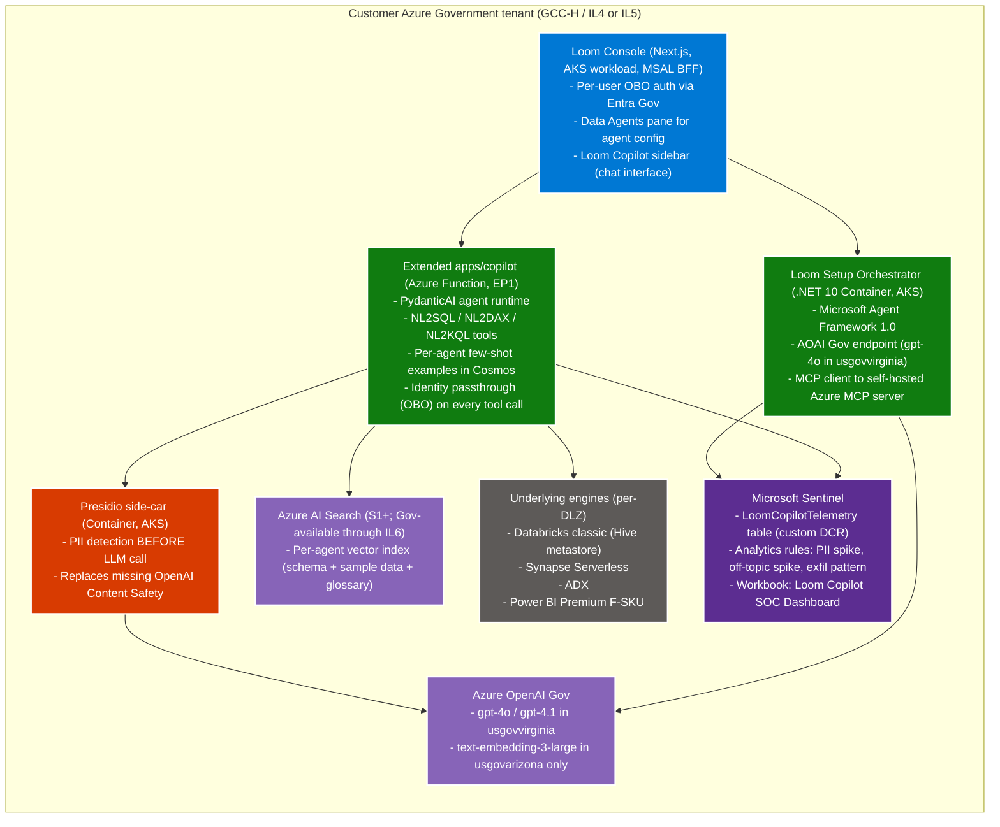

# Sovereign AI Agents

Building Loom Data Agents under Gov constraints — no Foundry Agent
Service, manual SOC pipeline, AOAI Gov endpoints, identity
passthrough throughout.

## Why this is hard in Gov

Per [Loom Data Agents parity](../workloads/data-agents-parity.md) +
[Compliance — feature × boundary matrix](../compliance/feature-boundary-matrix.md):

- **Foundry Agent Service** Gov-GA unconfirmed → can't use server-
  side thread persistence
- **Foundry portal** not at IL4+ → can't use Foundry Toolboxes for
  agent visibility
- **OpenAI Content Safety** not at IL4+ → must self-host Presidio
- **OpenAI Batch API** not in Gov → synchronous calls only
- **Defender for Cloud AI Threat Protection** Commercial-only →
  manual Sentinel pipeline
- **Cross-cloud B2B** restrictions for ITAR workloads → no
  Commercial AOAI fallback

## Architecture for sovereign agents



## Per-agent configuration pattern

For each Loom Data Agent in Gov:

```json
{
  "id": "agent-classified-analytics",
  "workspaceId": "ws-il4-mission-ops",
  "name": "Mission Analytics Agent",
  "description": "Answers questions about mission operational metrics",
  "instructions": "You answer questions about mission operational metrics. NEVER discuss classified data without confirming the requester is authenticated as a Mission Analyst Group member. Cite all queries.",
  "dataSources": [
    {
      "type": "lakehouse",
      "workspaceId": "ws-il4-mission-ops",
      "lakehouse": "mission-gold-lakehouse",
      "sensitivityFilter": ["Internal", "CUI"]
    }
  ],
  "exampleQueries": [
    {"question": "What's the mission readiness score this month?",
     "language": "SQL",
     "query": "SELECT AVG(readiness_score) FROM mission_ops_metrics WHERE month = MONTH(GETDATE())"}
  ],
  "sensitivityPolicy": {
    "blockOnLabels": ["Restricted-CNS", "Restricted-PII"],
    "requireAuth": true,
    "minSensitivity": "Internal"
  }
}
```

## Identity passthrough (OBO) — critical for federal audit

Every tool call carries the user's Entra Gov token:
- `nl2sql` → executes against Synapse Serverless using **user's**
  identity (Synapse RLS / CLS apply automatically)
- `nl2dax` → executes via Power BI XMLA using **user's** identity
  (semantic model RLS applies)
- `nl2kql` → executes against ADX using **user's** identity (ADX
  row-level security applies)

Audit log per query:
- User UPN
- Generated query
- Result row count
- Latency
- Sensitivity labels touched

→ Application Insights → LAW → Sentinel

## SOC monitoring patterns

Per [Defender AI workaround](../compliance/defender-ai-workaround.md):

| Rule | Trigger |
|---|---|
| Excessive PII redactions per user | >20 PII detections in 15 min from same user |
| Off-topic refusals spike | >20 refusals/15 min (possible prompt injection) |
| Unusually long outputs | >50K tokens output (possible jailbreak) |
| High-rate same-prompt repetition | >50 similar prompts in 5 min (possible bot) |
| Cross-workspace exfiltration | >5 distinct sensitive workspaces queried by one user in 10 min |

All fire as Sentinel incidents → routed to federal SOC.

## ITAR considerations

For ITAR-scoped Loom Data Agents:
- Limit agent access to US-person workforce (Entra group
  restriction)
- Mark ITAR-restricted tables with `ITAR-Restricted` sensitivity
  label
- Apply agent `sensitivityPolicy: { blockOnLabels: ['ITAR-
  Restricted'] }` to general-purpose agents
- Create separate ITAR-specific agents with explicit user
  authentication
- Sentinel rule: "ITAR-related prompt from non-US-person identity"

## Limitations vs Commercial Foundry agents

| Capability | Commercial Foundry | Gov Loom Data Agents |
|---|---|---|
| Server-side thread persistence | ✅ | ❌ (Cosmos session state instead) |
| Foundry portal observability | ✅ | ❌ (Console + Sentinel) |
| Foundry Toolboxes (preview) | ⚠ | ❌ (manual tool catalog) |
| Per-agent identity (Entra Agent ID) | ✅ | ❌ (UAMI + OBO) |
| Multi-agent orchestration (A2A protocol) | ✅ | ❌ (manual orchestration via MAF) |

These gaps close when Foundry Agent Service Gov-GAs.

## Related

- [Data Agents parity workload](../workloads/data-agents-parity.md)
- [Copilot orchestration ADR](../adr/0009-copilot-orchestration.md)
- [Defender AI workaround](../compliance/defender-ai-workaround.md)
- [Tutorial 05 — Data Agent over Lakehouse](../tutorials/05-data-agent.md)
- Existing parent: [AI Document Analytics & eDiscovery](../../use-cases/ai-document-analytics-ediscovery.md)
