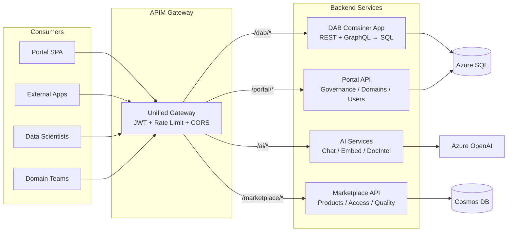
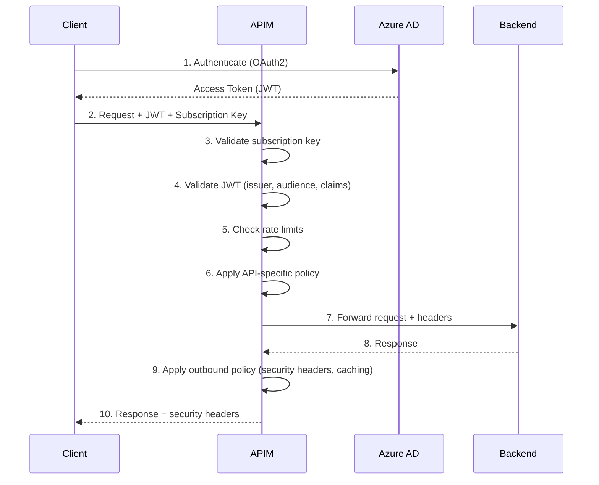

# APIM as the Unified Gateway for Data Mesh APIs

> Architecture guide for the CSA-in-a-Box APIM gateway layer — a single entry point
> for all Data Mesh services including DAB, AI, Marketplace, and Portal APIs.

## Why APIM for Data Mesh

Azure API Management provides the ideal gateway for a Data Mesh architecture:

- **Single entry point** — one URL for all data products, AI services, and governance APIs
- **Cross-cutting concerns** — authentication, rate limiting, caching, and monitoring applied consistently
- **Developer portal** — self-service API discovery aligned with Data Mesh's self-serve principle
- **Federation** — global policies for governance with domain-specific overrides
- **Observability** — unified analytics across all APIs via Application Insights

Without APIM, each service would need to independently implement JWT validation, CORS, rate limiting, and monitoring. APIM centralizes these concerns while letting domain teams own their API logic.

## Architecture Overview



## API Catalog

| API | Path | Backend | Methods | Auth | Description |
|-----|------|---------|---------|------|-------------|
| Data API Builder | `/dab/*` | DAB Container App | GET, POST (GraphQL) | JWT + Subscription | REST/GraphQL access to data products |
| AI Services | `/ai/*` | Portal FastAPI | POST | JWT + Subscription | Chat, embeddings, document intelligence |
| Marketplace | `/marketplace/*` | Portal FastAPI | GET, POST, PUT, DELETE | JWT + Subscription | Product discovery, access requests |
| Portal API | `/portal/*` | Portal FastAPI | GET, POST, PUT, DELETE | JWT + Subscription | Governance, domains, users, config |

## Security Model

All requests pass through a layered security model:

1. **TLS 1.2+** — enforced at the gateway level
2. **Subscription key** — identifies the consuming application/product
3. **JWT validation** — Azure AD token validated against configured issuer and audience
4. **Role-based access** — JWT roles mapped to backend authorization (e.g., DAB's X-MS-API-ROLE)
5. **Rate limiting** — per-subscription and per-user limits prevent abuse



## Products and Access Tiers

| Product | APIs Included | Rate Limit | Approval | Use Case |
|---------|--------------|------------|----------|----------|
| **Data Mesh Internal** | All 4 APIs | 100 calls/min | Auto | Internal teams, Portal SPA |
| **Data Mesh External** | DAB, Marketplace | 60 calls/min | Manual | Partner integrations |
| **AI Platform** | AI, Marketplace | 10-100 calls/min (per endpoint) | Manual | Data scientists, AI apps |

## Policy Patterns

### Global Policy (all APIs)

The global policy (`policies/global-policy.xml`) applies cross-cutting concerns:

- **CORS** — configurable origins via named value `{{allowed-origins}}`
- **Rate limiting** — per-subscription, configurable via `{{rate-limit-calls}}` / `{{rate-limit-period}}`
- **JWT validation** — Azure AD OpenID Connect discovery
- **Request tracing** — `X-Request-ID` header injection
- **Security headers** — `X-Content-Type-Options: nosniff`, `X-Frame-Options: DENY`, HSTS

### DAB Policy

The DAB policy (`policies/dab-policy.xml`) handles Data API Builder specifics:

- **Role mapping** — extracts `roles` claim from JWT and sets `X-MS-API-ROLE` header
- **Token passthrough** — forwards the original Bearer token to DAB
- **Response caching** — GET requests cached for 5 minutes

```xml
<!-- Example: JWT role extraction for DAB -->
<set-header name="X-MS-API-ROLE" exists-action="override">
    <value>@{
        // Extract first role from JWT roles claim
        var roles = context.Request.Headers["Authorization"];
        // ... parse JWT payload, return role name
    }</value>
</set-header>
```

### AI Policy

The AI policy (`policies/ai-policy.xml`) enforces strict usage controls:

- **Per-user rate limits** — 10 calls/min for chat, 100 calls/min for embeddings
- **Token budget** — `X-Token-Budget` header tells backend the max tokens allowed
- **Content safety** — `X-Content-Safety-Score` header in responses
- **Debug stripping** — removes internal headers (`X-Debug-Trace`, etc.)

### Marketplace Policy

The marketplace policy (`policies/marketplace-policy.xml`) optimizes for discovery:

- **Domain scoping** — extracts domain from JWT for tenant-isolated queries
- **Tiered caching** — products cached 2 min, domains cached 10 min
- **HATEOAS links** — adds `Link` header with self-referencing URL
- **Pagination** — forwards `X-Total-Count` for client pagination

### Error Handling

All policies inherit error handling from the global policy. Backend errors are logged to Application Insights with the correlation `X-Request-ID`.

## Data Mesh Integration

APIM directly enables four Data Mesh principles:

### Domain Ownership

Each domain team owns their data products, exposed through DAB. APIM products can be created per-domain, giving domain teams control over who accesses their data.

### Federated Computational Governance

The global policy enforces organization-wide standards (JWT validation, TLS, rate limiting), while API-specific policies allow domain teams to customize behavior (caching, role mapping, header transformations).

### Self-Serve Data Platform

The APIM Developer Portal provides:
- Browsable API catalog with interactive documentation
- Self-service subscription key generation
- API testing directly in the portal
- Usage analytics per subscription

### Data Products as APIs

Each shared dataset in the Data Mesh becomes an API in APIM:
1. Domain team publishes data product via DAB configuration
2. DAB exposes REST + GraphQL endpoints
3. APIM imports the DAB OpenAPI spec
4. Data product is discoverable in the Developer Portal

## Developer Portal

The APIM Developer Portal (auto-provisioned) provides:

- **API catalog** — browse all available APIs with OpenAPI documentation
- **Try it** — test API calls directly from the browser
- **Subscription management** — create and manage subscription keys
- **Analytics** — view usage statistics per subscription

Access the portal at: `https://{apim-name}.developer.azure-api.us`

### Customization

The Developer Portal can be customized to match organizational branding:
1. Navigate to the portal management interface in Azure Portal
2. Customize pages, layouts, and styles
3. Add custom content pages for onboarding guides

## Monitoring and Analytics

### Application Insights

All API calls are logged to Application Insights with:
- Request/response details (configurable sampling)
- Client IP address
- Correlation via `X-Request-ID`
- Custom dimensions (user domain, content safety scores)

### Log Analytics

Diagnostic settings send all APIM logs and metrics to Log Analytics for:
- KQL queries across all API traffic
- Azure Workbooks for visual dashboards
- Alert rules for error spikes or rate limit violations

### Key Queries

```kusto
// Top 5 APIs by request count (last 24h)
ApiManagementGatewayLogs
| where TimeGenerated > ago(24h)
| summarize RequestCount = count() by ApiId
| top 5 by RequestCount

// Failed requests by error code
ApiManagementGatewayLogs
| where TimeGenerated > ago(1h)
| where ResponseCode >= 400
| summarize Count = count() by ResponseCode, ApiId
| order by Count desc

// Average latency per API
ApiManagementGatewayLogs
| where TimeGenerated > ago(1h)
| summarize AvgLatency = avg(TotalTime) by ApiId
| order by AvgLatency desc
```

## Deployment

### Prerequisites

- Azure CLI with `apim` extension
- Bicep CLI v0.20+
- Azure AD app registration for JWT validation
- Backend services deployed (DAB, Portal FastAPI)

### Deploy with Bicep

```bash
# Dev environment
az deployment group create \
  --resource-group rg-datamesh-dev \
  --template-file deploy/bicep/DMLZ/modules/APIM/apim-gateway.bicep \
  --parameters deploy/bicep/DMLZ/modules/APIM/apim-gateway.dev.bicepparam

# Production environment
az deployment group create \
  --resource-group rg-datamesh-prod \
  --template-file deploy/bicep/DMLZ/modules/APIM/apim-gateway.bicep \
  --parameters deploy/bicep/DMLZ/modules/APIM/apim-gateway.prod.bicepparam
```

### Post-Deployment Steps

1. Import DAB OpenAPI spec (see `examples/data-api-builder/apim-integration/import-dab-api.sh`)
2. Configure Azure AD app registration with correct redirect URIs
3. Update named values with actual JWT issuer/audience
4. Apply API-specific policies via Azure Portal or CLI
5. Test endpoints (see `examples/data-api-builder/apim-integration/test-apim-endpoints.http`)

### Parameter Files

| File | Environment | SKU | Rate Limit | Locks |
|------|-------------|-----|-----------|-------|
| `apim-gateway.dev.bicepparam` | dev | Developer | 500/min | No |
| `apim-gateway.prod.bicepparam` | prod | Standard | 60/min | Yes |

## Troubleshooting

### Common Issues

**401 Unauthorized — JWT validation failed**
- Verify the `jwt-issuer` and `jwt-audience` named values match your Azure AD app registration
- Check that the token hasn't expired
- Ensure the token was issued for the correct audience

**429 Too Many Requests**
- Rate limit exceeded for the subscription or user
- Check `X-RateLimit-Remaining` header in responses
- Upgrade to a higher-tier product or request limit increase

**504 Gateway Timeout**
- Backend service is not responding within the timeout period
- Check backend health in Application Insights
- AI endpoints have a 120-second timeout; others have 30 seconds

**CORS errors in browser**
- Verify `allowed-origins` named value includes your frontend domain
- For dev, set to `*`; for production, list specific origins

**DAB returns 403 Forbidden**
- The `X-MS-API-ROLE` header may not match a DAB role
- Check that the JWT contains a `roles` claim
- Verify DAB configuration includes the role name

### Diagnostic Steps

1. Check APIM trace in Azure Portal (enable tracing for your subscription)
2. Query Application Insights for the `X-Request-ID`
3. Review Log Analytics for gateway logs
4. Test directly against backend (bypassing APIM) to isolate the issue

### APIM Provisioning Time

APIM instances take 30-45 minutes to provision. The Developer SKU is fastest. If deployment times out, check the Azure Portal for provisioning status — the deployment may still be in progress.

## Related Resources

- [Azure APIM documentation](https://learn.microsoft.com/en-us/azure/api-management/)
- [APIM policies reference](https://learn.microsoft.com/en-us/azure/api-management/api-management-policies)
- [Data API Builder documentation](https://learn.microsoft.com/en-us/azure/data-api-builder/)
- [CSA-in-a-Box Architecture](../architecture/)
