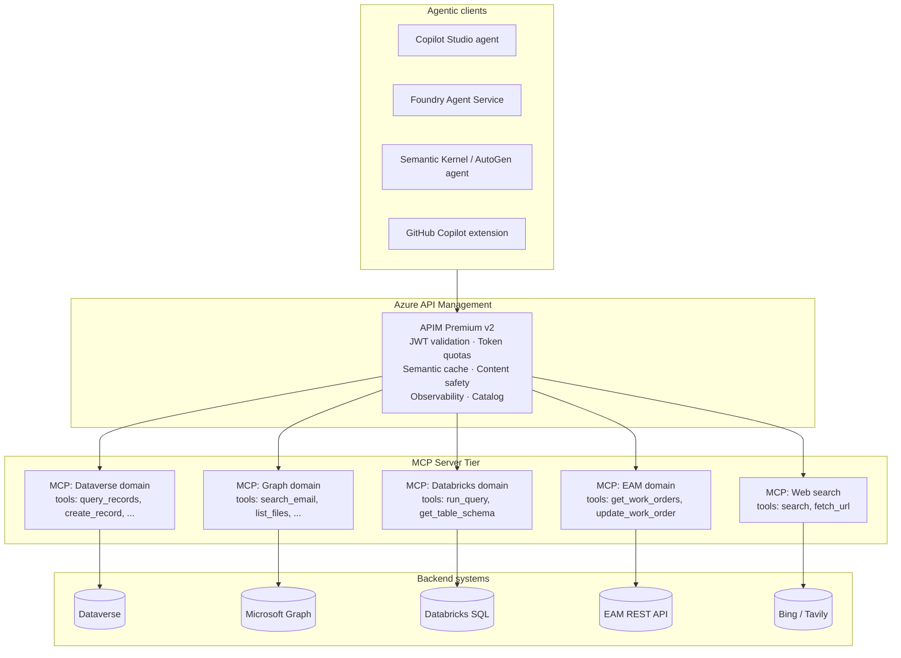

# Guide — APIM + MCP Layered Orchestration

!!! note "Freshness"
    **Validated against:** Azure API Management (AI-gateway policies: token-limit, token-metric, semantic caching) fronting Model Context Protocol (MCP) servers + Azure OpenAI / multi-model routing — **as of 2026-06-02.** MCP is an evolving spec and APIM's AI-gateway + MCP support is moving quickly; verify the protocol version and APIM policy surface against the current docs before deploying.

## The pattern

Model Context Protocol (MCP) servers expose **tools** (callable functions) and **resources** (readable data) to LLM clients over a uniform protocol. Agent clients call MCP servers; MCP servers call backends.

The naive deployment puts each agent directly in front of its own MCP servers. That fails in production for four reasons:

1. **No shared rate limit / token budget.** One bad agent loop drains shared quotas across multiple agents.
2. **No central auth.** Each agent / MCP server pairing reimplements auth.
3. **No central observability.** Token usage, tool latency, failure rates fragment across teams.
4. **No central lifecycle.** Retiring a tool means touching every consumer.

The production pattern puts **APIM between agents and MCP servers** — making MCP servers first-class APIs in the gateway.

---

## Architecture



### Why layered

| Property | Direct MCP | Layered (APIM + MCP) |
|---|---|---|
| Token budget per consumer | Per-MCP | Cross-MCP (one budget regardless of which tool) |
| Auth | Per-MCP | One Entra-issued token validated at gateway |
| Per-tool authorization | Per-MCP custom | APIM scope mapping |
| Observability | Per-MCP | Unified App Insights with dimensions |
| Caching | Per-MCP | Semantic cache shared across MCPs for repeated queries |
| Retirement | Touch every agent | Update APIM routing |
| Multi-agent reuse | Re-implement per agent | Configure once, reuse across agents |

---

## Concrete benefits in production

### Token exhaustion guard

One runaway agent loop can drain a $40k token budget overnight. APIM's `llm-token-limit` policy applied at the gateway caps it:

```xml
<azure-openai-token-limit
    counter-key="@(context.Subscription.Id)"
    tokens-per-minute="100000"
    estimate-prompt-tokens="true"
    remaining-tokens-header-name="x-ratelimit-remaining-tokens" />
```

The budget enforces regardless of which MCP server the agent calls or which backend that MCP server hits.

### Cost management

`azure-openai-emit-token-metric` emits per-subscription token counts to App Insights. Dimensioning by `tool_name` and `agent_name` gives a chargeback report:

```kql
customMetrics
| where name == "Total tokens"
| extend agent = tostring(customDimensions["agent-id"])
| extend tool = tostring(customDimensions["tool-name"])
| extend sub = tostring(customDimensions["subscription-id"])
| summarize tokens = sum(value) by agent, tool, sub, bin(timestamp, 1d)
| render columnchart
```

This is the production-grade answer to "which agent / tool combination is costing us money."

### Semantic caching across tools

When two agents ask similar questions of the same MCP, the gateway returns the cached result without recomputing the embedding or hitting the backend:

```xml
<azure-openai-semantic-cache-lookup
    score-threshold="0.85"
    embeddings-backend-id="aoai-embeddings"
    ignore-system-messages="true" />
```

Especially valuable for read-heavy MCPs (Graph search, Dataverse queries, EAM lookups).

---

## MCP server skeleton

A minimal MCP server in Python, designed to sit behind APIM:

```python
# mcp_server_eam.py
from mcp.server.fastmcp import FastMCP
from azure.identity import ManagedIdentityCredential
import httpx
import os

app = FastMCP("eam-domain", version="1.0.0")

EAM_API_BASE = os.environ["EAM_API_BASE"]
# Identity for downstream call to EAM REST API
cred = ManagedIdentityCredential()

@app.tool()
async def get_work_orders(
    site: str | None = None,
    status: str | None = None,
    priority: str | None = None,
    limit: int = 50,
) -> list[dict]:
    """Return open work orders, optionally filtered by site, status, priority."""
    token = cred.get_token(EAM_API_BASE + "/.default").token
    headers = {"Authorization": f"Bearer {token}"}
    params = {"limit": str(limit)}
    if site: params["site"] = site
    if status: params["status"] = status
    if priority: params["priority"] = priority
    async with httpx.AsyncClient(timeout=30) as client:
        resp = await client.get(f"{EAM_API_BASE}/work-orders", params=params, headers=headers)
        resp.raise_for_status()
        return resp.json()["value"]

@app.tool()
async def update_work_order(work_order_id: str, status: str, notes: str = "") -> dict:
    """Update a work order's status; requires Maintenance.Write scope at APIM."""
    token = cred.get_token(EAM_API_BASE + "/.default").token
    headers = {"Authorization": f"Bearer {token}"}
    body = {"status": status, "notes": notes}
    async with httpx.AsyncClient(timeout=30) as client:
        resp = await client.patch(f"{EAM_API_BASE}/work-orders/{work_order_id}", json=body, headers=headers)
        resp.raise_for_status()
        return resp.json()

if __name__ == "__main__":
    app.run()
```

Deploy as a container in Azure Container Apps. The container does not need to be exposed to the public — only to APIM (private link).

---

## APIM policy fragment for an MCP-fronted API

```xml
<policies>
  <inbound>
    <base />
    <!-- Entra-issued JWT, with scope mapping -->
    <validate-jwt header-name="Authorization" failed-validation-httpcode="401">
      <openid-config url="https://login.microsoftonline.com/{tenant}/v2.0/.well-known/openid-configuration" />
      <required-claims>
        <claim name="aud"><value>api://your-mcp-app-id</value></claim>
      </required-claims>
    </validate-jwt>

    <!-- Map JWT scope to authorized MCP tools -->
    <set-variable name="allowedTools" value="@{
      var scopes = (context.Request.Headers.GetValueOrDefault("Authorization", "").Replace("Bearer ", ""))
        .Split('.')[1]; // base64-decoded payload — production should use JwtSecurityTokenHandler
      // In production: parse properly and return the list of scope names.
      return scopes;
    }" />

    <!-- Per-subscription token budget across all MCPs -->
    <azure-openai-token-limit
        counter-key="@(context.Subscription.Id)"
        tokens-per-minute="100000"
        estimate-prompt-tokens="true" />

    <!-- Per-subscription request rate (catches non-LLM tool calls too) -->
    <rate-limit-by-key calls="600" renewal-period="60" counter-key="@(context.Subscription.Id)" />

    <!-- Semantic cache for read-heavy tools -->
    <azure-openai-semantic-cache-lookup
        score-threshold="0.85"
        embeddings-backend-id="aoai-embeddings"
        ignore-system-messages="true" />

    <!-- Content safety on tool inputs -->
    <llm-content-safety backend-id="content-safety">
      <categories>
        <category name="PromptInjection" threshold="2" />
      </categories>
    </llm-content-safety>

    <!-- Route to the MCP backend -->
    <set-backend-service backend-id="mcp-eam-domain" />
  </inbound>

  <backend>
    <forward-request />
  </backend>

  <outbound>
    <base />
    <azure-openai-semantic-cache-store duration="600" />
    <azure-openai-emit-token-metric>
      <dimension name="subscription-id" />
      <dimension name="tool-name" value="@(context.Request.OriginalUrl.Path)" />
      <dimension name="agent-id" value="@(context.Request.Headers.GetValueOrDefault("X-Agent-Id", "unknown"))" />
    </azure-openai-emit-token-metric>
  </outbound>
</policies>
```

---

## Agent-side wiring

### Copilot Studio

In Copilot Studio, register the MCP-fronted API as a **custom connector** built from the OpenAPI document APIM publishes. The Copilot Studio runtime calls APIM; APIM calls MCP; MCP calls the backend.

### Foundry Agent Service

```python
from azure.ai.agents.models import OpenApiAnonymousAuthDetails, OpenApiTool
import json

# Pull the OpenAPI doc from the APIM developer portal endpoint
with open("eam-mcp-openapi.json") as f:
    spec = json.load(f)

eam_tool = OpenApiTool(
    name="enterprise_asset_management",
    description="Tools for querying and updating work orders, assets, and maintenance events.",
    spec=spec,
    auth=OpenApiAnonymousAuthDetails(),  # APIM handles auth; the agent passes through
)
```

### Semantic Kernel

```csharp
var kernel = Kernel.CreateBuilder()
    .AddAzureOpenAIChatCompletion(...)
    .Build();

await kernel.ImportPluginFromOpenApiAsync(
    "EamMcp",
    new Uri("https://yourapim.azure-api.net/eam-mcp/openapi.json"),
    new OpenApiFunctionExecutionParameters {
        AuthCallback = AddApimSubscriptionKeyHeader
    }
);
```

In every case, the agent is configured against the APIM-fronted MCP, not against the MCP directly.

---

## Per-tool authorization

Use Entra scopes to express which tools a given consumer can invoke:

| Scope | Tool surface |
|---|---|
| `Eam.Read` | get_work_orders, get_asset_history, list_sites |
| `Eam.Write` | update_work_order, create_work_order |
| `Eam.Admin` | retire_asset, modify_pm_schedule |

The APIM policy maps requested tool to required scope; rejects calls without the scope. This is enforced at the gateway, not in MCP code — the MCP server doesn't have to know about Entra.

---

## Observability — what to dashboard

The operational dashboard for an agent estate:

| Panel | Query |
|---|---|
| Tokens per agent per day | `customMetrics | where name == "Total tokens" | summarize sum(value) by tostring(customDimensions["agent-id"]), bin(timestamp, 1d)` |
| Tokens per tool per day | `customMetrics | where name == "Total tokens" | summarize sum(value) by tostring(customDimensions["tool-name"]), bin(timestamp, 1d)` |
| Tool call success rate | `ApiManagementGatewayLogs | summarize total = count(), errors = countif(ResponseCode >= 400) by ApiId | extend success_rate = (total - errors) * 100.0 / total` |
| Cache hit rate | `customMetrics | where name == "Cache hit"` against `Cache miss` |
| Rate-limit hits | `ApiManagementGatewayLogs | where ResponseCode == 429 | summarize count() by ApimSubscriptionId, ApiId` |
| Top consumers | `ApiManagementGatewayLogs | summarize calls = count() by ApimSubscriptionId | top 10 by calls` |

Set alerts on token-budget-near-exhaustion, sustained rate-limit hits, and tool error rate above threshold.

---

## Anti-patterns

| Anti-pattern | Refuse because |
|---|---|
| Putting MCP servers directly in front of agents without APIM | Loses cross-tool budget, observability, auth consolidation |
| One giant MCP server for everything | Cohesion / blast-radius — break by domain |
| Each agent stands up its own MCP servers | Wastes engineering; loses portfolio view |
| MCP servers fronting their own ad-hoc REST clients | The MCP should call backends through APIM where possible to keep one identity model |
| Skipping semantic cache "for now" | Cost discipline is best built from the start |
| MCP servers exposing free-form SQL | Tools should be parameterized; raw SQL invites prompt injection on backends |

---

## Related material

- [Best practice — Multi-model AI orchestration](../best-practices/multi-model-ai-orchestration.md)
- [Guide — APIM as the universal API gateway](./apim-universal-gateway.md)
- [Use case — Cross-platform integration](../use-cases/cross-platform-integration-fabric.md)
- [Pattern — LLMOps & Evaluation](../patterns/llmops-evaluation.md)
- [Solution Store — Azure API-first accelerators](../solution-store/index.md)
