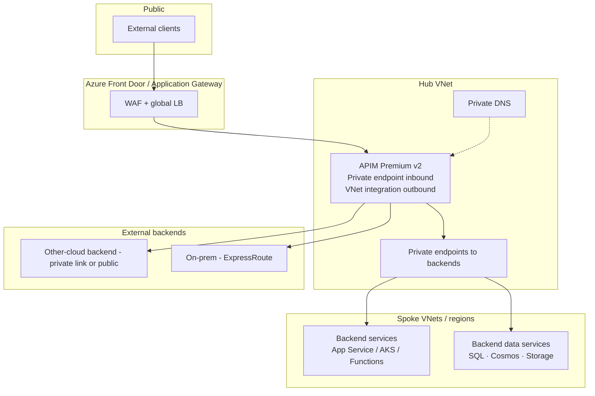

# Guide — Azure API Management as the Universal API Gateway

!!! info "Comparative positioning note"
    This document is written from the
    perspective of Microsoft Azure, Cloud Scale Analytics, and CSA Loom. Any
    description of third-party or competing products, services, pricing, or
    capabilities is derived from **publicly available documentation and sources**
    believed accurate at the time of writing, and is provided for **general
    comparison only**. We do not claim expertise in, or authority over, any
    non-Microsoft product or service; the respective vendor's official
    documentation is the authoritative source for their offerings, which may
    change over time. Nothing here is intended to disparage any vendor — where a
    competing product has genuine advantages, we aim to note them honestly.
    Verify all third-party details against the vendor's current official
    documentation before making decisions.


## What this guide covers

This is the complete operational guide for standing up Azure API Management (APIM) as the universal gateway in an API-first, multi-model, zero-move architecture. By the end, you will know:

1. Which SKU to choose and why
2. How to wire APIM into a hub-spoke network with private endpoints
3. How to integrate Microsoft Entra ID, including Conditional Access and CAE
4. The policy library — including the LLM-specific policies that distinguish APIM from competing gateways
5. How to set up the developer portal and the Purview API catalog integration
6. How to run multi-region with auto-failover
7. When and how to deploy the self-hosted gateway
8. The observability stack, CI/CD posture, and operational playbook

---

## SKU selection

| SKU | Capacity | Multi-region | VNet integration | Use case |
|---|---|---|---|---|
| **Consumption** | Per-call pricing; serverless | No | External / outbound only | Cheap, bursty, dev/test |
| **Developer** | Single instance | No | Yes | Non-production only — no SLA |
| **Basic / Standard** | Tiered | No | Standard supports VNet | Modest production loads |
| **Premium** | Multi-unit, capacity-priced | Yes | Yes (VNet integrated) | Enterprise production |
| **Premium v2** | Multi-unit, capacity-priced, AZ-resilient | Yes (regional active-active) | Yes (improved networking model) | **Default for new production deployments** |

**Recommendation.** Default to **Premium v2** for production. Premium v2 brings availability zones, simpler VNet model (outbound + inbound private endpoint), faster scale, and is the long-term forward path. Use Consumption for dev/test and ephemeral environments.

### Pricing shape

Premium v2 is **capacity-based** — you provision units. Each unit handles a target throughput depending on policy complexity (rough rule: 2,500 RPS for light policies, 1,000 RPS for heavy policies including LLM policies with semantic cache). Scale up/down based on usage.

Comparison to alternatives (figures for competing offerings are illustrative,
drawn from their public pricing pages — verify against current vendor docs):

| Workload | Competitor cloud API gateway | Competitor integration platform | APIM Premium v2 |
|---|---|---|---|
| 10M calls/month, basic auth | low fixed monthly | per-core licensing | Comparable / cheaper |
| 100M calls/month, JWT validation + rate limit | base gateway fee + serverless authorizer add-on | higher | One unit Premium v2 (~$2,000/mo) |
| 1B calls/month, LLM policies | serverless fan-out + NoSQL + search add-ons | build-your-own at runtime cost | Two-three units Premium v2 — competitive |

For high-volume LLM workloads, APIM's bundled policies can reduce the add-on
services other gateways require you to assemble. Validate the comparison for
your own traffic shape.

---

## Network topology



### Key choices

| Choice | Recommendation |
|---|---|
| **Inbound** | Private endpoint on APIM Premium v2; Front Door with WAF for public surface |
| **Outbound** | VNet integrated; route to backends via private endpoints; ExpressRoute for on-prem |
| **DNS** | Azure Private DNS Zones; conditional forwarders for on-prem |
| **TLS** | TLS 1.2 minimum; TLS 1.3 preferred; custom domain via Key Vault certificate |
| **WAF** | Application Gateway WAF v2 or Front Door WAF — choose the layer closest to the consumer |

---

## Identity integration

### Entra ID configuration

1. Register the API as an app in Entra (Application Registration)
2. Define scopes (e.g., `Data.Read`, `Data.Write`, `Admin.Manage`)
3. Issue subscription keys + tokens — both required for most APIs
4. Configure Conditional Access policies on the app, including MFA requirements

### JWT validation policy

```xml
<validate-jwt header-name="Authorization" failed-validation-httpcode="401" require-scheme="Bearer" require-signed-tokens="true">
  <openid-config url="https://login.microsoftonline.com/{tenantId}/v2.0/.well-known/openid-configuration" />
  <required-claims>
    <claim name="aud" match="any">
      <value>api://your-api-app-id</value>
    </claim>
    <claim name="scp" match="any" separator=" ">
      <value>Data.Read</value>
      <value>Data.Write</value>
    </claim>
  </required-claims>
</validate-jwt>
```

For Government / GCC High / DoD, use the boundary-appropriate authority URL (`login.microsoftonline.us` etc.).

### CAE (Continuous Access Evaluation)

CAE-enabled clients re-validate tokens on risk events within minutes. Enable by:

1. Requesting CAE-capable tokens from the client (MSAL with `clientCapabilities: ["CP1"]`)
2. APIM accepts the longer-lived tokens; backend revalidates on demand
3. Token revocation propagates in near real-time when device compliance changes or risk state escalates

### Managed identity for backends

APIM's managed identity asserts to backends without shared secrets:

```xml
<authentication-managed-identity resource="https://yourbackend.azurewebsites.net" />
```

Or for Microsoft Entra-protected services:

```xml
<authentication-managed-identity resource="00000003-0000-0000-c000-000000000000" output-token-variable-name="msi-access-token" ignore-error="false" />
<set-header name="Authorization" exists-action="override">
  <value>@("Bearer " + (string)context.Variables["msi-access-token"])</value>
</set-header>
```

---

## The policy library

### Tier 1 — Identity & authorization

| Policy | Purpose |
|---|---|
| `validate-jwt` | Validate Entra-issued JWT, check audience and scopes |
| `validate-client-certificate` | mTLS for high-assurance flows |
| `authentication-managed-identity` | Assert APIM's managed identity downstream |
| `authentication-basic` | (Avoid; legacy backends only) |

### Tier 2 — Rate limiting & quotas

| Policy | Purpose |
|---|---|
| `rate-limit-by-key` | Per-key, per-subscription, per-IP, per-user limits |
| `quota-by-key` | Long-period quotas (monthly, etc.) |
| `azure-openai-token-limit` | Per-subscription token budget for AOAI traffic |
| `llm-token-limit` | Generic LLM token budget for any model backend |

### Tier 3 — Caching

| Policy | Purpose |
|---|---|
| `cache-lookup` / `cache-store` | Standard HTTP response caching |
| `azure-openai-semantic-cache-lookup` / `store` | Vector-based semantic cache for AOAI |
| `llm-semantic-cache-lookup` / `store` | Generic semantic cache for any LLM model |

### Tier 4 — Transformation

| Policy | Purpose |
|---|---|
| `set-header`, `set-body`, `set-query-parameter` | Modify request/response |
| `set-variable` | Compute values inline |
| `xml-to-json`, `json-to-xml` | Format mediation |
| `set-backend-service` | Route by condition |
| `forward-request` | Send to backend with options |

### Tier 5 — Security

| Policy | Purpose |
|---|---|
| `ip-filter` | Allow / deny by CIDR |
| `validate-content` | Validate body against schema |
| `validate-headers` | Validate header set |
| `validate-parameters` | Validate query / path parameters |
| `check-header` | Quick existence check |
| `cors` | Cross-origin request handling |

### Tier 6 — Observability

| Policy | Purpose |
|---|---|
| `log-to-eventhub` | High-volume custom log emit |
| `trace` | Structured trace into App Insights |
| `emit-metric` | Custom metric to App Insights |
| `azure-openai-emit-token-metric` | Token usage metric per dimension |
| `llm-emit-token-metric` | Generic LLM token usage metric |

### Tier 7 — AI/LLM-specific (the differentiator)

Based on publicly documented capabilities at the time of writing, competing
gateways generally do not ship these as native policies — verify against each
vendor's current docs:

| Policy | Purpose | Typical competitor coverage |
|---|---|---|
| `azure-openai-token-limit` | Per-subscription token throttling | Not native |
| `llm-token-limit` | Same, multi-vendor | Not native |
| `azure-openai-semantic-cache-*` | Vector-based caching | Not native |
| `llm-semantic-cache-*` | Multi-vendor | Not native |
| `llm-content-safety` | Inline content safety | Not native |
| `azure-openai-emit-token-metric` | Token usage telemetry | Build-it |
| `llm-emit-token-metric` | Multi-vendor | Build-it |

These are the policies that make APIM not just an API gateway but a **multi-model LLM router**.

---

## Developer portal

The APIM Developer Portal is included with Standard / Premium / Premium v2. It provides:

- **OpenAPI rendering** with try-it-out
- **Subscription self-service** — developers request access to APIs
- **Documentation hosting** — Markdown pages per API
- **Customizable** via the visual designer or by editing the underlying React app

For enterprise estates, common patterns:

1. **Single portal per environment** — one portal in production, mirroring the API catalog
2. **Branded** — agency / company logos, color scheme, support contact
3. **Federated identity for developers** — Entra B2B / cross-tenant for external developers
4. **Integrated with Purview** — link portal entries to Purview catalog entries; ownership and SLA shown both places

Where the APIM Developer Portal can lag a dedicated API-catalog product from a competitor: discovery UX in very large estates (thousands of APIs). Mitigation: ship a Backstage instance in front of it, pulling APIM + Purview catalogs as data sources.

---

## Multi-region

### Active-active with Front Door

Premium v2 supports multi-region active-active. Pattern:

1. Primary region: APIM Premium v2, full unit count
2. Secondary region: APIM Premium v2, unit count sized for failover
3. Front Door: global load balancing with health probes
4. Backends: regional with private link; replicate state at the data layer (Cosmos DB, geo-replicated SQL, etc.)
5. Automatic failover: Front Door routes around an unhealthy region in seconds
6. Cache: regional; either accept the cold-start on failover or replicate via shared Redis

### When to use multi-region

| Need | Multi-region? |
|---|---|
| RPO < 1 hour | Yes |
| RTO < 5 minutes | Yes |
| Customers in multiple geographies | Yes — regional traffic locality |
| Compliance requires regional isolation | Single-region per boundary |

For federal / sovereign deployments, multi-region typically means multiple regions within a single boundary (e.g., Gov Virginia + Gov Arizona), not cross-boundary.

---

## Self-hosted gateway

The Self-Hosted Gateway runs APIM's data plane as a single container on any K8s, anywhere. Use cases:

- Edge / regional center deployments where data cannot leave
- Other-cloud integration where backends must be reached over a private link
- On-prem mainframe / ERP / EAM systems with REST adapters
- Sovereign / classified boundaries where the managed APIM control plane stays in Azure but the data plane runs inside the boundary

The control plane (APIs, policies, subscriptions, developer portal) stays in Azure-managed APIM. The self-hosted gateway pulls configuration on a schedule. Traffic never leaves the boundary.

Deployment:

```bash
# Helm install on AKS or any K8s
helm install apim-gateway azure-marketplace/azure-api-management-gateway \
  --set gateway.configuration.uri=https://yourservice.management.azure-api.net \
  --set gateway.auth.token=<token>
```

Or as a Docker container:

```bash
docker run -d \
  -p 8080:8080 -p 8081:8081 \
  --name apim-gateway \
  -e config.service.endpoint=yourservice.configuration.azure-api.net \
  -e config.service.auth=GatewayKey... \
  mcr.microsoft.com/azure-api-management/gateway:2
```

---

## Observability

Three pillars, all included:

| Pillar | Mechanism |
|---|---|
| **Metrics** | Azure Monitor metrics — calls, latency, errors, capacity utilization |
| **Logs** | Diagnostic settings → Log Analytics; full request/response logging configurable |
| **Distributed tracing** | Application Insights integration; correlation IDs propagated downstream |

### KQL queries that earn their keep

```kql
// p95 latency per API in last hour
ApiManagementGatewayLogs
| where TimeGenerated > ago(1h)
| summarize p95_latency = percentile(TotalTime, 95) by ApiId
| order by p95_latency desc

// Top consumers by call volume
ApiManagementGatewayLogs
| where TimeGenerated > ago(24h)
| summarize calls = count() by ApimSubscriptionId, ApiId
| top 20 by calls

// LLM token consumption per subscription
customMetrics
| where name == "Total tokens"
| summarize tokens = sum(value) by tostring(customDimensions["subscription-id"]), bin(timestamp, 1h)
| render timechart

// Rate-limit hits in last 24h
ApiManagementGatewayLogs
| where ResponseCode == 429
| summarize count() by ApimSubscriptionId, ApiId
```

These four queries form the basis of the operational dashboard.

---

## CI/CD

APIM is fully Bicep / ARM / Terraform deployable. Recommended pattern:

1. **Configuration in code** — APIs, products, policies, subscriptions, backends all in Bicep
2. **GitOps** — Repo is the source of truth; PR-driven changes
3. **Promotion** — Dev → Test → Prod via pipeline with policy linting
4. **Revisions for hotfixes** — Author in portal, validate, capture back to repo
5. **Versions for breaking changes** — Full version lifecycle in code

A Bicep starter is included in the [Solution Store](../solution-store/index.md) and at [`examples/apim-api-first-starter/`](https://github.com/fgarofalo56/csa-inabox/tree/main/examples/apim-api-first-starter).

---

## Operational playbook

| Event | Response |
|---|---|
| **429 spike on one subscription** | Confirm legitimate use; adjust rate limit if needed; escalate to consumer if abuse |
| **Latency spike on backend** | Check backend health; verify private endpoint connectivity; consider caching tier adjustment |
| **Token-budget exhausted** | Notify FinOps; review consumer's workload; adjust budget if approved |
| **Auth failures spike** | Check Entra health; check Conditional Access changes; check token signing key rotation |
| **Backend pool member ejected** | Confirm circuit breaker triggered correctly; investigate root cause on that member |
| **Self-hosted gateway disconnected from control plane** | Check outbound connectivity; check token expiration; restart pod |

The on-call rotation owns these playbooks. Drilling once per quarter is the discipline that catches gaps.

---

## Related material

- [Best practice — API-first data strategy](../best-practices/api-first-data-strategy.md)
- [Best practice — Multi-model AI orchestration](../best-practices/multi-model-ai-orchestration.md)
- [Guide — APIM + MCP layered orchestration](./apim-mcp-layered-orchestration.md)
- [Guide — APIM as the Unified Gateway for Data Mesh APIs](./apim-data-mesh-gateway.md)
- [Comparison — Azure vs AWS API stack](../comparison/azure-vs-aws-api-stack.md)
- [Comparison — Azure vs MuleSoft Anypoint Platform](../comparison/azure-vs-mulesoft.md)
- [Solution Store — Azure API-first accelerators](../solution-store/index.md)
