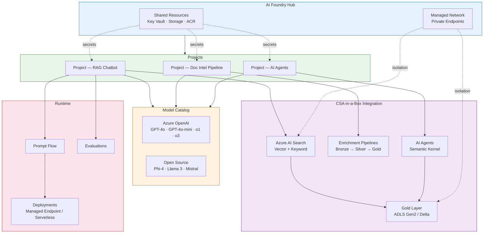
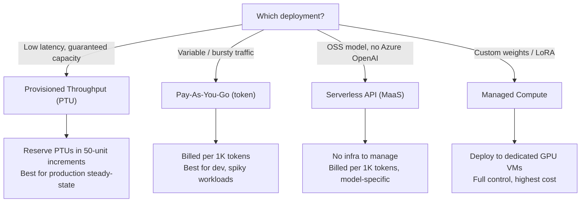
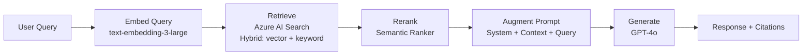
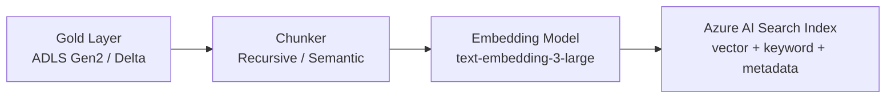
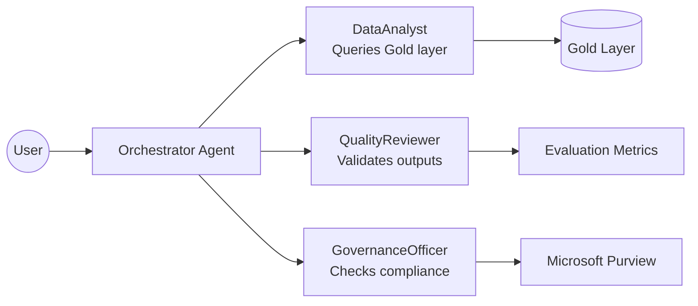
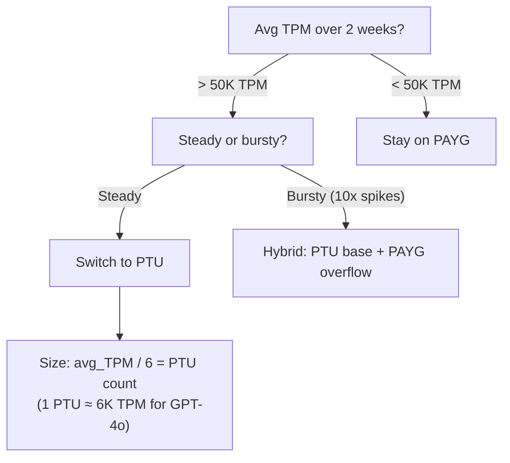
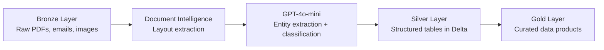

# Azure AI Foundry — Comprehensive Guide

> Architecture, deployment, and operational guide for Azure AI Foundry within the
> CSA-in-a-Box analytics platform.

Azure AI Foundry (formerly Azure AI Studio) is Microsoft's unified platform for
building, evaluating, and deploying generative-AI applications. It consolidates
model access, prompt engineering, evaluation, and responsible-AI tooling into a
single control plane organised around **Hubs** and **Projects**. This guide
covers everything a CSA-in-a-Box team needs to stand up AI workloads on top of
their existing Data Landing Zone.

---

## Architecture Overview



**Key relationships:**

- A **Hub** owns shared infrastructure — Key Vault, Storage, Container Registry,
  and managed networking. One Hub serves many Projects.
- A **Project** is the working boundary for a team or workload. It has its own
  connections, compute, and deployments.
- CSA-in-a-Box's Gold layer feeds AI Search indexes, which ground RAG flows.
  Enrichment pipelines use model endpoints to move data from Bronze to Silver.

---

## Hub & Project Setup

### Hub Creation (Bicep)

```bicep
@description('AI Foundry Hub — shared control plane for all AI projects')
resource aiHub 'Microsoft.MachineLearningServices/workspaces@2024-10-01' = {
  name: '${prefix}-ai-hub'
  location: location
  kind: 'Hub'
  identity: {
    type: 'SystemAssigned'
  }
  properties: {
    friendlyName: 'CSA AI Foundry Hub'
    description: 'Shared hub for CSA-in-a-Box AI workloads'
    keyVaultId: keyVault.id
    storageAccountId: storageAccount.id
    containerRegistryId: containerRegistry.id
    managedNetwork: {
      isolationMode: 'AllowInternetOutbound'   // or 'AllowOnlyApprovedOutbound'
      outboundRules: {
        aoai: {
          type: 'PrivateEndpoint'
          destination: {
            serviceResourceId: openAiAccount.id
            subresourceTarget: 'account'
          }
        }
        search: {
          type: 'PrivateEndpoint'
          destination: {
            serviceResourceId: aiSearch.id
            subresourceTarget: 'searchService'
          }
        }
      }
    }
  }
}
```

### Project Creation

```bicep
resource aiProject 'Microsoft.MachineLearningServices/workspaces@2024-10-01' = {
  name: '${prefix}-ai-rag-project'
  location: location
  kind: 'Project'
  identity: {
    type: 'SystemAssigned'
  }
  properties: {
    friendlyName: 'RAG Chatbot Project'
    hubResourceId: aiHub.id
  }
}
```

### Linked Services

Every Project inherits the Hub's connections but can add its own.

| Service              | Connection Type       | Purpose                                |
| -------------------- | --------------------- | -------------------------------------- |
| Azure OpenAI         | `AzureOpenAI`         | GPT-4o, embeddings                     |
| Azure AI Search      | `CognitiveSearch`     | Vector & keyword index                 |
| ADLS Gen2            | `AzureBlobStorage`    | Gold layer data products               |
| Key Vault            | `AzureKeyVault`       | Secrets — API keys, connection strings |
| Application Insights | `ApplicationInsights` | Telemetry and tracing                  |

### Managed Network Isolation

!!! warning "Production deployments must use managed networking"
For any environment handling sensitive or regulated data, set
`isolationMode` to `AllowOnlyApprovedOutbound` and explicitly approve every
outbound destination via `outboundRules`. `AllowInternetOutbound` is
acceptable only for dev/sandbox.

Managed networking creates a managed VNet behind the Hub. All outbound traffic
from compute (Prompt Flow runtimes, managed endpoints) exits through this VNet.
Private Endpoints declared in `outboundRules` are injected automatically.

---

## Model Catalog

### Azure OpenAI Models

| Model                      | Use Case                                  | Context Window | Strengths                                 |
| -------------------------- | ----------------------------------------- | -------------- | ----------------------------------------- |
| **GPT-4o**                 | General reasoning, RAG generation, agents | 128 K          | Best all-round quality/speed/cost balance |
| **GPT-4o-mini**            | Classification, extraction, high-volume   | 128 K          | 10-15x cheaper than GPT-4o                |
| **o1**                     | Complex reasoning, math, code gen         | 200 K          | Extended thinking for hard problems       |
| **o3**                     | Scientific reasoning, planning            | 200 K          | Highest reasoning ceiling                 |
| **text-embedding-3-large** | Embeddings (1536-3072 dims)               | 8 K            | High recall for vector search             |
| **text-embedding-3-small** | Embeddings (512-1536 dims)                | 8 K            | Cost-effective for large corpora          |

### Open-Source Models (Model-as-a-Service)

| Model                    | Publisher  | Strengths                             | Deployment                        |
| ------------------------ | ---------- | ------------------------------------- | --------------------------------- |
| **Phi-4**                | Microsoft  | Small-model excellence, code, math    | Serverless API                    |
| **Llama 3.1 (8B / 70B)** | Meta       | Multilingual, long context            | Serverless API or Managed Compute |
| **Mistral Large**        | Mistral AI | European compliance, function calling | Serverless API                    |
| **Cohere Command R+**    | Cohere     | RAG-optimised, citation grounding     | Serverless API                    |

### Deployment Options



### Provisioned Throughput vs Pay-Per-Token

| Dimension               | Provisioned Throughput (PTU)   | Pay-As-You-Go (PAYG)            |
| ----------------------- | ------------------------------ | ------------------------------- |
| **Billing**             | Monthly per PTU                | Per 1 K tokens                  |
| **Latency**             | Guaranteed SLA                 | Best-effort, may throttle       |
| **Capacity**            | Reserved, always available     | Shared, subject to quota        |
| **Scale**               | Fixed (must add PTUs)          | Elastic up to quota             |
| **Min commitment**      | 1 month                        | None                            |
| **Best for**            | Production, >50 K TPM          | Dev, spiky, unpredictable loads |
| **Cost at high volume** | Lower per-token effective cost | Higher per-token cost           |

!!! tip "Start with PAYG, graduate to PTU"
Measure your steady-state tokens-per-minute in PAYG for 2-4 weeks. If you
consistently exceed 50 K TPM, a PTU reservation will be cheaper and more
predictable. Use the [Azure OpenAI PTU Calculator](https://oai.azure.com/portal/calculator)
to size your reservation.

---

## Prompt Flow

Prompt Flow is AI Foundry's visual + code-first orchestration engine for LLM
applications. Flows are DAGs of nodes — each node is a Python function, LLM
call, or tool invocation.

### Flow Authoring

Flows can be authored in three ways:

1. **Visual editor** — drag-and-drop in AI Foundry portal
2. **VS Code extension** — local authoring with the Prompt Flow extension
3. **SDK / CLI** — `pfazure` CLI or `promptflow` Python SDK

### RAG Flow Pattern

The canonical RAG flow for CSA-in-a-Box follows retrieve-augment-generate:



**Sample flow node — retrieve from AI Search:**

```python
from promptflow.core import tool
from azure.search.documents import SearchClient
from azure.identity import DefaultAzureCredential

@tool
def retrieve(query_embedding: list[float], top_k: int = 5) -> list[dict]:
    """Hybrid search against the Gold-layer index."""
    client = SearchClient(
        endpoint=os.environ["SEARCH_ENDPOINT"],
        index_name="gold-data-products",
        credential=DefaultAzureCredential(),
    )
    results = client.search(
        search_text=None,
        vector_queries=[{
            "vector": query_embedding,
            "k_nearest_neighbors": top_k,
            "fields": "content_vector",
        }],
        select=["title", "content", "source", "chunk_id"],
        top=top_k,
    )
    return [dict(r) for r in results]
```

### Evaluation Flows

Every RAG flow should have a companion evaluation flow that scores outputs
against a labelled dataset. See the [Evaluations](#evaluations) section for
built-in evaluators.

### CI/CD for Flows

```yaml
# .github/workflows/prompt-flow-ci.yml (excerpt)
- name: Run evaluation
  run: |
      pfazure run create \
        --flow ./flows/rag-chatbot \
        --data ./eval/test-dataset.jsonl \
        --run-name "ci-eval-${{ github.sha }}" \
        --column-mapping query='${data.question}' \
        --stream
- name: Check quality gate
  run: |
      SCORE=$(pfazure run show --name "ci-eval-${{ github.sha }}" \
        --query "properties.metrics.groundedness" -o tsv)
      if (( $(echo "$SCORE < 3.5" | bc -l) )); then
        echo "::error::Groundedness score $SCORE is below threshold 3.5"
        exit 1
      fi
```

### Connection Management

Connections store credentials for external services. They are scoped to a
Project and encrypted at rest in Key Vault.

```bash
# Create an Azure OpenAI connection
pfazure connection create \
  --name aoai-connection \
  --type azure_open_ai \
  --api-base "$AOAI_ENDPOINT" \
  --api-type azure \
  --api-version 2024-06-01
```

---

## RAG with CSA-in-a-Box

This section bridges Tutorial 08 (RAG with Azure AI Search) and the Gold layer
built in Tutorial 01. The pattern: Gold-layer data products are chunked,
embedded, and indexed in Azure AI Search; RAG flows retrieve from those indexes
at query time.

### Indexing Gold-Layer Data Products



**Chunking strategies:**

| Strategy           | Chunk Size      | Overlap    | Best For                         |
| ------------------ | --------------- | ---------- | -------------------------------- |
| **Fixed-size**     | 512 tokens      | 50 tokens  | Uniform docs (CSV descriptions)  |
| **Recursive**      | 512-1024 tokens | 100 tokens | Structured docs (Markdown, HTML) |
| **Semantic**       | Variable        | —          | Long-form reports, legal docs    |
| **Document-level** | Full doc        | —          | Short docs (metadata cards)      |

!!! info "Embedding dimensions matter"
`text-embedding-3-large` supports 256, 1024, 1536, or 3072 dimensions.
CSA-in-a-Box defaults to **1536** for the balance of recall and storage cost.
Use `dimensions=1536` in your embedding call and match the index field
definition.

### Vector Search Configuration

```json
{
    "name": "gold-data-products",
    "fields": [
        { "name": "chunk_id", "type": "Edm.String", "key": true },
        { "name": "title", "type": "Edm.String", "searchable": true },
        { "name": "content", "type": "Edm.String", "searchable": true },
        { "name": "source", "type": "Edm.String", "filterable": true },
        { "name": "domain", "type": "Edm.String", "filterable": true },
        {
            "name": "content_vector",
            "type": "Collection(Edm.Single)",
            "searchable": true,
            "dimensions": 1536,
            "vectorSearchProfile": "hnsw-profile"
        }
    ],
    "vectorSearch": {
        "algorithms": [
            {
                "name": "hnsw-algo",
                "kind": "hnsw",
                "parameters": { "m": 4, "efConstruction": 400, "efSearch": 500 }
            }
        ],
        "profiles": [{ "name": "hnsw-profile", "algorithm": "hnsw-algo" }]
    },
    "semantic": {
        "configurations": [
            {
                "name": "default",
                "prioritizedFields": {
                    "contentFields": [{ "fieldName": "content" }],
                    "titleField": { "fieldName": "title" }
                }
            }
        ]
    }
}
```

### Hybrid Search (Keyword + Vector)

Hybrid search combines BM25 keyword scoring with vector similarity and optional
semantic reranking. This delivers the best recall across both exact-match and
semantic queries.

```python
from azure.search.documents.models import VectorizedQuery

results = search_client.search(
    search_text=user_query,           # keyword leg
    vector_queries=[
        VectorizedQuery(
            vector=query_embedding,   # vector leg
            k_nearest_neighbors=10,
            fields="content_vector",
        )
    ],
    query_type="semantic",
    semantic_configuration_name="default",
    top=5,
)
```

---

## AI Agents

AI agents combine LLM reasoning with tool calling to perform multi-step tasks
autonomously. CSA-in-a-Box uses **Semantic Kernel** as the primary agent
framework (see [ADR-0017](../adr/0017-rag-service-layer.md) for the RAG
service-layer decision and [Tutorial 07](../tutorials/07-agents-foundry-sk/README.md)
for the hands-on walkthrough).

### Semantic Kernel Integration

```python
import semantic_kernel as sk
from semantic_kernel.connectors.ai.open_ai import AzureChatCompletion

kernel = sk.Kernel()
kernel.add_service(AzureChatCompletion(
    deployment_name="gpt-4o",
    endpoint=os.environ["AOAI_ENDPOINT"],
    api_key=os.environ["AOAI_KEY"],       # or use DefaultAzureCredential
))

# Register a plugin that queries Gold-layer data
kernel.add_plugin(DataQueryPlugin(), plugin_name="data_query")
```

### Multi-Agent Patterns



| Agent                 | Role                                  | Tools                             | Grounding Source              |
| --------------------- | ------------------------------------- | --------------------------------- | ----------------------------- |
| **DataAnalyst**       | Query data, generate insights         | `DataQueryPlugin`, SQL, AI Search | Gold-layer tables and indexes |
| **QualityReviewer**   | Validate accuracy, flag hallucination | Evaluation SDK                    | Ground-truth datasets         |
| **GovernanceOfficer** | Check PII, enforce retention          | Purview API, content safety       | Data catalog policies         |

### Function Calling over CSA Data Products

Agents call functions that wrap CSA-in-a-Box services:

```python
from semantic_kernel.functions import kernel_function

class DataQueryPlugin:
    @kernel_function(description="Query a Gold-layer data product by SQL")
    def query_gold(self, sql: str) -> str:
        """Execute a read-only query against the Gold layer."""
        # Validate SQL is SELECT-only
        if not sql.strip().upper().startswith("SELECT"):
            return "Error: only SELECT queries are permitted."
        # Execute against Databricks SQL warehouse or Synapse serverless
        return execute_read_only(sql)
```

---

## Evaluations

AI Foundry provides a built-in evaluation framework to measure RAG and
generation quality. Run evaluations locally, in Prompt Flow, or via CI/CD.

### Built-In Evaluators

| Evaluator        | What It Measures                               | Scale | When to Use              |
| ---------------- | ---------------------------------------------- | ----- | ------------------------ |
| **Groundedness** | Is the answer supported by retrieved context?  | 1-5   | Every RAG flow           |
| **Relevance**    | Does the answer address the question?          | 1-5   | Every RAG flow           |
| **Fluency**      | Is the language natural and readable?          | 1-5   | User-facing outputs      |
| **Coherence**    | Is the answer logically consistent?            | 1-5   | Multi-turn conversations |
| **Similarity**   | How close is the output to a reference answer? | 1-5   | Regression testing       |
| **F1 Score**     | Token-level overlap with reference             | 0-1   | Extractive QA            |

### Running Evaluations

```python
from azure.ai.evaluation import evaluate, GroundednessEvaluator, RelevanceEvaluator

results = evaluate(
    data="eval/test-dataset.jsonl",
    evaluators={
        "groundedness": GroundednessEvaluator(model_config=model_config),
        "relevance": RelevanceEvaluator(model_config=model_config),
    },
    evaluator_config={
        "groundedness": {
            "query": "${data.question}",
            "context": "${data.context}",
            "response": "${data.answer}",
        },
        "relevance": {
            "query": "${data.question}",
            "response": "${data.answer}",
        },
    },
)
print(results.metrics)
# {'groundedness.score': 4.2, 'relevance.score': 4.5}
```

### CI/CD Quality Gates

!!! warning "Never ship a RAG flow without evaluation gates"
Set minimum thresholds for groundedness (>= 3.5) and relevance (>= 3.5) in
your CI pipeline. Flows that fall below these thresholds must not be deployed
to production.

| Metric       | Dev Threshold | Staging Threshold | Prod Threshold |
| ------------ | ------------- | ----------------- | -------------- |
| Groundedness | >= 3.0        | >= 3.5            | >= 4.0         |
| Relevance    | >= 3.0        | >= 3.5            | >= 4.0         |
| Fluency      | >= 3.0        | >= 3.5            | >= 3.5         |
| Coherence    | >= 3.0        | >= 3.5            | >= 3.5         |

---

## Responsible AI

### Content Safety Filters

Azure AI Foundry applies content safety filters to all Azure OpenAI deployments
by default. Filters cover four harm categories (hate, sexual, violence,
self-harm) at configurable severity levels.

| Filter             | Default Level | Customisable | Applies To          |
| ------------------ | ------------- | ------------ | ------------------- |
| Hate & Fairness    | Medium        | Yes          | Prompt + Completion |
| Sexual             | Medium        | Yes          | Prompt + Completion |
| Violence           | Medium        | Yes          | Prompt + Completion |
| Self-Harm          | Medium        | Yes          | Prompt + Completion |
| Prompt Shields     | On            | Yes          | Prompt only         |
| Protected Material | On            | Limited      | Completion only     |

### Purview DSPM for AI

Microsoft Purview Data Security Posture Management (DSPM) for AI monitors
interactions with generative-AI services:

- **Sensitive data detection** — identifies PII, PHI, and classified data in
  prompts and completions
- **Oversharing alerts** — flags when sensitive data is sent to AI endpoints
- **Activity explorer** — audit trail of all AI interactions
- **DLP policies** — block or warn when prompts contain regulated data

### Prompt Shields & Jailbreak Detection

Prompt Shields detect two attack vectors:

1. **Direct attacks (jailbreaks)** — user attempts to override system instructions
2. **Indirect attacks (XPIA)** — injected instructions in retrieved documents

```python
from azure.ai.contentsafety import ContentSafetyClient

client = ContentSafetyClient(endpoint, credential)
response = client.analyze_text({
    "text": user_prompt,
    "categories": ["Hate", "Violence", "Sexual", "SelfHarm"],
    "blocklistNames": ["custom-blocked-terms"],
})
# Check response.categoriesAnalysis for severity scores
```

---

## Cost Management

### Token Consumption Tracking

Track token usage at multiple levels:

1. **Per-deployment** — Azure Monitor metrics (`ProcessedPromptTokens`,
   `GeneratedCompletionTokens`)
2. **Per-request** — `usage` field in API response (`prompt_tokens`,
   `completion_tokens`)
3. **Per-project** — aggregate via Application Insights custom dimensions

```kusto
// KQL — daily token consumption by deployment
AzureDiagnostics
| where ResourceProvider == "MICROSOFT.COGNITIVESERVICES"
| where Category == "RequestResponse"
| extend promptTokens = toint(properties_s.promptTokens)
| extend completionTokens = toint(properties_s.completionTokens)
| summarize TotalPrompt=sum(promptTokens),
            TotalCompletion=sum(completionTokens)
    by bin(TimeGenerated, 1d), deploymentName=tostring(properties_s.modelDeploymentName)
| order by TimeGenerated desc
```

### PTU vs PAYG Decision Tree



### Quota Management

!!! info "Request quota increases early"
Azure OpenAI quotas are per-subscription, per-region. For production
workloads, request increases at least 2 weeks before go-live via the Azure
Portal (Azure OpenAI > Quotas) or by filing a support request.

### Model Retirement Planning

Azure OpenAI models follow a published retirement schedule. CSA-in-a-Box teams
should:

1. Subscribe to the [Azure OpenAI model deprecation page](https://learn.microsoft.com/en-us/azure/ai-services/openai/concepts/model-retirements)
2. Maintain a `model_config` abstraction (never hard-code model names)
3. Test new model versions in a staging Project before promoting
4. Allow at least 4 weeks for migration and evaluation before retirement date

---

## Security

### Managed Identity for Model Access

!!! tip "Always prefer managed identity over API keys"
API keys are a shared secret. Managed identity eliminates key rotation
burden and reduces blast radius if a credential leaks.

```bicep
// Grant the AI Project's managed identity access to Azure OpenAI
resource roleAssignment 'Microsoft.Authorization/roleAssignments@2022-04-01' = {
  scope: openAiAccount
  name: guid(aiProject.id, openAiAccount.id, cognitiveServicesUserRole)
  properties: {
    principalId: aiProject.identity.principalId
    roleDefinitionId: cognitiveServicesUserRole   // Cognitive Services OpenAI User
    principalType: 'ServicePrincipal'
  }
}
```

### Private Endpoints

All AI Foundry services should be reachable only over Private Endpoints in
production. The Hub's managed network handles this when `isolationMode` is set
to `AllowOnlyApprovedOutbound`.

| Service            | Private Endpoint Sub-Resource | Required |
| ------------------ | ----------------------------- | -------- |
| Azure OpenAI       | `account`                     | Yes      |
| Azure AI Search    | `searchService`               | Yes      |
| ADLS Gen2          | `blob`, `dfs`                 | Yes      |
| Key Vault          | `vault`                       | Yes      |
| Container Registry | `registry`                    | Yes      |

### RBAC Roles

| Role                                       | Scope          | Grants                                          |
| ------------------------------------------ | -------------- | ----------------------------------------------- |
| **Azure AI Developer**                     | Project        | Create deployments, run flows, view evaluations |
| **Azure AI Inference Deployment Operator** | Project        | Deploy and manage model endpoints               |
| **Cognitive Services OpenAI User**         | OpenAI Account | Call model endpoints (chat, embeddings)         |
| **Cognitive Services OpenAI Contributor**  | OpenAI Account | Create deployments, manage fine-tunes           |
| **Search Index Data Contributor**          | AI Search      | Read/write index data                           |
| **Reader**                                 | Hub            | View Hub resources (no modifications)           |

### API Key Rotation

If API keys must be used (non-production, external integrations):

1. Store keys in Key Vault, never in code or environment variables
2. Rotate keys every 90 days
3. Use Key Vault's expiration and notification policies
4. After rotation, update all connections in AI Foundry via `pfazure connection update`

---

## CSA-in-a-Box Integration Patterns

### Enrichment Pipeline — AI-Powered Bronze-to-Silver

Use AI models to extract structured data from unstructured Bronze-layer
documents.



**Example — extract entities from regulatory filings:**

```python
from azure.ai.documentintelligence import DocumentIntelligenceClient

client = DocumentIntelligenceClient(endpoint, credential)
poller = client.begin_analyze_document(
    "prebuilt-layout",
    body={"urlSource": bronze_blob_url},
)
result = poller.result()

# Pass extracted text to GPT-4o-mini for entity extraction
entities = extract_entities(result.content, model="gpt-4o-mini")
write_to_silver(entities, table="regulatory_entities")
```

### Classification Pipeline

Classify incoming documents or records into domain categories using
few-shot prompting:

```python
system_prompt = """Classify the document into exactly one category:
- financial_report
- regulatory_filing
- correspondence
- technical_specification
Respond with JSON: {"category": "...", "confidence": 0.0-1.0}"""

response = client.chat.completions.create(
    model="gpt-4o-mini",
    messages=[
        {"role": "system", "content": system_prompt},
        {"role": "user", "content": document_text[:4000]},
    ],
    response_format={"type": "json_object"},
    temperature=0,
)
```

### Summarization Pipeline

Generate concise summaries of Gold-layer data products for the data catalog:

```python
summary = client.chat.completions.create(
    model="gpt-4o-mini",
    messages=[
        {"role": "system", "content": (
            "Summarize the dataset in 2-3 sentences for a data catalog. "
            "Include: what the data represents, time range, key fields, "
            "and number of records."
        )},
        {"role": "user", "content": dataset_description},
    ],
    max_tokens=200,
    temperature=0.3,
)
```

---

## Anti-Patterns

| Anti-Pattern            | Why It Fails                        | Do This Instead                                                    |
| ----------------------- | ----------------------------------- | ------------------------------------------------------------------ |
| Hard-coding model names | Model retirements break production  | Use a `model_config` mapping, abstracted behind env vars           |
| Skipping evaluations    | Silent quality degradation          | Run evaluation flows in CI; enforce quality gates                  |
| Single large index      | Slow queries, poor relevance        | Create domain-specific indexes (one per data product family)       |
| API keys in code        | Security incident waiting to happen | Managed identity + Key Vault references                            |
| No chunking strategy    | Retrieval quality is random         | Match chunk size to content type; test with eval datasets          |
| Ignoring content safety | Compliance and reputational risk    | Keep default filters; add custom blocklists for domain terms       |
| PTU over-provisioning   | Wasted spend                        | Start with PAYG, size PTUs from 2+ weeks of usage data             |
| Monolithic Prompt Flow  | Untestable, hard to debug           | Small flows with single-responsibility nodes; compose via subflows |

---

## Pre-Flight Checklist

**Before deploying an AI workload to production:**

- [ ] Hub uses `AllowOnlyApprovedOutbound` isolation mode
- [ ] All services reachable via Private Endpoints only
- [ ] Managed identity used for all service-to-service auth (no API keys)
- [ ] RBAC roles assigned at minimum scope (Project, not Subscription)
- [ ] Content safety filters configured and tested
- [ ] Evaluation flow exists with quality gates in CI/CD
- [ ] Groundedness >= 4.0 and Relevance >= 4.0 on production eval dataset
- [ ] Token consumption alerts configured in Azure Monitor
- [ ] Model retirement dates tracked; migration plan documented
- [ ] Prompt Shields enabled for all user-facing endpoints
- [ ] PII detection enabled via Purview DSPM for AI
- [ ] Disaster recovery: Hub and Projects exist in paired region (or redeployable via IaC)
- [ ] Data products indexed with appropriate chunking strategy and tested recall

---

## Related Resources

### CSA-in-a-Box Tutorials

- [Tutorial 06 — AI-First Analytics with Azure AI Foundry](../tutorials/06-ai-analytics-foundry/README.md)
- [Tutorial 07 — Building AI Agents with Semantic Kernel](../tutorials/07-agents-foundry-sk/README.md)
- [Tutorial 08 — RAG with Azure AI Search](../tutorials/08-rag-vector-search/README.md)
- [Tutorial 09 — GraphRAG Knowledge Graphs](../tutorials/09-graphrag-knowledge/README.md)

### CSA-in-a-Box Architecture Decisions

- [ADR-0007 — Azure OpenAI over Self-Hosted LLM](../adr/0007-azure-openai-over-self-hosted-llm.md)
- [ADR-0017 — RAG Service-Layer Extraction](../adr/0017-rag-service-layer.md)
- [RAG vs Fine-Tuning vs Agents](../decisions/rag-vs-finetune-vs-agents.md)

### Microsoft Documentation

- [Azure AI Foundry documentation](https://learn.microsoft.com/en-us/azure/ai-studio/)
- [Azure OpenAI Service](https://learn.microsoft.com/en-us/azure/ai-services/openai/)
- [Azure AI Search — vector search](https://learn.microsoft.com/en-us/azure/search/vector-search-overview)
- [Prompt Flow documentation](https://learn.microsoft.com/en-us/azure/ai-studio/how-to/prompt-flow)
- [Responsible AI overview](https://learn.microsoft.com/en-us/azure/ai-services/openai/concepts/content-filter)
- [Model retirements and deprecations](https://learn.microsoft.com/en-us/azure/ai-services/openai/concepts/model-retirements)
