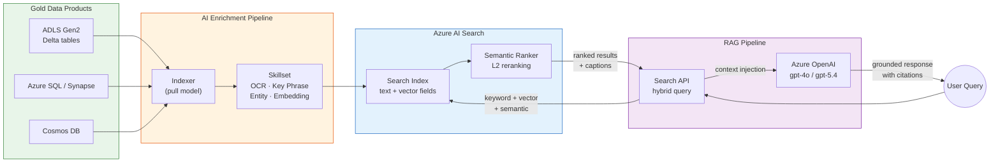
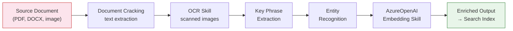
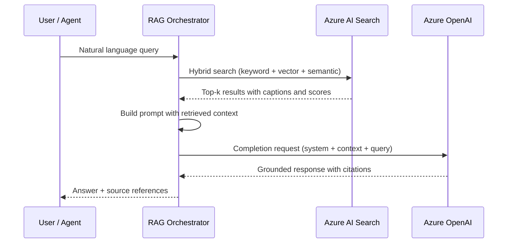

# Azure AI Search

## Overview

Azure AI Search (formerly Azure Cognitive Search) is the **vector and hybrid search
engine** that powers every Retrieval-Augmented Generation (RAG) pattern in CSA-in-a-Box.
It sits between the curated Gold data products in the medallion lakehouse and the Azure
OpenAI models that generate grounded, citation-backed responses for end users, agents,
and copilots.

In the CSA-in-a-Box architecture, AI Search serves three primary roles:

| Role                       | What It Provides                                                                                             |
| -------------------------- | ------------------------------------------------------------------------------------------------------------ |
| **Vector store**           | High-dimensional embedding index for semantic similarity search over Gold data products                      |
| **Hybrid search engine**   | Combined keyword, vector, and semantic ranking in a single query — maximizing recall and precision           |
| **AI enrichment pipeline** | Built-in and custom skillsets that extract text (OCR), key phrases, entities, and embeddings during indexing |

Unlike a standalone vector database, AI Search delivers **full-text search, faceted
navigation, geo-spatial queries, and L2 semantic reranking** alongside vector similarity
— making it the natural choice when RAG workloads coexist with traditional search
experiences.

!!! tip "Related Resources"
| Resource | Purpose |
|----------|---------|
| [Tutorial 08 — RAG with Azure AI Search](../tutorials/08-rag-vector-search/README.md) | Hands-on lab: build an end-to-end RAG pipeline |
| [Tutorial 06 — AI Analytics Foundry](../tutorials/06-ai-analytics-foundry/README.md) | Azure OpenAI provisioning and embedding model setup |
| [Tutorial 07 — AI Agents with Semantic Kernel](../tutorials/07-agents-foundry-sk/README.md) | Semantic Kernel retrieval plugin for AI agents |
| [Tutorial 09 — GraphRAG Knowledge](../tutorials/09-graphrag-knowledge/README.md) | Graph-based RAG for complex knowledge extraction |
| [RAG vs Fine-tune vs Agents](../decisions/rag-vs-finetune-vs-agents.md) | Decision tree for choosing the right AI pattern |
| [Azure OpenAI ADR](../adr/0007-azure-openai-over-self-hosted-llm.md) | Why CSA-in-a-Box standardizes on Azure OpenAI |
| [Security & Compliance](../best-practices/security-compliance.md) | Network isolation and Zero Trust patterns |

---

## Architecture

The following diagram shows how Azure AI Search fits into the CSA-in-a-Box data and AI
pipeline — from Gold data products through indexing and enrichment to RAG-powered
responses.



---

## Index Design

A well-designed index is the foundation of every search and RAG workload. CSA-in-a-Box
indexes follow a consistent pattern that separates content fields, metadata fields, and
vector fields.

### Field Types

| EDM Type                  | Purpose                        | Example                              |
| ------------------------- | ------------------------------ | ------------------------------------ |
| `Edm.String`              | Full-text searchable content   | `content`, `title`, `summary`        |
| `Collection(Edm.Single)`  | Dense vector embedding         | `content_vector` (1536 or 3072 dims) |
| `Edm.Int32` / `Edm.Int64` | Numeric filters and facets     | `year`, `page_number`                |
| `Edm.DateTimeOffset`      | Temporal filters               | `published_date`, `last_modified`    |
| `Edm.Boolean`             | Binary filters                 | `is_public`, `is_active`             |
| `Edm.GeographyPoint`      | Geo-spatial search             | `location`                           |
| `Collection(Edm.String)`  | Multi-value filters and facets | `tags`, `categories`                 |

### Analyzers

Analyzers control how text is tokenized and normalized at index and query time.

| Analyzer          | When to Use                                                                     |
| ----------------- | ------------------------------------------------------------------------------- |
| `standard.lucene` | Default for general English content — tokenizes, lowercases, removes stop words |
| `keyword`         | Exact-match fields like IDs, codes, or status values — no tokenization          |
| `en.microsoft`    | English content requiring stemming and lemmatization                            |
| `en.lucene`       | Lighter English analysis — good balance of precision and recall                 |
| Custom analyzer   | Domain-specific tokenization (e.g., hyphenated part numbers, legal citations)   |

!!! info "Index vs Search Analyzer"
You can set different analyzers for indexing and querying. Use a broader analyzer at
index time (e.g., `en.microsoft` with stemming) and a stricter analyzer at query time
to reduce false positives for exact-match requirements.

### Scoring Profiles

Scoring profiles let you boost relevance based on field weights, freshness, distance, or
tag matching — without changing the query itself.

```json
{
    "scoringProfiles": [
        {
            "name": "recency-boosted",
            "text": {
                "weights": {
                    "title": 3.0,
                    "summary": 2.0,
                    "content": 1.0
                }
            },
            "functions": [
                {
                    "type": "freshness",
                    "fieldName": "published_date",
                    "boost": 2.0,
                    "parameters": {
                        "boostingDuration": "P365D"
                    },
                    "interpolation": "linear"
                }
            ]
        }
    ],
    "defaultScoringProfile": "recency-boosted"
}
```

### Vector Search Configuration

Azure AI Search supports two algorithm families for approximate nearest neighbor (ANN)
search on vector fields.

| Algorithm                                     | Latency                  | Recall         | Memory | Best For                                      |
| --------------------------------------------- | ------------------------ | -------------- | ------ | --------------------------------------------- |
| **HNSW** (Hierarchical Navigable Small World) | Low (sub-50 ms)          | High (95-99%)  | Higher | Production workloads — default recommendation |
| **Exhaustive KNN**                            | Higher (scales linearly) | Perfect (100%) | Lower  | Small indexes or ground-truth evaluation      |

```json
{
    "vectorSearch": {
        "algorithms": [
            {
                "name": "hnsw-config",
                "kind": "hnsw",
                "hnswParameters": {
                    "m": 4,
                    "efConstruction": 400,
                    "efSearch": 500,
                    "metric": "cosine"
                }
            }
        ],
        "profiles": [
            {
                "name": "vector-profile",
                "algorithmConfigurationName": "hnsw-config",
                "vectorizer": "openai-vectorizer"
            }
        ],
        "vectorizers": [
            {
                "name": "openai-vectorizer",
                "kind": "azureOpenAI",
                "azureOpenAIParameters": {
                    "resourceUri": "https://<your-aoai>.openai.azure.com",
                    "deploymentId": "text-embedding-3-large",
                    "modelName": "text-embedding-3-large",
                    "apiKey": "<managed-identity-preferred>"
                }
            }
        ]
    }
}
```

!!! warning "HNSW Tuning"
Higher `m` and `efConstruction` values improve recall but increase index build time
and memory consumption. Start with the defaults (`m=4`, `efConstruction=400`) and
tune only when recall metrics from your evaluation set demand it.

---

## Indexing

### Push vs Pull Model

Azure AI Search supports two indexing strategies. CSA-in-a-Box uses both depending on
the data source and latency requirements.

| Model               | Mechanism                                             | Best For                                                                               |
| ------------------- | ----------------------------------------------------- | -------------------------------------------------------------------------------------- |
| **Pull (Indexer)**  | Scheduled crawler connects to a supported data source | Batch ingestion from ADLS, SQL, Cosmos DB — the primary pattern for Gold data products |
| **Push (SDK/REST)** | Application calls the Index Documents API directly    | Real-time updates, custom chunking pipelines, streaming scenarios                      |

### Indexers for Common Data Sources

| Data Source         | Connector                | Notes                                                                          |
| ------------------- | ------------------------ | ------------------------------------------------------------------------------ |
| ADLS Gen2           | `azureblob` / `adlsgen2` | Parses PDF, DOCX, PPTX, JSON, CSV, and plain text; supports hierarchical paths |
| Azure SQL           | `azuresql`               | High-watermark or SQL integrated change tracking for incremental indexing      |
| Cosmos DB           | `cosmosdb`               | Change feed for near-real-time incremental indexing                            |
| Azure Table Storage | `azuretable`             | Simple key-value lookups                                                       |
| SharePoint Online   | `sharepoint`             | Enterprise document libraries (requires app registration)                      |

### AI Enrichment Pipeline (Skillsets)

Skillsets attach to an indexer and run a sequence of built-in or custom skills over each
document during indexing. This is how CSA-in-a-Box extracts structured data and
embeddings from unstructured Gold assets.



**Built-in skills used in CSA-in-a-Box:**

| Skill                  | Purpose                                                    |
| ---------------------- | ---------------------------------------------------------- |
| OCR                    | Extracts text from scanned images and image-based PDFs     |
| Key Phrase Extraction  | Identifies dominant terms for faceted search               |
| Entity Recognition     | Detects people, organizations, locations, dates            |
| Language Detection     | Routes content to the correct language analyzer            |
| Text Split             | Chunks large documents for embedding generation            |
| Azure OpenAI Embedding | Generates `text-embedding-3-large` vectors during indexing |

**Custom skills** can be added via Azure Functions to run domain-specific enrichment
(e.g., legal citation parsing, classification models, PII redaction).

### Change Detection and Incremental Enrichment

| Strategy               | How It Works                                                                                                          |
| ---------------------- | --------------------------------------------------------------------------------------------------------------------- |
| High-watermark         | Indexer tracks a monotonically increasing column (e.g., `last_modified`) and only processes new/changed rows          |
| SQL change tracking    | Uses SQL Server integrated change tracking for row-level deltas                                                       |
| Cosmos DB change feed  | Captures inserts and updates automatically via the Cosmos DB change feed                                              |
| Soft delete            | Detects a designated column value (e.g., `is_deleted = true`) and removes documents from the index                    |
| Incremental enrichment | Caches skillset outputs in a knowledge store; re-enriches only changed documents — saves Azure OpenAI embedding costs |

!!! tip "Enable Incremental Enrichment"
Attach a knowledge store (Azure Blob container) to your skillset to enable caching.
This avoids re-running expensive embedding generation on documents that have not
changed — a significant cost saver on large indexes.

---

## Vector Search

### Embedding Generation

CSA-in-a-Box standardizes on **Azure OpenAI `text-embedding-3-large`** for embedding
generation. This model produces 3072-dimensional vectors and supports dimensionality
reduction via the `dimensions` parameter.

| Model                    | Dimensions     | Max Tokens | Notes                                                           |
| ------------------------ | -------------- | ---------- | --------------------------------------------------------------- |
| `text-embedding-3-large` | 3072 (default) | 8,191      | Highest quality; recommended for RAG                            |
| `text-embedding-3-large` | 1536 (reduced) | 8,191      | 50% storage savings with minimal quality loss                   |
| `text-embedding-3-small` | 1536           | 8,191      | Lower cost; suitable for high-volume, lower-precision use cases |

```python
from openai import AzureOpenAI

client = AzureOpenAI(
    azure_endpoint="https://<your-aoai>.openai.azure.com",
    api_version="2024-10-21",
    azure_ad_token_provider=token_provider,  # managed identity
)

response = client.embeddings.create(
    input=["CSA-in-a-Box Gold data product: enforcement summary"],
    model="text-embedding-3-large",
    dimensions=3072,
)

vector = response.data[0].embedding  # List[float] of length 3072
```

### Hybrid Search (Keyword + Vector + Semantic Ranking)

Hybrid search is the **default query mode** for CSA-in-a-Box RAG pipelines. It combines
three retrieval strategies in a single request to maximize both recall and precision.

| Stage                   | Mechanism                         | What It Does                                                               |
| ----------------------- | --------------------------------- | -------------------------------------------------------------------------- |
| **1. Keyword**          | BM25 full-text search             | Exact and stemmed term matching — catches acronyms, proper nouns, IDs      |
| **2. Vector**           | HNSW approximate nearest neighbor | Semantic similarity — catches paraphrases and related concepts             |
| **3. Semantic Ranking** | Cross-encoder L2 reranker         | Reranks the merged result set using a transformer model for deep relevance |

```python
from azure.search.documents import SearchClient
from azure.search.documents.models import VectorizableTextQuery

search_client = SearchClient(
    endpoint="https://<your-search>.search.windows.net",
    index_name="csa-gold-index",
    credential=credential,
)

results = search_client.search(
    search_text="antitrust enforcement actions 2025",
    vector_queries=[
        VectorizableTextQuery(
            text="antitrust enforcement actions 2025",
            k_nearest_neighbors=50,
            fields="content_vector",
        )
    ],
    query_type="semantic",
    semantic_configuration_name="csa-semantic-config",
    top=5,
    select=["title", "content", "source_url", "published_date"],
)

for result in results:
    print(f"[{result['@search.reranker_score']:.2f}] {result['title']}")
    print(f"  Caption: {result['@search.captions'][0].text}")
```

### Integrated Vectorization

With integrated vectorization, Azure AI Search generates embeddings at both index time
and query time — eliminating the need for client-side embedding calls.

| Benefit                       | Description                                                               |
| ----------------------------- | ------------------------------------------------------------------------- |
| No client-side embedding code | The search service calls Azure OpenAI directly                            |
| Consistent model version      | Index-time and query-time embeddings always use the same model deployment |
| Simplified pipeline           | Fewer moving parts in the ingestion and query paths                       |

Configure integrated vectorization by adding a `vectorizer` to your vector search
profile (see the index definition in the [Vector Search Configuration](#vector-search-configuration)
section above).

---

## Semantic Ranking

Semantic ranking adds a **transformer-based L2 reranking** stage on top of keyword and
vector results. It is the single most impactful feature for RAG relevance in
CSA-in-a-Box.

### Configuration

```json
{
    "semantic": {
        "configurations": [
            {
                "name": "csa-semantic-config",
                "prioritizedFields": {
                    "titleField": { "fieldName": "title" },
                    "contentFields": [{ "fieldName": "content" }],
                    "keywordsFields": [{ "fieldName": "tags" }]
                }
            }
        ]
    }
}
```

### Capabilities

| Feature               | Description                                                                                |
| --------------------- | ------------------------------------------------------------------------------------------ |
| **L2 reranking**      | Cross-encoder reranks the top 50 results from the L1 retrieval stage for deeper relevance  |
| **Semantic captions** | Extracts the most relevant passage from each document — ideal for RAG context injection    |
| **Semantic answers**  | Returns a direct extractive answer when the query has a clear factual answer in the corpus |

!!! info "Semantic Ranking Limits"
Semantic ranking reranks up to 50 results per query. It is available on Basic tier
and above (free tier includes a limited number of semantic queries per month). See
the [Cost](#cost) section for pricing details.

---

## RAG Integration

### Retrieval Pipeline

The CSA-in-a-Box RAG pipeline follows a four-step pattern for every user query.



### Prompt Engineering with Search Results

Structure your system prompt to clearly separate instructions, retrieved context, and
the user question. This pattern prevents hallucination and enables citation tracking.

```text
## Instructions
You are a data analyst assistant for the CSA-in-a-Box platform.
Answer the user's question using ONLY the provided context.
If the context does not contain enough information, say so.
Cite sources using [Source N] notation.

## Context

[Source {{ loop.index }}] ({{ doc.source_url }})
{{ doc.content }}


## Question
{{ user_query }}
```

### Citation and Grounding Patterns

| Pattern                    | Description                                                                                                           |
| -------------------------- | --------------------------------------------------------------------------------------------------------------------- |
| **Inline citations**       | `[Source 1]` markers in the response text, mapped to search result metadata                                           |
| **Confidence filtering**   | Discard results below a reranker score threshold (e.g., `@search.reranker_score < 1.0`)                               |
| **Chunk overlap**          | Use overlapping text chunks (e.g., 128-token overlap on 512-token chunks) to preserve context across chunk boundaries |
| **Multi-index federation** | Query multiple indexes (e.g., policies + case law) and merge results before prompt injection                          |

### Semantic Kernel Retrieval Plugin

CSA-in-a-Box provides a Semantic Kernel retrieval plugin that wraps Azure AI Search as
a native Kernel function. This is the recommended integration point for AI agents and
copilots built in Tutorial 07.

```csharp
// Semantic Kernel — Azure AI Search plugin registration
using Microsoft.SemanticKernel;
using Microsoft.SemanticKernel.Plugins.Memory;

var kernel = Kernel.CreateBuilder()
    .AddAzureOpenAIChatCompletion("gpt-4o", endpoint, credential)
    .Build();

var searchPlugin = new AzureAISearchPlugin(
    searchEndpoint: "https://<your-search>.search.windows.net",
    indexName: "csa-gold-index",
    credential: credential,
    semanticConfigurationName: "csa-semantic-config"
);

kernel.ImportPluginFromObject(searchPlugin, "SearchPlugin");

// The agent can now call SearchPlugin.Search() as a native function
var result = await kernel.InvokePromptAsync(
    "{{SearchPlugin.Search $query}} Answer: {{$query}}",
    new KernelArguments { ["query"] = "What enforcement actions occurred in 2025?" }
);
```

!!! tip "Cross-Reference: Agent Tutorials"
See [Tutorial 07 — AI Agents with Semantic Kernel](../tutorials/07-agents-foundry-sk/README.md)
for the full agent implementation and
[Tutorial 08 — RAG with Azure AI Search](../tutorials/08-rag-vector-search/README.md)
for the step-by-step RAG pipeline lab.

---

## Security

### Authentication and Authorization

| Method                          | When to Use                                                                                                                         |
| ------------------------------- | ----------------------------------------------------------------------------------------------------------------------------------- |
| **Azure AD RBAC (recommended)** | Production — assign `Search Index Data Reader`, `Search Index Data Contributor`, or `Search Service Contributor` roles via Entra ID |
| **API keys**                    | Development and quick prototyping only — rotate regularly, never embed in client code                                               |

!!! warning "Avoid API Keys in Production"
API keys grant full access to all indexes on the service. Use Azure AD RBAC with
least-privilege role assignments for every production workload. Managed identity
eliminates the need to store credentials entirely.

### Index-Level Security

Azure AI Search does not support native index-level RBAC. To isolate tenants or
workloads, use one of these strategies:

| Strategy          | Description                                                                   |
| ----------------- | ----------------------------------------------------------------------------- |
| Separate indexes  | One index per tenant or security boundary — simplest to reason about          |
| Separate services | Complete network and data isolation — required for IL4/IL5 FedRAMP boundaries |

### Document-Level Security Filters

For row-level access control within a shared index, add a security filter field and
enforce it on every query.

```python
# Index field: "allowed_groups": Collection(Edm.String), filterable
results = search_client.search(
    search_text="budget allocation",
    filter="allowed_groups/any(g: g eq 'finance-team')",
    vector_queries=[...],
    query_type="semantic",
    semantic_configuration_name="csa-semantic-config",
)
```

!!! danger "Always Enforce Security Filters Server-Side"
Never rely on the client to append security filters. Enforce them in your API
middleware or backend service so that no query can bypass document-level access
control.

### Managed Identity for Indexer Connections

Configure indexer data source connections with managed identity to eliminate stored
credentials for ADLS Gen2, Azure SQL, and Cosmos DB.

```json
{
    "name": "adls-gold-datasource",
    "type": "adlsgen2",
    "credentials": {
        "connectionString": null
    },
    "identity": {
        "@odata.type": "#Microsoft.Azure.Search.DataSourceManagedIdentity",
        "userAssignedIdentity": "/subscriptions/<sub>/resourceGroups/<rg>/providers/Microsoft.ManagedIdentity/userAssignedIdentities/<identity>"
    },
    "container": {
        "name": "gold",
        "query": "data-products/"
    }
}
```

### Private Endpoints

For network-isolated deployments (common in government and regulated industries),
deploy Azure AI Search with a Private Endpoint and disable public network access.

| Component                          | Private Endpoint Target      |
| ---------------------------------- | ---------------------------- |
| Search service                     | `searchService` sub-resource |
| Indexer → ADLS Gen2                | `blob` or `dfs` sub-resource |
| Indexer → Azure SQL                | `sqlServer` sub-resource     |
| Indexer → Cosmos DB                | `Sql` sub-resource           |
| Search → Azure OpenAI (vectorizer) | `account` sub-resource       |

---

## Performance

### Partition and Replica Sizing

| Dimension      | Purpose                                  | Guidance                                                             |
| -------------- | ---------------------------------------- | -------------------------------------------------------------------- |
| **Replicas**   | Query throughput and high availability   | Start with 2 for HA; scale up for QPS                                |
| **Partitions** | Storage capacity and indexing throughput | Each partition adds ~25 GB (Standard) or ~100 GB (Storage Optimized) |

!!! info "SLA Requires Replicas"
Azure AI Search SLA for queries requires **2+ replicas**. For read-write SLA
(queries + indexing), you need **3+ replicas**.

### Index Optimization

| Technique                                                   | Impact                                                                   |
| ----------------------------------------------------------- | ------------------------------------------------------------------------ |
| Disable `retrievable` on large fields not needed in results | Reduces response payload size                                            |
| Use `filterable` and `sortable` only on fields that need it | Reduces index storage                                                    |
| Reduce vector dimensions (e.g., 3072 to 1536)               | Halves vector storage with minimal recall loss                           |
| Use `stored: false` on vector fields                        | Saves storage when you only need similarity search, not vector retrieval |

### Query Performance Tuning

| Technique                   | Description                                                               |
| --------------------------- | ------------------------------------------------------------------------- |
| Narrow `select` clause      | Return only the fields your application needs                             |
| Use `$filter` before search | Pre-filter narrows the candidate set before BM25 and vector scoring       |
| Limit `top` and `skip`      | Deep pagination is expensive — use `search_after` for cursor-based paging |
| Warm the index              | Run a representative query set after deployment to prime caches           |

---

## Cost

### Service Tiers

| Tier                     | Max Indexes | Storage          | Vector Dims  | Semantic Ranker       | Price Range (est.) |
| ------------------------ | ----------- | ---------------- | ------------ | --------------------- | ------------------ |
| **Free**                 | 3           | 50 MB            | Limited      | Limited queries/month | $0                 |
| **Basic**                | 15          | 2 GB             | Full support | Included              | ~$75/mo            |
| **Standard S1**          | 50          | 25 GB/partition  | Full support | Included              | ~$250/mo           |
| **Standard S2**          | 200         | 100 GB/partition | Full support | Included              | ~$1,000/mo         |
| **Standard S3**          | 200         | 200 GB/partition | Full support | Included              | ~$2,000/mo         |
| **Storage Optimized L1** | 10          | 1 TB/partition   | Full support | Included              | ~$2,500/mo         |
| **Storage Optimized L2** | 10          | 2 TB/partition   | Full support | Included              | ~$5,000/mo         |

!!! tip "Start Small"
Most CSA-in-a-Box pilots start on **Basic** or **Standard S1**. You can scale
partitions and replicas independently without downtime. Promote to S2+ only when
index size or QPS demands it.

### Cost Drivers

| Driver                         | How to Optimize                                                                   |
| ------------------------------ | --------------------------------------------------------------------------------- |
| Service tier and replica count | Right-size to actual index size and query load                                    |
| Semantic ranker                | Free allocation on Basic+; pay-per-query beyond threshold                         |
| Azure OpenAI embedding calls   | Enable incremental enrichment to avoid re-embedding unchanged documents           |
| Storage                        | Reduce vector dimensions; disable `stored` on vector fields; remove unused fields |

---

## Anti-Patterns

Avoid these common mistakes when deploying Azure AI Search with CSA-in-a-Box.

!!! danger "Anti-Pattern: Indexing Raw Bronze Data"
**Problem:** Indexing raw, uncleansed Bronze data pollutes the search index with
duplicates, schema inconsistencies, and low-quality text.
**Fix:** Always index from the **Gold** layer where data has been deduplicated,
conformed, and enriched by the dbt transformation pipeline.

!!! danger "Anti-Pattern: Skipping Semantic Ranking"
**Problem:** Using keyword-only or vector-only search for RAG retrieval. Keyword
search misses paraphrases; vector search misses exact terms and acronyms.
**Fix:** Always use **hybrid search with semantic ranking** enabled. The L2
reranker consistently improves answer quality for RAG workloads.

!!! danger "Anti-Pattern: Over-Sized Monolithic Indexes"
**Problem:** Cramming every data product into a single massive index with hundreds
of fields and millions of documents.
**Fix:** Create **domain-scoped indexes** (e.g., `policy-index`, `case-law-index`,
`financial-index`) and use multi-index federation in the RAG pipeline. This
improves relevance, simplifies security filters, and enables independent scaling.

!!! warning "Anti-Pattern: Client-Side Embedding Without Versioning"
**Problem:** Generating embeddings client-side with no guarantee that the model
version matches the embeddings stored in the index.
**Fix:** Use **integrated vectorization** so the search service controls both
index-time and query-time embedding generation with the same model deployment.

!!! warning "Anti-Pattern: No Chunking Strategy"
**Problem:** Indexing entire documents as single fields, leading to truncation at
the embedding model's token limit and poor retrieval granularity.
**Fix:** Implement a deliberate **chunking strategy** — typically 512 tokens with
128-token overlap. Use the built-in Text Split skill or a custom chunker in your
push pipeline.

---

## Cross-References

- **Hands-on RAG lab:** [Tutorial 08 — RAG with Azure AI Search](../tutorials/08-rag-vector-search/README.md)
- **AI Foundry setup:** [Tutorial 06 — AI Analytics Foundry](../tutorials/06-ai-analytics-foundry/README.md)
- **Agent integration:** [Tutorial 07 — AI Agents with Semantic Kernel](../tutorials/07-agents-foundry-sk/README.md)
- **Graph-based RAG:** [Tutorial 09 — GraphRAG Knowledge](../tutorials/09-graphrag-knowledge/README.md)
- **Decision guidance:** [RAG vs Fine-tune vs Agents](../decisions/rag-vs-finetune-vs-agents.md)
- **Storage layer:** [Azure Data Lake Storage Gen2 Guide](azure-data-lake.md)
- **Compute engines:** [Azure Synapse Guide](azure-synapse.md) | [Databricks Guide](databricks-best-practices.md)
- **Governance:** [Purview Setup](../governance/PURVIEW_SETUP.md) | [Data Cataloging](../governance/DATA_CATALOGING.md)
- **Security baseline:** [Security & Compliance](../best-practices/security-compliance.md)
- **Cost management:** [Cost Optimization](../best-practices/cost-optimization.md)
