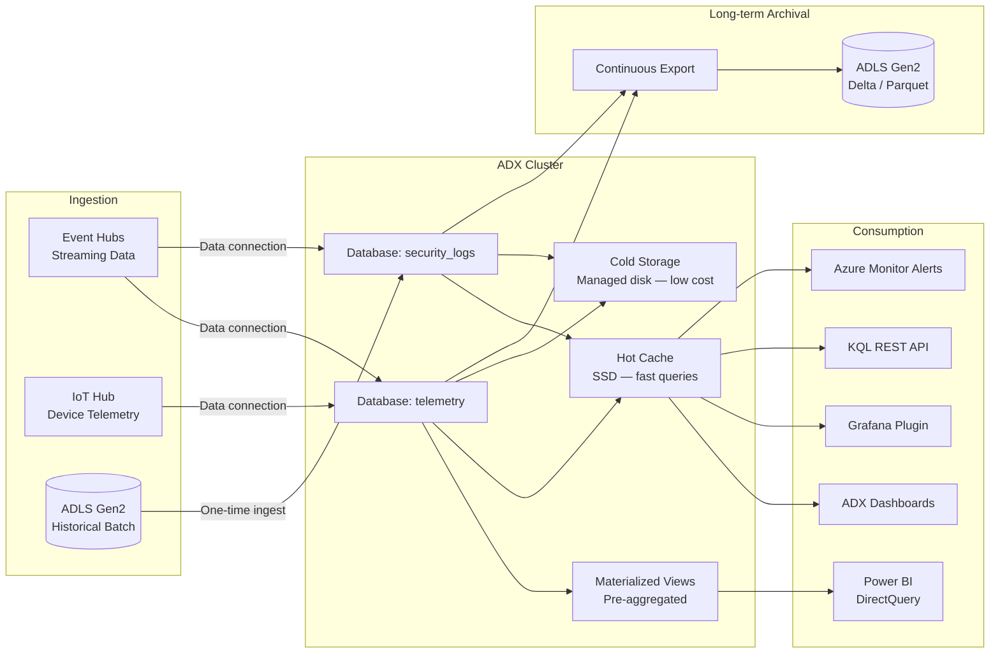
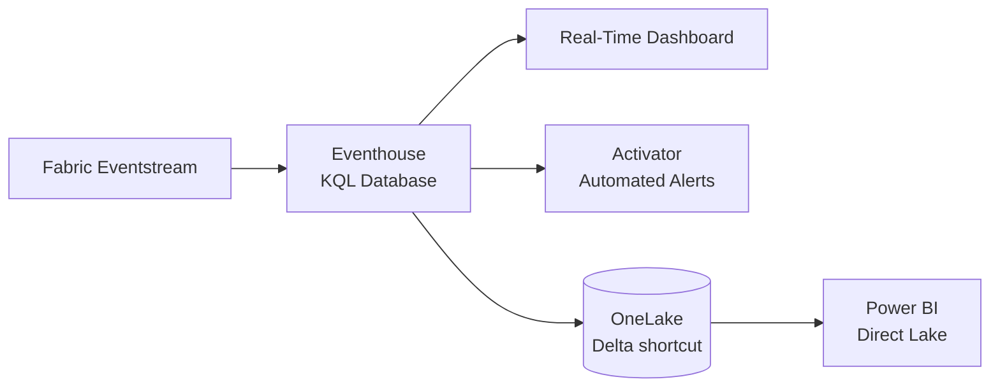

# Azure Data Explorer (ADX) / KQL Guide

> Azure Data Explorer delivers sub-second queries over streaming and time-series
> data — the hot-path analytics engine in CSA-in-a-Box for real-time dashboards,
> anomaly detection, and operational intelligence.

---

## Why ADX

Azure Data Explorer (Kusto) is purpose-built for exploring large volumes of
semi-structured telemetry, logs, and time-series data. Where the Delta
Lakehouse excels at batch analytics across the medallion layers, ADX excels
at interactive, ad-hoc queries over streaming data with sub-second response
times. CSA-in-a-Box uses ADX alongside the Lakehouse — not instead of it —
for scenarios where detection latency is measured in seconds, not hours.

---

## Architecture Overview



---

## Setup

### Cluster Creation (Bicep)

```bicep
resource adxCluster 'Microsoft.Kusto/clusters@2023-08-15' = {
  name: 'adxcsa${environment}${location}'
  location: location
  sku: {
    name: 'Standard_E8ads_v5'    // Dev: Dev(No SLA)_Standard_E2a_v4
    tier: 'Standard'
    capacity: 2                  // Node count (min 2 for production)
  }
  identity: {
    type: 'SystemAssigned'
  }
  properties: {
    enableStreamingIngest: true
    enableAutoStop: true          // Auto-stop when idle (dev/test)
    enableDiskEncryption: true
    enableDoubleEncryption: false // Set true for IL5/CMMC workloads
    publicNetworkAccess: 'Disabled'
    trustedExternalTenants: []
  }
}
```

### Database Creation

```bicep
resource adxDatabase 'Microsoft.Kusto/clusters/databases@2023-08-15' = {
  parent: adxCluster
  name: 'telemetry'
  location: location
  kind: 'ReadWrite'
  properties: {
    softDeletePeriod: 'P365D'   // Keep data for 1 year
    hotCachePeriod: 'P30D'      // Keep 30 days in hot cache (SSD)
  }
}
```

### Table Schema Definition (KQL)

```kql
// Create the raw telemetry table
.create table TelemetryRaw (
    DeviceId: string,
    Timestamp: datetime,
    Temperature: real,
    Humidity: real,
    Pressure: real,
    Location: dynamic,        // JSON: {"lat": 38.9, "lon": -77.0}
    Tags: dynamic             // JSON: {"site": "dc-east", "floor": 3}
) with (folder = "raw")

// Create ingestion mapping for Event Hub JSON payload
.create table TelemetryRaw ingestion json mapping 'TelemetryMapping'
    '[{"column":"DeviceId","path":"$.device_id","datatype":"string"},'
    ' {"column":"Timestamp","path":"$.timestamp","datatype":"datetime"},'
    ' {"column":"Temperature","path":"$.temperature","datatype":"real"},'
    ' {"column":"Humidity","path":"$.humidity","datatype":"real"},'
    ' {"column":"Pressure","path":"$.pressure","datatype":"real"},'
    ' {"column":"Location","path":"$.location","datatype":"dynamic"},'
    ' {"column":"Tags","path":"$.tags","datatype":"dynamic"}]'

// Set retention and caching policy
.alter table TelemetryRaw policy retention softdelete = 365d
.alter table TelemetryRaw policy caching hot = 30d
```

---

## Ingestion

### Ingestion Methods

| Method                         | Latency                                   | Best for                        | Configuration             |
| ------------------------------ | ----------------------------------------- | ------------------------------- | ------------------------- |
| **Streaming ingestion**        | < 10 seconds                              | Low-latency, low-volume         | Enable on cluster + table |
| **Queued (batched) ingestion** | 1-5 minutes                               | High throughput, cost-efficient | Default; batching policy  |
| **Event Hub data connection**  | 1-5 minutes (queued) or < 10s (streaming) | CSA streaming pipeline          | Managed data connection   |
| **IoT Hub data connection**    | 1-5 minutes                               | Device telemetry                | Managed data connection   |
| **One-time ADLS ingest**       | Minutes to hours                          | Historical backfill             | `.ingest into` command    |

### Event Hub Data Connection (Bicep)

```bicep
resource ehDataConnection 'Microsoft.Kusto/clusters/databases/dataConnections@2023-08-15' = {
  parent: adxDatabase
  name: 'dc-telemetry-eh'
  location: location
  kind: 'EventHub'
  properties: {
    eventHubResourceId: eventHub.id
    consumerGroup: 'cg-adx'
    tableName: 'TelemetryRaw'
    mappingRuleName: 'TelemetryMapping'
    dataFormat: 'MULTIJSON'
    compression: 'None'
    managedIdentityResourceId: adxCluster.id
  }
}
```

### Batching Policy

Control the trade-off between ingestion latency and efficiency.

```kql
// Default batching: 5 minutes or 1 GB or 1000 files
// For lower latency (higher cost):
.alter table TelemetryRaw policy ingestionbatching
    @'{"MaximumBatchingTimeSpan": "00:00:30", "MaximumNumberOfItems": 500, "MaximumRawDataSizeMB": 256}'
```

---

## KQL Essentials

### Core Operators

```kql
// Filter, project, and sort
TelemetryRaw
| where Timestamp > ago(1h)
| where Temperature > 35.0
| project DeviceId, Timestamp, Temperature, Humidity
| order by Temperature desc
| take 100

// Aggregation with time bins
TelemetryRaw
| where Timestamp > ago(24h)
| summarize
    AvgTemp = avg(Temperature),
    MaxTemp = max(Temperature),
    EventCount = count()
    by bin(Timestamp, 1h), DeviceId
| order by Timestamp asc
```

### Time Series Analysis

```kql
// Create a regular time series and detect anomalies
let min_t = ago(7d);
let max_t = now();
let dt = 1h;
TelemetryRaw
| where Timestamp between (min_t .. max_t)
| make-series AvgTemp = avg(Temperature) on Timestamp from min_t to max_t step dt by DeviceId
| extend (anomalies, score, baseline) = series_decompose_anomalies(AvgTemp, 1.5)
| mv-expand Timestamp to typeof(datetime),
            AvgTemp to typeof(real),
            anomalies to typeof(int),
            score to typeof(real),
            baseline to typeof(real)
| where anomalies != 0
| project Timestamp, DeviceId, AvgTemp, baseline, score, AnomalyType = iff(anomalies > 0, "Spike", "Dip")
```

### Anomaly Detection

```kql
// Decompose time series into trend, seasonality, and residual
TelemetryRaw
| where Timestamp > ago(30d)
| make-series AvgTemp = avg(Temperature) on Timestamp step 1h by DeviceId
| extend (flag, score, baseline) = series_decompose_anomalies(AvgTemp)
| render anomalychart with (anomalycolumns=flag)
```

### Geospatial Queries

```kql
// Find devices within a geographic polygon (e.g., a facility boundary)
let facility = dynamic({
    "type": "Polygon",
    "coordinates": [[[-77.05, 38.88], [-77.03, 38.88], [-77.03, 38.90], [-77.05, 38.90], [-77.05, 38.88]]]
});
TelemetryRaw
| where Timestamp > ago(1h)
| extend lat = toreal(Location.lat), lon = toreal(Location.lon)
| where geo_point_in_polygon(lon, lat, facility)
| summarize DeviceCount = dcount(DeviceId), AvgTemp = avg(Temperature)
```

### Render Visualizations

```kql
// Time chart
TelemetryRaw
| where Timestamp > ago(24h)
| summarize AvgTemp = avg(Temperature) by bin(Timestamp, 15m), DeviceId
| render timechart

// Pie chart of events by device
TelemetryRaw
| where Timestamp > ago(1h)
| summarize EventCount = count() by DeviceId
| top 10 by EventCount
| render piechart
```

---

## Materialized Views

Materialized views pre-aggregate data for dashboard queries, reducing compute
at query time.

```kql
// Hourly aggregation — dashboards query this instead of raw table
.create materialized-view with (backfill=true) TelemetryHourly on table TelemetryRaw {
    TelemetryRaw
    | summarize
        AvgTemp = avg(Temperature),
        MaxTemp = max(Temperature),
        MinTemp = min(Temperature),
        AvgHumidity = avg(Humidity),
        EventCount = count()
        by bin(Timestamp, 1h), DeviceId
}

// Daily rollup for trend dashboards
.create materialized-view with (backfill=true) TelemetryDaily on table TelemetryRaw {
    TelemetryRaw
    | summarize
        AvgTemp = avg(Temperature),
        P95Temp = percentile(Temperature, 95),
        EventCount = count()
        by bin(Timestamp, 1d), DeviceId
}
```

!!! tip "Dashboard Performance"
Point Power BI DirectQuery and Grafana dashboards at materialized views,
not raw tables. A dashboard hitting `TelemetryHourly` runs 10-100x faster
than one scanning `TelemetryRaw` with a `summarize`.

---

## Data Retention

### Hot Cache vs Cold Storage

| Tier             | Storage               | Query speed | Cost                   | Use case                       |
| ---------------- | --------------------- | ----------- | ---------------------- | ------------------------------ |
| **Hot cache**    | SSD on cluster nodes  | Sub-second  | Higher (compute-bound) | Recent data, active dashboards |
| **Cold storage** | Managed disk (remote) | Seconds     | Lower                  | Historical queries, compliance |

```kql
// Keep 30 days hot, 365 days total
.alter table TelemetryRaw policy caching hot = 30d
.alter table TelemetryRaw policy retention softdelete = 365d recoverability = enabled
```

### Continuous Export to ADLS

For data older than the ADX retention period, export to ADLS for long-term
archival in the Delta Lakehouse.

```kql
// Create external table for export target
.create external table TelemetryArchive (
    DeviceId: string,
    Timestamp: datetime,
    Temperature: real,
    Humidity: real,
    Pressure: real
) kind=adls
    partition by (Year: int = getYear(Timestamp), Month: int = getMonth(Timestamp))
    pathformat = ("year=" Year "/month=" Month)
    dataformat = parquet
    (
        h@'https://csaadls.blob.core.windows.net/archive/telemetry;managed_identity=system'
    )

// Set up continuous export
.create-or-alter continuous-export TelemetryExport
    to table TelemetryArchive
    with (intervalBetweenRuns=1h, forcedLatency=10m)
    <| TelemetryRaw
       | project DeviceId, Timestamp, Temperature, Humidity, Pressure
```

---

## Fabric Eventhouse

Fabric Eventhouse is ADX running inside Fabric — same KQL engine, same query
language, integrated with OneLake and Real-Time Dashboards.

| Feature              | Standalone ADX         | Fabric Eventhouse          |
| -------------------- | ---------------------- | -------------------------- |
| **KQL engine**       | Same                   | Same                       |
| **Deployment**       | Azure resource (Bicep) | Fabric workspace item      |
| **Storage**          | Managed by ADX         | OneLake (Delta-compatible) |
| **Dashboards**       | ADX Dashboards         | Real-Time Dashboards       |
| **Alerting**         | Azure Monitor          | Fabric Activator (Reflex)  |
| **Gov availability** | GA                     | Not yet Gov GA (ADR-0018)  |



!!! info "Migration Path"
When Fabric reaches Gov GA, ADX workloads migrate to Eventhouse with no
KQL changes. The query language, table schemas, and materialized views
are identical. See [ADR-0018](../adr/0018-fabric-rti-adapter.md) for the
env-gated adapter pattern.

---

## Dashboards and Visualization

### ADX Dashboards

Native dashboards built into the ADX web UI. Best for ops teams who write
KQL directly.

- KQL-native — each tile is a KQL query
- Parameters — dropdown filters backed by KQL queries
- Auto-refresh — configurable refresh interval (30s minimum)
- Sharing — share via URL or embed in portal

### Grafana Plugin

For teams already using Grafana, the Azure Data Explorer plugin provides
native KQL support.

```ini
# Grafana data source configuration
[plugin.azure-data-explorer]
  clusterUrl = https://adxcsadeveastus.eastus.kusto.windows.net
  database = telemetry
  authentication = managed_identity
```

### Power BI Connector

Use DirectQuery from Power BI to ADX for real-time dashboards that combine
streaming data with batch Gold layer data.

```kql
// Optimized view for Power BI (materialized view recommended)
TelemetryHourly
| where Timestamp > ago(30d)
| project Timestamp, DeviceId, AvgTemp, MaxTemp, EventCount
```

!!! warning "Power BI + ADX Performance"
Always point Power BI DirectQuery at materialized views or functions —
never at raw tables. Power BI generates KQL queries for every visual
interaction; raw table scans will be slow and expensive.

---

## Security

### Authentication

| Method                | Use case                                    | Configuration                                    |
| --------------------- | ------------------------------------------- | ------------------------------------------------ |
| **Managed Identity**  | Azure services (Functions, ADF, Databricks) | Assign `Database Viewer` or `Database User` role |
| **Entra ID user**     | Analysts, dashboard users                   | Add to database principals                       |
| **Service principal** | External apps, CI/CD                        | App registration + database principal            |

### Network Security

- **Private Endpoints** — connect via Private Link; disable public access
- **VNet injection** — deploy ADX cluster into a VNet (legacy; prefer Private Endpoints)
- **Managed Private Endpoints** — ADX-initiated connections to sources (Event Hub, ADLS)

### Row-Level Security

```kql
// Create a function that filters by user's region
.create function with (
    folder="security",
    docstring="RLS filter for regional access"
) RegionalFilter() {
    TelemetryRaw
    | where Tags.region == current_principal_details().Region
       or current_principal_details().Role == "Admin"
}

// Apply as restricted view policy
.alter table TelemetryRaw policy restricted_view_access true
```

---

## Monitoring

### Key Metrics

| Metric                   | Alert threshold      | What it means                                 |
| ------------------------ | -------------------- | --------------------------------------------- |
| **Ingestion latency**    | > 5 minutes (queued) | Batching delay or source issue                |
| **Ingestion volume**     | Drop > 50%           | Source failure or data connection issue       |
| **Cache utilization**    | > 80%                | Consider increasing hot cache or cluster size |
| **CPU utilization**      | > 70% sustained      | Scale out or optimize queries                 |
| **Query duration (P95)** | > 30 seconds         | Missing materialized views or unoptimized KQL |
| **Failed ingestions**    | Any                  | Schema mismatch or mapping error              |

### Diagnostic Settings

```bicep
resource adxDiagnostics 'Microsoft.Insights/diagnosticSettings@2021-05-01-preview' = {
  scope: adxCluster
  name: 'adx-diagnostics'
  properties: {
    workspaceId: logAnalyticsWorkspace.id
    logs: [
      { category: 'SucceededIngestion', enabled: true }
      { category: 'FailedIngestion', enabled: true }
      { category: 'Command', enabled: true }
      { category: 'Query', enabled: true }
    ]
    metrics: [
      { category: 'AllMetrics', enabled: true }
    ]
  }
}
```

---

## Cost Optimization

### Cluster SKU Sizing

| Workload              | Recommended SKU               | Nodes | Use case                                  |
| --------------------- | ----------------------------- | ----- | ----------------------------------------- |
| **Dev/Test**          | `Dev(No SLA)_Standard_E2a_v4` | 1     | Single-node, no SLA, auto-stop            |
| **Small production**  | `Standard_E8ads_v5`           | 2     | < 1 TB hot data, moderate queries         |
| **Medium production** | `Standard_E16ads_v5`          | 3-5   | 1-10 TB hot data, concurrent dashboards   |
| **Large production**  | `Standard_E16ads_v5`          | 8+    | > 10 TB hot data, heavy anomaly detection |

!!! tip "Auto-Stop for Dev/Test"
Enable `enableAutoStop: true` on dev/test clusters. The cluster stops
after 24 hours of inactivity and restarts on the next query — saving
significant compute cost.

### Cost Levers

| Lever                  | Action                               | Impact                    |
| ---------------------- | ------------------------------------ | ------------------------- |
| **Hot cache period**   | Reduce from 30d to 7d                | Less SSD storage per node |
| **Retention period**   | Export to ADLS, reduce ADX retention | Less managed storage      |
| **Materialized views** | Pre-aggregate; reduce query compute  | Lower per-query cost      |
| **Auto-stop**          | Enable for non-production            | Zero cost when idle       |
| **Reserved instances** | 1-year or 3-year commitment          | 30-60% discount           |

---

## Anti-Patterns

!!! failure "Don't: Use ADX as a data warehouse"
ADX is optimized for time-series and log analytics, not relational
star-schema queries. Use the Delta Lakehouse (Databricks/Synapse) for
warehouse workloads and ADX for streaming analytics.

!!! failure "Don't: Query raw tables from dashboards"
Every dashboard refresh scans the raw table without materialized views.
Create materialized views for any query pattern used by dashboards.

!!! failure "Don't: Set hot cache to maximum retention"
Keeping all data in hot cache is expensive and unnecessary. Only recent
data (7-30 days) needs sub-second query speed; older data queries can
tolerate seconds of latency from cold storage.

!!! failure "Don't: Ignore ingestion failures"
Failed ingestions usually indicate schema mismatches between the source
payload and the table mapping. Monitor the `FailedIngestion` log and
fix mappings immediately — failed events are dropped, not retried.

!!! success "Do: Use streaming ingestion for low-latency use cases"
When detection latency must be under 10 seconds (fraud, security),
enable streaming ingestion on the table. For everything else, queued
ingestion is more cost-efficient.

!!! success "Do: Export to ADLS for long-term retention"
Continuous export moves aged data to Parquet in ADLS, where it joins
the Delta Lakehouse and is queryable by dbt, Databricks, and Synapse
at a fraction of the ADX storage cost.

---

## Checklist

- [ ] ADX cluster deployed via Bicep with streaming ingestion enabled
- [ ] Database(s) created with appropriate retention and cache policies
- [ ] Table schemas defined with ingestion mappings
- [ ] Event Hub data connections configured with dedicated consumer groups
- [ ] Materialized views created for dashboard queries
- [ ] Continuous export to ADLS configured for long-term archival
- [ ] Private Endpoints enabled; public network access disabled
- [ ] Managed identity granted `Database Viewer` for downstream services
- [ ] Diagnostic settings forwarding to Log Analytics
- [ ] Alerting configured for failed ingestions and high CPU
- [ ] Dev/test clusters set to auto-stop
- [ ] Power BI connector tested against materialized views (not raw tables)

---

## Related Documentation

- [ADR-0005 — Event Hubs over Kafka](../adr/0005-event-hubs-over-kafka.md)
- [ADR-0018 — Fabric RTI Adapter](../adr/0018-fabric-rti-adapter.md)
- [Pattern — Streaming & CDC](../patterns/streaming-cdc.md)
- [Use Case — Real-Time Intelligence](../use-cases/realtime-intelligence-anomaly-detection.md)
- [Use Case — Cybersecurity Threat Analytics](../use-cases/cybersecurity-threat-analytics.md)
- [Guide — Event Hubs](event-hubs.md)
- [Guide — Power BI](power-bi.md) (DirectQuery to ADX)
