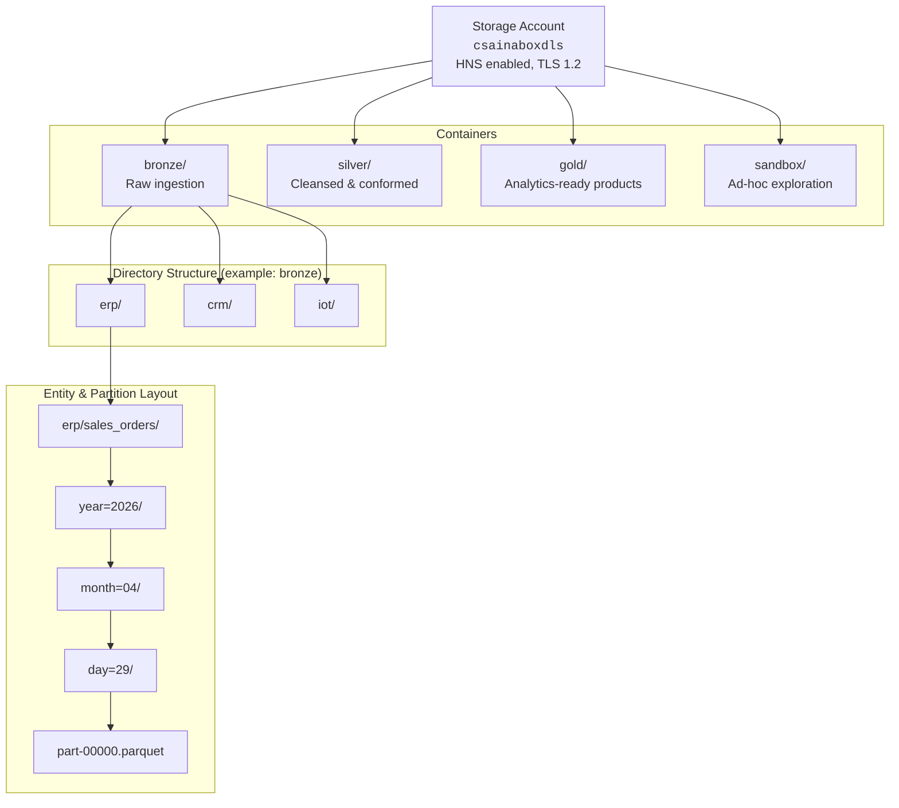

# Azure Data Lake Storage Gen2

## Overview

Azure Data Lake Storage Gen2 (ADLS Gen2) is the **foundation storage layer** for every CSA-in-a-Box deployment. It combines the scalability and cost-efficiency of Azure Blob Storage with a **hierarchical namespace** (HNS) purpose-built for analytics workloads — giving you POSIX-like directory semantics, fine-grained ACLs, and atomic directory operations that flat object stores cannot provide.

In the CSA-in-a-Box architecture, ADLS Gen2 holds every byte of the medallion lakehouse: raw ingestion files in Bronze, cleansed and conformed Delta tables in Silver, and analytics-ready data products in Gold. Every compute engine — Databricks, Synapse, Fabric, ADF, dbt — reads from and writes to this single storage layer.

!!! tip "Related Guides"
| Guide | Purpose |
|-------|---------|
| [Medallion Architecture](../best-practices/medallion-architecture.md) | Layer design, quality gates, and dbt transformations |
| [Data Flow — Medallion](../reference-architecture/data-flow-medallion.md) | End-to-end ingestion through Bronze/Silver/Gold |
| [Security & Compliance](../best-practices/security-compliance.md) | Network isolation, encryption, and Zero Trust |
| [Cost Optimization](../best-practices/cost-optimization.md) | Storage tiering and spend reduction strategies |
| [Disaster Recovery](../best-practices/disaster-recovery.md) | Replication, failover, and DR drills |

---

## Architecture

The storage hierarchy follows a strict convention that aligns with the medallion architecture and enables predictable access control, lifecycle management, and data discovery.



**Canonical path pattern:**

```
abfss://<container>@<account>.dfs.core.windows.net/<domain>/<entity>/<partition_key=value>/...
```

---

## Container & Directory Design

### Container-per-Layer (recommended)

CSA-in-a-Box uses **one container per medallion layer** rather than one container per domain. This design simplifies lifecycle policies (one rule per container), aligns ACLs with data maturity, and makes cross-domain joins in Silver and Gold natural.

| Container | Purpose                            | Typical Writers         | Typical Readers                |
| --------- | ---------------------------------- | ----------------------- | ------------------------------ |
| `bronze`  | Raw, append-only ingestion         | ADF, Event Hubs Capture | Databricks, dbt                |
| `silver`  | Cleansed, conformed, deduplicated  | dbt, Databricks jobs    | dbt, Databricks, Synapse       |
| `gold`    | Star schemas, aggregates, products | dbt, Databricks jobs    | Power BI, APIs, ML pipelines   |
| `sandbox` | Ad-hoc exploration, prototyping    | Data scientists         | Data scientists (self-service) |

### Hierarchical Namespace Benefits

Enabling HNS is **mandatory** for CSA-in-a-Box. Without it:

- Directory renames are O(n) object copies instead of atomic metadata operations
- ACLs cannot be applied at the directory level
- Delta Lake `VACUUM` and `OPTIMIZE` performance degrades significantly
- Spark partition discovery scans every blob prefix

!!! warning "HNS Cannot Be Added Later"
Hierarchical namespace must be enabled at storage account creation time. Converting an existing flat-namespace account requires a migration. Always provision new accounts with HNS enabled.

### Path Naming Conventions

| Level     | Convention                  | Example                       |
| --------- | --------------------------- | ----------------------------- |
| Container | Lowercase medallion layer   | `bronze`, `silver`, `gold`    |
| Domain    | Snake_case business domain  | `erp`, `crm`, `iot_telemetry` |
| Entity    | Snake_case source entity    | `sales_orders`, `customers`   |
| Partition | Hive-style `key=value`      | `year=2026/month=04/day=29`   |
| Files     | Engine-generated part files | `part-00000-*.snappy.parquet` |

### Partition Layout Strategies

| Strategy                | When to Use                                    | Example Path Suffix             |
| ----------------------- | ---------------------------------------------- | ------------------------------- |
| **Date (Y/M/D)**        | Append-heavy event data, time-series ingestion | `year=2026/month=04/day=29`     |
| **Date (Y/M)**          | Monthly batch loads, financial closes          | `year=2026/month=04`            |
| **Ingestion timestamp** | CDC / watermark-based loads                    | `ingest_date=2026-04-29`        |
| **Region / tenant**     | Multi-tenant isolation                         | `region=east/tenant=agency_a`   |
| **None (flat)**         | Small reference tables (< 1 GB)                | _(files directly under entity)_ |

!!! info "Partition Cardinality"
Keep partition cardinality under **10,000** per table. Over-partitioning (e.g., partitioning by customer ID with millions of values) creates excessive small files and metadata overhead.

---

## Access Control

ADLS Gen2 provides **four complementary access control mechanisms**. In CSA-in-a-Box deployments, the preferred pattern is RBAC for broad access, ACLs for fine-grained directory permissions, and managed identities for all service-to-service communication.

### RBAC (Role-Based Access Control)

RBAC roles grant access at the **storage account or container** level and are the first layer of defense.

| Role                          | Scope           | Grants                                | CSA-in-a-Box Usage                    |
| ----------------------------- | --------------- | ------------------------------------- | ------------------------------------- |
| Storage Blob Data Owner       | Storage account | Full control including ACL management | Platform admins only                  |
| Storage Blob Data Contributor | Container       | Read + write + delete (no ACL mgmt)   | ADF, Databricks service principals    |
| Storage Blob Data Reader      | Container       | Read-only                             | Power BI, Synapse serverless, Purview |
| Storage Blob Delegator        | Storage account | Generate user-delegation SAS tokens   | Rare — short-lived SAS scenarios      |

```bash
# Assign Reader on gold container to the Power BI service principal
az role assignment create \
  --assignee <pbi-service-principal-id> \
  --role "Storage Blob Data Reader" \
  --scope "/subscriptions/<sub>/resourceGroups/<rg>/providers/Microsoft.Storage/storageAccounts/<acct>/blobServices/default/containers/gold"
```

### ACLs (Access Control Lists)

ACLs provide **POSIX-like permissions** (read, write, execute) on individual directories and files. They are essential when different teams need different access within the same container.

| ACL Type        | Purpose                                                    |
| --------------- | ---------------------------------------------------------- |
| **Access ACL**  | Controls access to the specific object (file or directory) |
| **Default ACL** | Template inherited by new child objects in a directory     |

```bash
# Grant the data-engineering group rwx on bronze/erp/ and set as default
az storage fs access set \
  --acl "group:<data-eng-group-id>:rwx" \
  --path erp \
  --file-system bronze \
  --account-name csainaboxdls \
  --auth-mode login

# Set default ACL so new subdirectories inherit
az storage fs access set \
  --acl "default:group:<data-eng-group-id>:rwx" \
  --path erp \
  --file-system bronze \
  --account-name csainaboxdls \
  --auth-mode login
```

!!! tip "ACL Inheritance"
Default ACLs only apply to **new** child objects created after the default is set. Existing children are unaffected. Use `az storage fs access set-recursive` to backfill ACLs on existing directory trees.

### Managed Identity Access

All CSA-in-a-Box services authenticate to ADLS using **managed identities** — never shared keys or connection strings.

| Service            | Identity Type                     | Recommended Role              |
| ------------------ | --------------------------------- | ----------------------------- |
| Azure Data Factory | System-assigned MI                | Storage Blob Data Contributor |
| Databricks         | Service principal (Unity Catalog) | Storage Blob Data Contributor |
| Synapse serverless | Workspace MI                      | Storage Blob Data Reader      |
| Purview            | System-assigned MI                | Storage Blob Data Reader      |
| Power BI           | Service principal                 | Storage Blob Data Reader      |

### SAS Tokens — When to Avoid

!!! danger "Avoid SAS Tokens in Production Pipelines"
SAS tokens are opaque, difficult to audit, and cannot be revoked individually. Use them **only** for time-limited, external-party data sharing where managed identity is not possible. Never embed SAS tokens in application code or pipeline configurations.

If a SAS token is required, always use **user-delegation SAS** (backed by Entra ID) rather than account-key SAS, and set the shortest practical expiry.

### Network Security

| Control                    | Purpose                                            | CSA-in-a-Box Default |
| -------------------------- | -------------------------------------------------- | -------------------- |
| **Storage Firewall**       | Restrict access to allowed VNets and IPs           | Enabled              |
| **Private Endpoints**      | Route traffic through Azure backbone, no public IP | Enabled (production) |
| **Disable public access**  | Block all internet-routable requests               | Yes (production)     |
| **Trusted Azure services** | Allow ADF, Purview, Synapse through firewall       | Enabled              |

```bash
# Create a private endpoint for the DFS sub-resource
az network private-endpoint create \
  --name pe-csainaboxdls-dfs \
  --resource-group rg-data-platform \
  --vnet-name vnet-data \
  --subnet snet-private-endpoints \
  --private-connection-resource-id <storage-account-resource-id> \
  --group-id dfs \
  --connection-name pec-csainaboxdls-dfs
```

---

## Performance

### File Size Optimization

File size is the **single biggest performance lever** for ADLS Gen2 workloads. The hierarchical namespace accelerates metadata operations, but read throughput is still governed by file size and parallelism.

| File Size          | Impact                                                     | Recommendation              |
| ------------------ | ---------------------------------------------------------- | --------------------------- |
| < 8 MB             | Excessive metadata overhead, slow listing, poor throughput | Avoid — compact immediately |
| 8 MB -- 128 MB     | Acceptable for streaming micro-batches                     | Compact on schedule         |
| **256 MB -- 1 GB** | **Optimal** for analytical reads (Spark, Synapse)          | Target for Silver/Gold      |
| > 2 GB             | Diminishing returns, harder to parallelize                 | Split during write          |

### Small File Problem

Small files are the most common performance anti-pattern in lakehouse storage. They arise from:

- Streaming micro-batches writing every few seconds
- Over-partitioned tables
- CDC pipelines with per-record commits

**Remediation:**

```sql
-- Delta Lake: compact small files into optimal size
OPTIMIZE delta.`abfss://silver@csainaboxdls.dfs.core.windows.net/erp/sales_orders`
  WHERE year = 2026 AND month = 4;

-- Delta Lake: Z-order for predicate pushdown
OPTIMIZE delta.`abfss://gold@csainaboxdls.dfs.core.windows.net/erp/fact_sales`
  ZORDER BY (customer_id, order_date);
```

### Throughput Limits

| Metric                       | Standard (GPv2 HNS) | Premium (BlockBlob HNS) |
| ---------------------------- | ------------------- | ----------------------- |
| Max ingress per account      | 25 Gbps             | 45 Gbps                 |
| Max egress per account       | 50 Gbps             | 75 Gbps                 |
| Max request rate per account | 20,000 IOPS         | 75,000 IOPS             |
| Max single-file throughput   | ~60 MBps            | ~250 MBps               |

!!! tip "Premium for Hot Path"
Use Premium BlockBlobStorage with HNS for streaming ingestion or interactive query workloads where latency matters. Standard GPv2 is sufficient for batch-heavy Bronze/Silver/Gold pipelines.

### Parallel Upload / Download

```python
# Python SDK — parallel upload with max_concurrency
from azure.storage.filedatalake import DataLakeServiceClient

service = DataLakeServiceClient(
    account_url="https://csainaboxdls.dfs.core.windows.net",
    credential=default_credential,
)

file_client = service.get_file_client("bronze", "erp/sales_orders/full_extract.parquet")

with open("full_extract.parquet", "rb") as f:
    file_client.upload_data(
        f,
        overwrite=True,
        max_concurrency=8,     # parallel transfer threads
        chunk_size=100 * 1024 * 1024,  # 100 MB chunks
    )
```

---

## Data Lifecycle Management

Lifecycle management policies automatically tier or delete data based on age, reducing storage costs without manual intervention.

### Policy Configuration

```json
{
    "rules": [
        {
            "enabled": true,
            "name": "bronze-tiering",
            "type": "Lifecycle",
            "definition": {
                "actions": {
                    "baseBlob": {
                        "tierToCool": {
                            "daysAfterModificationGreaterThan": 30
                        },
                        "tierToArchive": {
                            "daysAfterModificationGreaterThan": 90
                        },
                        "delete": { "daysAfterModificationGreaterThan": 365 }
                    }
                },
                "filters": {
                    "blobTypes": ["blockBlob"],
                    "prefixMatch": ["bronze/"]
                }
            }
        },
        {
            "enabled": true,
            "name": "gold-tiering",
            "type": "Lifecycle",
            "definition": {
                "actions": {
                    "baseBlob": {
                        "tierToCool": { "daysAfterModificationGreaterThan": 90 }
                    }
                },
                "filters": {
                    "blobTypes": ["blockBlob"],
                    "prefixMatch": ["gold/"]
                }
            }
        }
    ]
}
```

### Cost Impact by Tier

Pricing below is approximate (East US, LRS, per GB/month) and should be validated against the [Azure pricing calculator](https://azure.microsoft.com/pricing/calculator/).

| Tier        | Storage Cost | Read Cost (per 10K ops) | Retrieval Cost | Min Retention | Best For                     |
| ----------- | ------------ | ----------------------- | -------------- | ------------- | ---------------------------- |
| **Hot**     | $0.018       | $0.004                  | Free           | None          | Active Silver/Gold tables    |
| **Cool**    | $0.010       | $0.010                  | Free           | 30 days       | Bronze after 30 days         |
| **Cold**    | $0.0036      | $0.065                  | $0.03/GB       | 90 days       | Bronze after 90 days         |
| **Archive** | $0.0012      | $5.00                   | $0.022/GB      | 180 days      | Compliance / legal retention |

!!! warning "Archive Rehydration"
Archive tier reads require rehydration (1--15 hours for standard, < 1 hour for high priority at higher cost). Never place data in Archive that your pipelines query on a regular schedule.

### Immutable Storage

For regulated workloads (FedRAMP, SEC 17a-4, HIPAA), ADLS Gen2 supports immutable storage policies.

| Policy Type              | Behavior                                        | Use Case                    |
| ------------------------ | ----------------------------------------------- | --------------------------- |
| **Time-based retention** | Data cannot be deleted or modified until expiry | Regulatory retention (7 yr) |
| **Legal hold**           | Data is immutable until all holds are cleared   | Active litigation, audit    |

```bash
# Set 7-year immutable retention on the bronze container
az storage container immutability-policy create \
  --account-name csainaboxdls \
  --container-name bronze \
  --period 2555 \
  --allow-protected-append-writes true
```

---

## Redundancy & Disaster Recovery

### Redundancy Options

| Option   | Copies | Regions           | Durability (annual) | ~Cost Multiplier | CSA-in-a-Box Usage          |
| -------- | ------ | ----------------- | ------------------- | ---------------- | --------------------------- |
| **LRS**  | 3      | 1                 | 11 nines            | 1.0x             | Dev/test, sandbox           |
| **ZRS**  | 3      | 1 (3 AZs)         | 12 nines            | 1.25x            | Production (single region)  |
| **GRS**  | 6      | 2                 | 16 nines            | 2.0x             | DR-required workloads       |
| **GZRS** | 6      | 2 (3 AZs primary) | 16 nines            | 2.5x             | Mission-critical production |

!!! tip "CSA-in-a-Box Default"
Production deployments default to **ZRS** for cost-effective zone resilience. Enable **GRS/GZRS** only when cross-region DR is an explicit requirement and the 2x cost premium is justified.

### Cross-Region Replication

For GRS/GZRS accounts, replication is **asynchronous** with no SLA on replication lag. For workloads requiring deterministic RPO:

- **Object replication rules** — replicate specific containers (e.g., `gold` only) to a secondary storage account in another region
- **ADF copy activities** — schedule periodic cross-region copies with validation
- **azcopy sync** — manual or scripted DR as a last resort

```bash
# azcopy sync for manual DR (last resort)
azcopy sync \
  "https://csainaboxdls.dfs.core.windows.net/gold" \
  "https://csainaboxdr.dfs.core.windows.net/gold" \
  --recursive \
  --delete-destination=false
```

### Object Replication Rules

Object replication provides **asynchronous, policy-based** replication between two storage accounts. Unlike GRS, you choose which containers and prefixes to replicate.

```bash
# Create replication policy: gold container → DR account
az storage account or-policy create \
  --account-name csainaboxdls \
  --destination-account csainaboxdr \
  --source-container gold \
  --destination-container gold \
  --min-creation-time "2026-01-01T00:00:00Z"
```

---

## Delta Lake on ADLS Gen2

Delta Lake is the default table format in CSA-in-a-Box. Its transaction log (\_delta_log) lives alongside data files in ADLS Gen2, making the storage account the single source of truth.

### Transaction Log Performance

The Delta transaction log writes a JSON file per commit and periodically consolidates into Parquet checkpoints. On ADLS Gen2 with HNS:

- **Listing is fast** — HNS makes directory listing O(1) per level, not O(n) blob enumeration
- **Checkpointing matters** — without checkpoints, readers must replay every JSON commit file

```sql
-- Configure checkpoint interval (default is every 10 commits)
ALTER TABLE delta.`abfss://silver@csainaboxdls.dfs.core.windows.net/erp/customers`
SET TBLPROPERTIES ('delta.checkpointInterval' = '10');
```

### VACUUM with ADLS

`VACUUM` removes data files no longer referenced by the transaction log. On ADLS Gen2, this triggers physical deletes against the hierarchical namespace.

```sql
-- Remove unreferenced files older than 7 days (default retention)
VACUUM delta.`abfss://silver@csainaboxdls.dfs.core.windows.net/erp/customers`
  RETAIN 168 HOURS;
```

!!! warning "VACUUM and Time Travel"
`VACUUM` permanently deletes old file versions. After vacuuming, time-travel queries beyond the retention window will fail. Set `RETAIN` to at least your longest query or rollback window.

### Concurrent Writes

Delta Lake uses **optimistic concurrency control** (OCC) on ADLS Gen2. Concurrent writers to the same table succeed as long as they do not modify the same partitions. For high-contention tables:

- Enable **write-ahead log compaction** to reduce commit conflicts
- Partition by a key that distributes writes across non-overlapping partitions
- Use `MERGE` with narrow predicates to minimize conflict windows

---

## Integration with CSA-in-a-Box Services

### Databricks — Direct Access (recommended)

CSA-in-a-Box prefers **direct access via `abfss://`** over legacy DBFS mounts. Direct access integrates with Unity Catalog for governance and supports credential passthrough.

```python
# Read Delta table directly — no mounts needed
df = spark.read.format("delta").load(
    "abfss://silver@csainaboxdls.dfs.core.windows.net/erp/customers"
)

# Unity Catalog external location (managed by Terraform/Bicep)
# CREATE EXTERNAL LOCATION silver_erp
#   URL 'abfss://silver@csainaboxdls.dfs.core.windows.net/erp'
#   WITH (STORAGE CREDENTIAL csa_inabox_cred);
```

!!! danger "Avoid DBFS Mounts"
DBFS mounts (`/mnt/...`) bypass Unity Catalog governance, do not support fine-grained access, and are deprecated in Databricks. Always use `abfss://` paths with external locations.

### Synapse Serverless SQL

```sql
-- External data source pointing to ADLS Gen2
CREATE EXTERNAL DATA SOURCE GoldLake
WITH (
    LOCATION = 'abfss://gold@csainaboxdls.dfs.core.windows.net',
    TYPE = HADOOP
);

-- Query Delta table via OPENROWSET
SELECT *
FROM OPENROWSET(
    BULK 'erp/fact_sales/**',
    DATA_SOURCE = 'GoldLake',
    FORMAT = 'DELTA'
) AS rows
WHERE year = 2026;
```

### Azure Data Factory

ADF accesses ADLS Gen2 through a **linked service** backed by the factory's managed identity.

```json
{
    "name": "ls_adls_csainabox",
    "type": "Microsoft.DataFactory/factories/linkedservices",
    "properties": {
        "type": "AzureBlobFS",
        "typeProperties": {
            "url": "https://csainaboxdls.dfs.core.windows.net"
        },
        "connectVia": { "referenceName": "AutoResolveIntegrationRuntime" }
    }
}
```

### Microsoft Purview

Purview scans ADLS Gen2 to populate the data catalog with schema, lineage, and classification metadata. Register the storage account as a data source and schedule scans against each container.

```bash
# Register ADLS Gen2 as a Purview data source (via REST API)
az rest --method PUT \
  --uri "https://<purview-account>.purview.azure.com/scan/datasources/csainaboxdls?api-version=2022-07-01-preview" \
  --body '{
    "kind": "AzureDataLakeStoreGen2",
    "properties": {
      "endpoint": "https://csainaboxdls.dfs.core.windows.net",
      "resourceGroup": "rg-data-platform",
      "subscriptionId": "<sub-id>"
    }
  }'
```

### dbt — External Locations

dbt models in CSA-in-a-Box read from and write to ADLS Gen2 via Databricks external locations or Synapse external tables.

```yaml
# dbt source configuration (sources.yml)
sources:
    - name: bronze_erp
      schema: bronze_erp
      meta:
          external_location: "abfss://bronze@csainaboxdls.dfs.core.windows.net/erp/{name}"
      tables:
          - name: sales_orders
          - name: customers
```

---

## Monitoring & Alerting

### Key Metrics

| Metric                       | Source          | Alert Threshold             | Why It Matters                          |
| ---------------------------- | --------------- | --------------------------- | --------------------------------------- |
| **Used capacity**            | Azure Monitor   | > 80% of quota              | Prevent throttling from capacity limits |
| **Ingress/Egress**           | Azure Monitor   | Sustained > 80% of limit    | Detect throughput bottlenecks           |
| **Transaction count**        | Azure Monitor   | Spike > 3x baseline         | Identify runaway queries or scans       |
| **E2E latency (P99)**        | Azure Monitor   | > 200 ms (standard)         | Detect storage slowdowns                |
| **Availability**             | Azure Monitor   | < 99.9%                     | Trigger DR procedures                   |
| **Lifecycle policy actions** | Diagnostic logs | Unexpected deletes or tiers | Catch misconfigured policies            |

### Diagnostic Logging

Enable Storage Analytics and diagnostic settings to stream logs to Log Analytics.

```bash
# Enable diagnostic settings for ADLS Gen2
az monitor diagnostic-settings create \
  --name diag-csainaboxdls \
  --resource <storage-account-resource-id> \
  --workspace <log-analytics-workspace-id> \
  --logs '[
    {"category": "StorageRead",  "enabled": true, "retentionPolicy": {"enabled": true, "days": 30}},
    {"category": "StorageWrite", "enabled": true, "retentionPolicy": {"enabled": true, "days": 30}},
    {"category": "StorageDelete","enabled": true, "retentionPolicy": {"enabled": true, "days": 90}}
  ]' \
  --metrics '[{"category": "Transaction", "enabled": true}]'
```

### Capacity Alert

```bash
# Alert when used capacity exceeds 80% of 50 TiB quota
az monitor metrics alert create \
  --name alert-adls-capacity-80pct \
  --resource-group rg-data-platform \
  --scopes <storage-account-resource-id> \
  --condition "avg UsedCapacity > 43980465111040" \
  --window-size 1h \
  --evaluation-frequency 1h \
  --action <action-group-id> \
  --description "ADLS Gen2 used capacity exceeds 80% of 50 TiB"
```

---

## Anti-Patterns

!!! danger "Common Mistakes That Degrade Performance, Security, or Cost"

    **1. Flat namespace storage account for analytics.**
    Without HNS, every directory rename is an O(n) copy. Delta Lake VACUUM and OPTIMIZE become painfully slow. Always enable HNS.

    **2. Shared access keys in pipeline configurations.**
    Account keys grant full, unrevocable access to the entire storage account. Use managed identities for all service access.

    **3. Thousands of tiny files per partition.**
    Streaming micro-batches without compaction create millions of small files. Run `OPTIMIZE` on a schedule (hourly for Silver, daily for Gold).

    **4. Archive tier on actively queried data.**
    Archive rehydration takes hours and costs per-GB. Only archive data that is never queried in normal operations.

    **5. DBFS mounts instead of abfss:// direct access.**
    Mounts bypass Unity Catalog governance and are deprecated. Use external locations with `abfss://` paths.

    **6. Single storage account for all environments.**
    Dev/test workloads sharing a production storage account risk accidental data corruption and create noisy neighbor issues. Use separate accounts per environment.

    **7. No default ACLs on directories.**
    Without default ACLs, new files inherit no permissions beyond RBAC. Set default ACLs on every domain directory to ensure consistent access.

---

## Do / Don't Quick Reference

| Do                                                    | Don't                                                  |
| ----------------------------------------------------- | ------------------------------------------------------ |
| Enable HNS at account creation                        | Create flat-namespace accounts for lakehouse workloads |
| Use `abfss://` direct access paths                    | Mount storage as DBFS `/mnt/`                          |
| Authenticate via managed identity / service principal | Use shared account keys or embed SAS tokens            |
| Target 256 MB -- 1 GB file sizes                      | Leave streaming micro-batch small files uncompacted    |
| Apply lifecycle policies per container                | Manually move blobs between tiers                      |
| Set default ACLs on domain directories                | Rely on RBAC alone for directory-level access          |
| Enable Private Endpoints in production                | Allow public network access to production accounts     |
| Use ZRS (minimum) for production                      | Use LRS for production workloads                       |
| Run `OPTIMIZE` and `VACUUM` on schedule               | Let Delta transaction logs grow unbounded              |
| Monitor capacity and throughput metrics               | Ignore storage until throttling occurs                 |

---

## Deployment Checklist

- [ ] Storage account created with **HNS enabled** and TLS 1.2 minimum
- [ ] Containers provisioned: `bronze`, `silver`, `gold`, `sandbox`
- [ ] Redundancy set to **ZRS** (production) or LRS (dev/test)
- [ ] **Public network access disabled** (production)
- [ ] Private Endpoints created for `dfs` and `blob` sub-resources
- [ ] Storage Firewall configured with trusted Azure services allowed
- [ ] Managed identities assigned RBAC roles per service (see Access Control table)
- [ ] Default ACLs set on all domain directories in each container
- [ ] Lifecycle management policies applied (bronze tiering, gold tiering)
- [ ] Diagnostic logging enabled to Log Analytics
- [ ] Capacity and availability alerts configured
- [ ] Purview data source registered and scan scheduled
- [ ] Databricks external locations created (Unity Catalog)
- [ ] Synapse external data sources configured
- [ ] ADF linked service created with managed identity auth
- [ ] Soft delete enabled (7-day retention minimum)
- [ ] Shared access keys **disabled** (Entra-only authentication)

---

## Further Reading

- [Medallion Architecture Best Practices](../best-practices/medallion-architecture.md) — layer design and quality gates
- [Data Flow — Medallion](../reference-architecture/data-flow-medallion.md) — end-to-end pipeline architecture
- [Security & Compliance Best Practices](../best-practices/security-compliance.md) — network isolation and Zero Trust
- [Cost Optimization Best Practices](../best-practices/cost-optimization.md) — storage spend reduction
- [Disaster Recovery Best Practices](../best-practices/disaster-recovery.md) — replication and failover drills
- [Delta Lake over Iceberg & Parquet (ADR-0003)](../adr/0003-delta-lake-over-iceberg-and-parquet.md) — table format decision
- [Databricks Guide](../DATABRICKS_GUIDE.md) — cluster configuration and Unity Catalog setup
