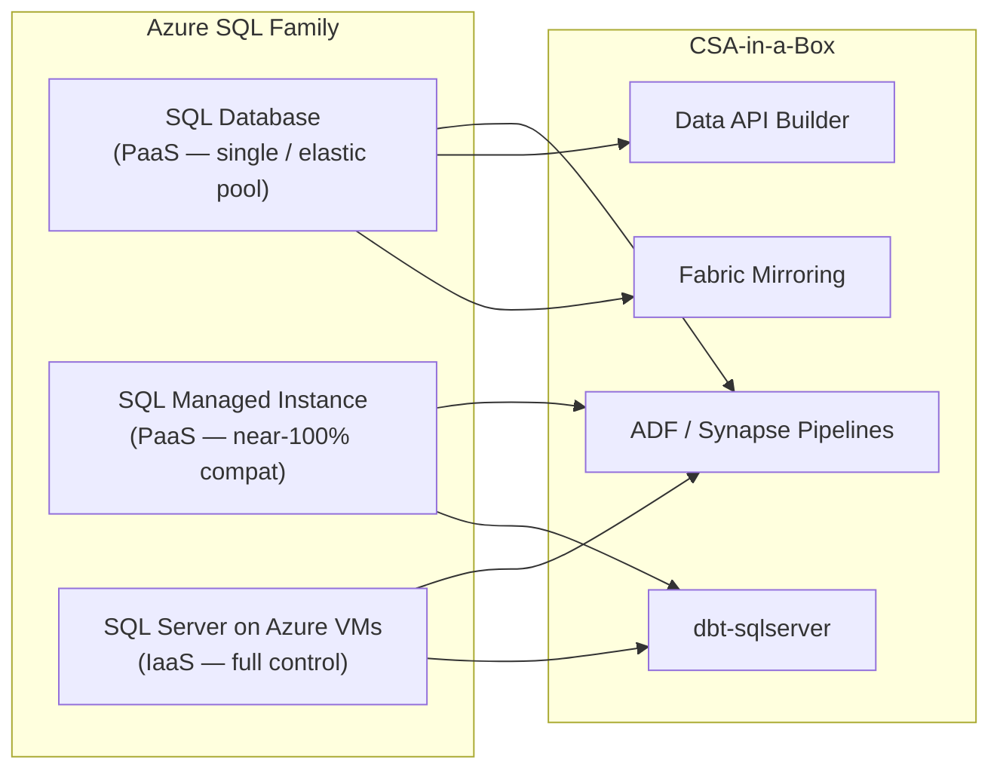
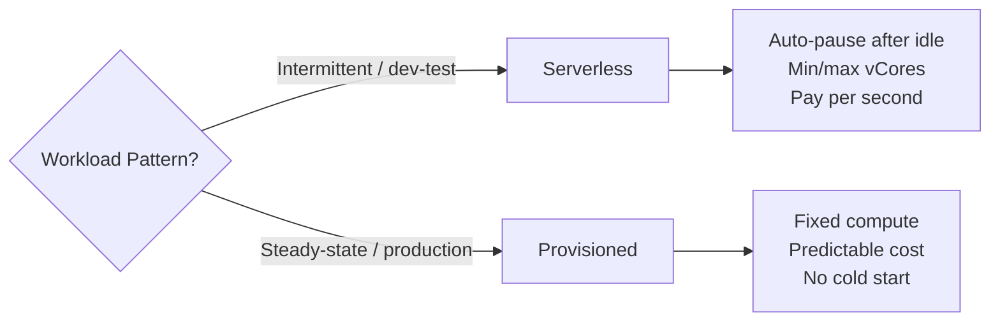
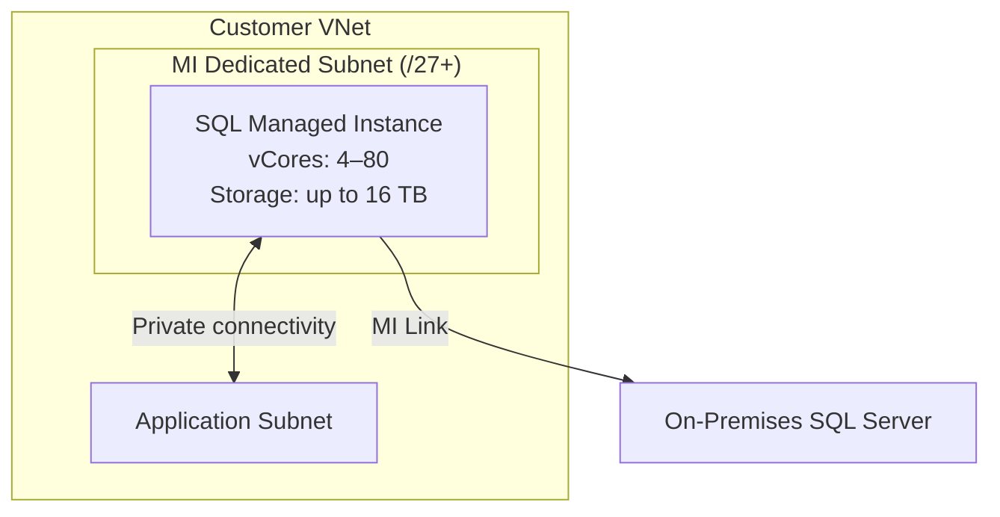
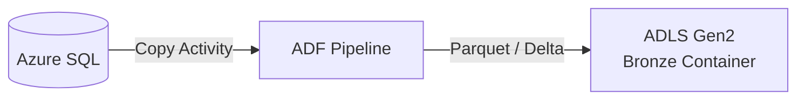
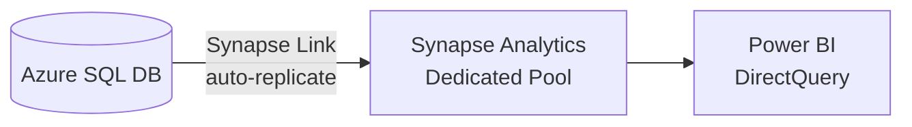
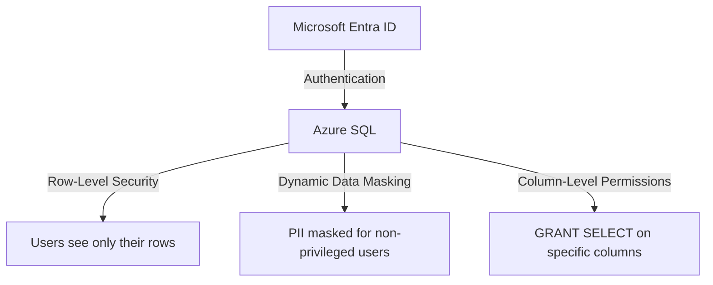
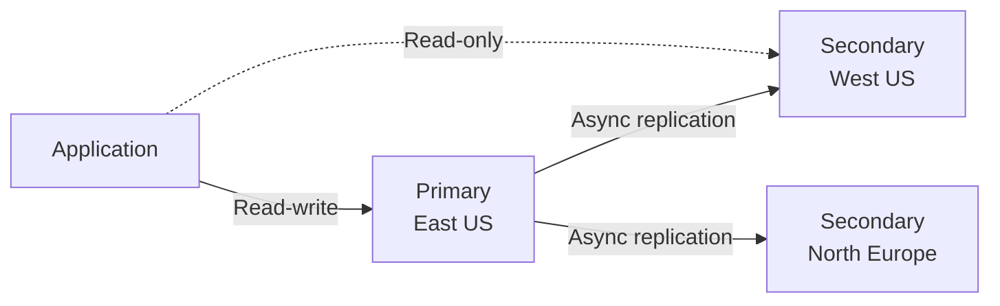
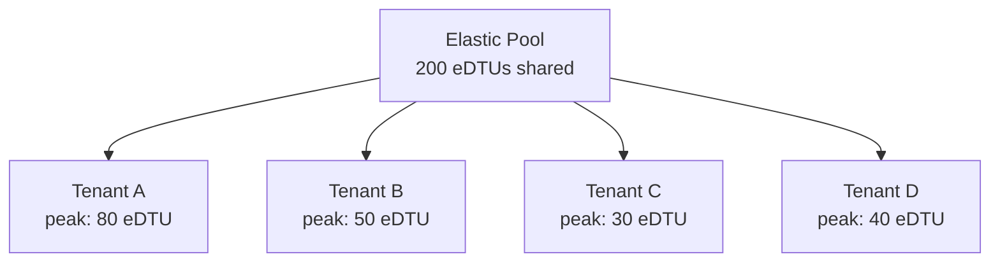

# Azure SQL — Comprehensive Guide

!!! note "Quick Summary"
Azure SQL is a family of managed relational database services built on the SQL Server engine.
This guide covers **all three flavors** — SQL Database, SQL Managed Instance, and SQL Server
on Azure VMs — with practical guidance on when to use each within CSA-in-a-Box, how to
integrate them into ingestion and transformation pipelines, and how to operate them securely
at scale.

## Overview

The Azure SQL family shares the same SQL Server engine but exposes it through three deployment
models that trade off control for managed convenience:

| Deployment Model               | One-Liner                                                                         |
| ------------------------------ | --------------------------------------------------------------------------------- |
| **Azure SQL Database**         | Fully managed PaaS — single databases or elastic pools, serverless or provisioned |
| **Azure SQL Managed Instance** | Near-100 % SQL Server compatibility in a managed VNet-injected instance           |
| **SQL Server on Azure VMs**    | Full IaaS control — run any SQL Server edition/version on Windows or Linux VMs    |



### When to Use Each in CSA-in-a-Box

- **SQL Database** — New cloud-native workloads, multi-tenant data products exposed via Data API
  Builder, serverless dev/test databases, Hyperscale for large analytical stores.
- **SQL Managed Instance** — Lift-and-shift of on-premises SQL Server databases that depend on
  SQL Agent, cross-database queries, CLR, Service Broker, or linked servers.
- **SQL Server on Azure VMs** — Legacy applications requiring a specific SQL Server version or
  edition, third-party software that demands OS-level access, or features not yet available in
  PaaS (e.g., certain replication topologies).

---

## Comparison Table

| Dimension                  | SQL Database                                      | SQL Managed Instance                        | SQL Server on Azure VMs       |
| -------------------------- | ------------------------------------------------- | ------------------------------------------- | ----------------------------- |
| **Service model**          | PaaS (database-scoped)                            | PaaS (instance-scoped)                      | IaaS                          |
| **SQL Server compat**      | ~95 % (T-SQL surface)                             | ~99 % (instance features)                   | 100 %                         |
| **Pricing models**         | DTU, vCore (provisioned / serverless), Hyperscale | vCore (General Purpose / Business Critical) | Pay-as-you-go, AHUB, Reserved |
| **Max size**               | 128 TB (Hyperscale)                               | 16 TB                                       | VM disk limits                |
| **High availability**      | Built-in (zone-redundant, geo-replication)        | Built-in (Always On under the hood)         | Always On AG (self-managed)   |
| **Networking**             | Public + private endpoint                         | VNet-injected (private by default)          | VNet / NSG (self-managed)     |
| **SQL Agent**              | No (use elastic jobs or ADF)                      | Yes                                         | Yes                           |
| **Cross-database queries** | No (use elastic query)                            | Yes                                         | Yes                           |
| **CLR / linked servers**   | No                                                | Yes                                         | Yes                           |
| **SSIS**                   | No (use ADF SSIS IR)                              | No (use ADF SSIS IR)                        | Yes                           |
| **Migration complexity**   | Low (schema + data)                               | Medium (instance-level)                     | Low (backup/restore)          |
| **Patching**               | Automatic                                         | Automatic                                   | Manual or auto-patch          |
| **Fabric Mirroring**       | Yes                                               | Preview                                     | No                            |
| **CSA-in-a-Box fit**       | Data products, APIs, dev/test                     | Enterprise lift-and-shift                   | Legacy, unsupported features  |

---

## Azure SQL Database

### Single Database vs Elastic Pool

| Aspect                    | Single Database                 | Elastic Pool                                       |
| ------------------------- | ------------------------------- | -------------------------------------------------- |
| **Use case**              | Predictable, isolated workloads | Multi-tenant, variable workloads sharing resources |
| **Billing**               | Per-database DTU/vCore          | Shared DTU/vCore across pool                       |
| **Best for CSA-in-a-Box** | Dedicated data product stores   | SaaS-style multi-tenant analytics                  |

### DTU vs vCore

| Model     | Best When                                                | Notes                                            |
| --------- | -------------------------------------------------------- | ------------------------------------------------ |
| **DTU**   | Simple workloads, predictable I/O                        | Bundled CPU + I/O + memory; easy to start        |
| **vCore** | Need fine-grained control, Hybrid Benefit, or serverless | Separate compute/storage; maps to on-prem sizing |

!!! tip "Right-Sizing Shortcut"
Use the [Azure SQL DTU Calculator](https://dtucalculator.azurewebsites.net/) to capture a
production workload trace and map it to the correct DTU/vCore tier before migrating.

### Serverless vs Provisioned



**Serverless** auto-pauses after a configurable idle period (default 1 hour) and resumes on the
next connection. Ideal for dev/test environments and bursty internal tools. Not recommended for
latency-sensitive production APIs where cold-start delays (up to ~1 minute) are unacceptable.

### Hyperscale Tier

Hyperscale is the answer when your database outgrows the 4 TB limit of General Purpose / Business
Critical tiers:

- **Scale:** Up to 100 TB with instant point-in-time snapshots via page-server architecture.
- **Read scale-out:** Up to 4 named replicas for offloading analytical queries.
- **Instant database copy:** Near-instant `CREATE DATABASE ... AS COPY OF` for large databases.
- **Reverse migration:** Hyperscale databases can now be migrated back to General Purpose.

!!! info "Hyperscale for Analytics"
Hyperscale is a strong candidate when CSA-in-a-Box pipelines produce large Silver/Gold-tier
relational datasets that analysts query directly via Power BI or DAB, and the team prefers
SQL Database over Synapse dedicated pools.

### Ledger Tables

Ledger tables provide tamper-evident, cryptographically verifiable audit trails — useful in
regulated industries (financial services, healthcare, government):

```sql
-- Append-only ledger table (immutable)
CREATE TABLE dbo.AuditLog (
    EventId     INT IDENTITY PRIMARY KEY,
    EventTime   DATETIME2 NOT NULL DEFAULT SYSUTCDATETIME(),
    Actor       NVARCHAR(128),
    Action      NVARCHAR(256),
    Details     NVARCHAR(MAX)
) WITH (SYSTEM_VERSIONING = ON, LEDGER = ON (APPEND_ONLY = ON));

-- Verify ledger integrity
EXEC sp_verify_database_ledger;
```

### JSON and Vector Support

SQL Database supports native JSON functions (`JSON_VALUE`, `JSON_QUERY`, `JSON_MODIFY`,
`OPENJSON`, `FOR JSON`) and, as of SQL Server 2025 compatibility, vector data types and
`VECTOR_DISTANCE` for similarity search — enabling hybrid transactional-analytical-AI workloads
without a separate vector store.

```sql
-- Store and query embeddings (SQL Server 2025 / preview)
ALTER TABLE dbo.Documents ADD Embedding VECTOR(1536);

SELECT TOP 5 Title,
       VECTOR_DISTANCE('cosine', Embedding, @queryVector) AS Distance
FROM   dbo.Documents
ORDER  BY Distance;
```

### Data API Builder Integration

Azure SQL Database pairs naturally with **Data API Builder (DAB)**, which auto-generates REST and
GraphQL endpoints over SQL objects with zero application code.

!!! abstract "Cross-Reference"
See [Tutorial 11 — Data API Builder](../tutorials/11-data-api-builder/README.md) for a
hands-on walkthrough of deploying DAB as a Container App backed by Azure SQL.

---

## Azure SQL Managed Instance

### When to Choose MI over SQL Database

Choose Managed Instance when the workload depends on **instance-scoped features** that SQL
Database does not support:

- **SQL Agent** — scheduled jobs, alerts, operators
- **Cross-database queries** — `USE [OtherDB]; SELECT ...`
- **CLR assemblies** — custom .NET code in-database
- **Service Broker** — asynchronous messaging between databases
- **Linked servers** — federated queries to external sources
- **Database Mail** — SMTP-based alerting from T-SQL

### Architecture

Managed Instance runs inside a dedicated subnet in your VNet with a managed Always On
availability group under the hood:



### MI Link (Near-Real-Time Replication)

MI Link uses Always On distributed availability groups to replicate data from on-premises SQL
Server to Managed Instance in near-real-time. This enables:

- **Online migration** — replicate continuously, then fail over with minimal downtime.
- **Read-scale offloading** — run reporting/analytics on the MI replica while production stays
  on-premises.
- **Disaster recovery** — MI serves as a warm standby in Azure.

```sql
-- On the on-premises SQL Server (source)
ALTER AVAILABILITY GROUP [MI_Link_AG]
    ADD DATABASE [AdventureWorks];

-- Failover when ready (on MI)
ALTER AVAILABILITY GROUP [MI_Link_AG] FAILOVER;
```

### Instance Pools

Instance pools let you pre-provision compute and share it across multiple small Managed
Instances — useful when you have many small databases that individually would not justify a
4-vCore minimum:

- **Cost savings:** Share vCores across instances; pay for the pool, not each instance.
- **Fast provisioning:** New instances within a pool deploy in ~5 minutes vs. ~45 minutes.
- **Density:** Up to 40 instances per pool (General Purpose).

---

## SQL Server on Azure VMs

### When to Use IaaS

| Scenario                                 | Why IaaS                                         |
| ---------------------------------------- | ------------------------------------------------ |
| Legacy app requires SQL Server 2014/2016 | PaaS supports current engine only                |
| Third-party software needs OS access     | Agents, custom drivers, file-system dependencies |
| Specific replication topology            | Merge replication, peer-to-peer                  |
| SSIS packages on the same box            | Co-located SSIS runtime                          |
| FCI (Failover Cluster Instance)          | Shared-disk clustering                           |
| Full sysadmin access required            | Registry, startup parameters, trace flags        |

### SQL Server 2022 on Azure

SQL Server 2022 introduces Azure-connected features that blur the IaaS/PaaS boundary:

- **Azure Synapse Link for SQL Server** — zero-ETL replication to Synapse Analytics.
- **Microsoft Entra ID authentication** — managed identity and Azure AD groups.
- **Managed disaster recovery to Azure** — link to SQL Managed Instance for DR.
- **S3-compatible object storage backup** — back up to ADLS via S3 API.
- **Ledger, contained AG, query store hints** — parity with cloud.

### Azure Hybrid Benefit and BYOL

If you have SQL Server licenses with Software Assurance, apply **Azure Hybrid Benefit (AHB)** to
reduce VM costs by up to 55 %. AHB also applies to SQL Database and Managed Instance vCore tiers.

```bash
# Enable Hybrid Benefit on a SQL VM
az sql vm update \
    --resource-group $RG \
    --name sql-vm-01 \
    --license-type AHUB
```

---

## Integration with CSA-in-a-Box

### ADF Copy Activity — SQL to Bronze



```json
{
    "type": "Copy",
    "source": {
        "type": "AzureSqlSource",
        "sqlReaderQuery": "SELECT * FROM dbo.Orders WHERE ModifiedDate > @{pipeline().parameters.watermark}"
    },
    "sink": {
        "type": "ParquetSink",
        "storeSettings": { "type": "AzureBlobFSWriteSettings" }
    }
}
```

### Change Data Capture (CDC) for Incremental Loads

CDC captures row-level changes (inserts, updates, deletes) in system tables, enabling efficient
incremental extraction without modifying application code:

```sql
-- Enable CDC on the database
EXEC sys.sp_cdc_enable_db;

-- Enable CDC on a table
EXEC sys.sp_cdc_enable_table
    @source_schema = N'dbo',
    @source_name   = N'Orders',
    @role_name     = NULL,
    @supports_net_changes = 1;

-- Query net changes since last watermark
SELECT *
FROM   cdc.fn_cdc_get_net_changes_dbo_Orders(@from_lsn, @to_lsn, 'all');
```

!!! warning "CDC Cleanup"
CDC retention defaults to 3 days. In high-volume tables, monitor `cdc.*_CT` table sizes and
adjust `@retention` via `sys.sp_cdc_change_db_owner` or the cleanup job schedule to prevent
transaction log bloat.

### Synapse Link for SQL (Zero-ETL)

Synapse Link for SQL automatically replicates operational data from SQL Database or SQL Server
2022 into a Synapse Analytics dedicated SQL pool — no pipelines to build or maintain:



### Fabric Mirroring for SQL Database

Fabric Mirroring continuously replicates Azure SQL Database tables into Microsoft Fabric OneLake
as Delta tables — enabling T-SQL sources to participate in the Fabric lakehouse without custom
ETL:

- Near-real-time replication (seconds of latency).
- Data lands in OneLake as open Delta/Parquet.
- Queryable via Fabric SQL endpoint, Spark, KQL, and Power BI.

!!! abstract "Cross-Reference"
See [ADR-0010 — Fabric Strategic Target](../adr/0010-fabric-strategic-target.md) for
the architectural rationale behind Fabric as the convergence layer.

### dbt Adapters

CSA-in-a-Box supports two dbt adapters for SQL workloads:

| Adapter         | Target                                     | Install                     |
| --------------- | ------------------------------------------ | --------------------------- |
| `dbt-sqlserver` | Azure SQL Database / MI / SQL Server on VM | `pip install dbt-sqlserver` |
| `dbt-fabric`    | Fabric SQL Endpoint (mirrored data)        | `pip install dbt-fabric`    |

```yaml
# profiles.yml — Azure SQL Database with managed identity
my_sql_project:
    target: dev
    outputs:
        dev:
            type: sqlserver
            driver: "ODBC Driver 18 for SQL Server"
            server: "{{ env_var('AZURE_SQL_SERVER') }}"
            database: "{{ env_var('AZURE_SQL_DB') }}"
            authentication: ActiveDirectoryMsi
            schema: silver
            threads: 4
```

### Polybase / OPENROWSET — Query ADLS from SQL

SQL Managed Instance and SQL Server 2022 on VMs can query Parquet and CSV files in ADLS directly
using `OPENROWSET`:

```sql
SELECT TOP 100 *
FROM OPENROWSET(
    BULK 'https://csaadls.dfs.core.windows.net/bronze/orders/*.parquet',
    FORMAT = 'PARQUET'
) AS orders;
```

---

## Security

### Authentication and Identity

| Method                            | SQL Database | Managed Instance | SQL Server on VM |
| --------------------------------- | ------------ | ---------------- | ---------------- |
| **Microsoft Entra ID (Azure AD)** | Yes          | Yes              | Yes (SQL 2022+)  |
| **Managed Identity**              | Yes          | Yes              | Yes (SQL 2022+)  |
| **SQL Authentication**            | Yes          | Yes              | Yes              |
| **Windows Authentication**        | No           | Yes (Kerberos)   | Yes              |

!!! success "Best Practice"
Use **Microsoft Entra ID + managed identity** for all service-to-service connections
(ADF, Container Apps, Functions). Disable SQL authentication where possible.

### Encryption

- **TDE (Transparent Data Encryption)** — enabled by default on SQL Database and MI; encrypts
  data at rest with service-managed or customer-managed keys (CMK via Azure Key Vault).
- **Always Encrypted** — column-level encryption where the database engine never sees plaintext.
  Use for PII, SSN, financial data. Supports enclaves for richer query operations.
- **TLS 1.2+** — enforced for data in transit on all Azure SQL services.

### Access Controls



- **Row-Level Security (RLS)** — filter predicates restrict row access per user/role.
- **Dynamic Data Masking** — masks sensitive columns (email, SSN) for non-admin users at query
  time without changing stored data.
- **Column-Level Permissions** — `GRANT`/`DENY` at the column level for fine-grained control.

### Auditing and Threat Detection

- **Azure SQL Auditing** — logs all database events to a storage account, Log Analytics, or
  Event Hub. Enable at the server level for consistent coverage.
- **Microsoft Defender for SQL** — advanced threat detection (SQL injection, anomalous access,
  brute-force), vulnerability assessment scans, and security recommendations.
- **Vulnerability Assessment** — periodic scans check for misconfigurations, excessive
  permissions, and unprotected sensitive data with remediation guidance.

---

## Performance

### Intelligent Performance

Azure SQL Database includes built-in intelligence that continuously monitors and optimizes
workloads:

| Feature                       | What It Does                                             | Action Required                 |
| ----------------------------- | -------------------------------------------------------- | ------------------------------- |
| **Automatic Tuning**          | Creates/drops indexes, forces good plans                 | Enable in Azure Portal or T-SQL |
| **Automatic Indexing**        | Identifies missing indexes and validates before applying | Part of auto-tuning             |
| **Query Store**               | Captures query plans and runtime stats over time         | Enabled by default              |
| **Query Performance Insight** | Visual dashboard for top resource-consuming queries      | Azure Portal                    |

```sql
-- Enable automatic tuning recommendations
ALTER DATABASE CURRENT
SET AUTOMATIC_TUNING (
    CREATE_INDEX = ON,
    DROP_INDEX = ON,
    FORCE_LAST_GOOD_PLAN = ON
);
```

### In-Memory OLTP

In-Memory OLTP (Hekaton) stores tables in memory-optimized structures and compiles stored
procedures to native code — delivering 10-30x throughput improvements for high-concurrency
OLTP workloads:

```sql
-- Memory-optimized table
CREATE TABLE dbo.SessionState (
    SessionId   UNIQUEIDENTIFIER PRIMARY KEY NONCLUSTERED,
    Payload     VARBINARY(8000),
    ExpiresAt   DATETIME2
) WITH (MEMORY_OPTIMIZED = ON, DURABILITY = SCHEMA_AND_DATA);
```

!!! info "Availability"
In-Memory OLTP is available on **Business Critical** and **Hyperscale** tiers for SQL
Database, and on **Business Critical** for Managed Instance.

### Columnstore Indexes

Columnstore indexes compress data by column and use batch-mode execution — ideal for analytical
queries over large fact tables:

```sql
-- Clustered columnstore on a fact table
CREATE CLUSTERED COLUMNSTORE INDEX CCI_FactSales
ON dbo.FactSales;

-- Non-clustered columnstore for hybrid OLTP + analytics
CREATE NONCLUSTERED COLUMNSTORE INDEX NCCI_Orders
ON dbo.Orders (OrderDate, CustomerId, TotalAmount);
```

---

## High Availability and Disaster Recovery

### HA/DR Options by Deployment

| Capability                 | SQL Database                    | Managed Instance        | SQL Server on VM         |
| -------------------------- | ------------------------------- | ----------------------- | ------------------------ |
| **Zone-redundant HA**      | Yes (Premium / BC / Hyperscale) | Yes (Business Critical) | Manual (AG across zones) |
| **Active geo-replication** | Yes (up to 4 secondaries)       | No                      | No                       |
| **Failover groups**        | Yes                             | Yes                     | No (use AG listener)     |
| **Point-in-time restore**  | Yes (7–35 days)                 | Yes (7–35 days)         | Manual backups           |
| **Long-term retention**    | Yes (up to 10 years)            | Yes (up to 10 years)    | Manual (to ADLS)         |
| **Geo-restore**            | Yes                             | Yes                     | Manual geo-backup        |

### Active Geo-Replication



Active geo-replication maintains up to 4 readable secondaries in different regions with
independent connection strings. Use for read-offloading and manual failover scenarios.

### Failover Groups

Failover groups provide a single listener endpoint that automatically redirects traffic after
failover — applications do not need connection string changes:

```
# Listener endpoints (auto-redirect)
<fog-name>.database.windows.net        # read-write
<fog-name>.secondary.database.windows.net  # read-only
```

!!! tip "RPO/RTO"
Failover groups target **RPO < 5 seconds** (async replication) and **RTO < 30 seconds**
(automatic failover). For RPO = 0, use Business Critical tier with zone-redundant HA.

---

## Cost Optimization

### Strategies

| Strategy                         | Savings                                        | Applies To               |
| -------------------------------- | ---------------------------------------------- | ------------------------ |
| **Serverless auto-pause**        | Up to 70 % for intermittent workloads          | SQL Database (vCore)     |
| **Reserved capacity**            | Up to 65 % (1- or 3-year commitment)           | SQL Database, MI         |
| **Azure Hybrid Benefit**         | Up to 55 % (use existing SA licenses)          | SQL Database, MI, SQL VM |
| **Elastic pools**                | Share resources across databases               | SQL Database             |
| **Right-sizing**                 | Eliminate over-provisioned tiers               | All                      |
| **Hyperscale — reverse migrate** | Move back to GP when scale is no longer needed | SQL Database             |

### Elastic Pools for Multi-Tenant



Individual databases burst as needed while the pool absorbs the aggregate. This works well when
tenants have non-overlapping peak usage patterns.

### Serverless Auto-Pause Example

```bash
# Create a serverless database with auto-pause
az sql db create \
    --resource-group $RG \
    --server csa-sql-server \
    --name devdb \
    --edition GeneralPurpose \
    --compute-model Serverless \
    --family Gen5 \
    --min-capacity 0.5 \
    --capacity 4 \
    --auto-pause-delay 60
```

---

## Anti-Patterns

!!! danger "Common Mistakes"

    **1. Using SQL Database when you need SQL Agent**
    SQL Database does not support SQL Agent. If your workload depends on Agent jobs, use Managed
    Instance or migrate job scheduling to ADF / Elastic Jobs.

    **2. Embedding connection strings with SQL auth in app config**
    Use managed identity instead. SQL auth credentials in config files are a security incident
    waiting to happen.

    **3. Ignoring DTU throttling**
    DTU-based databases silently throttle I/O when the DTU ceiling is reached. Monitor
    `sys.dm_db_resource_stats` and set alerts on `avg_cpu_percent` and `avg_data_io_percent`.

    **4. Skipping CDC cleanup tuning**
    Default CDC cleanup retains 3 days of change history. On high-write tables this can grow the
    transaction log dramatically. Tune retention and monitor `cdc.*_CT` sizes.

    **5. Running analytical queries on OLTP databases without read replicas**
    Heavy reporting queries compete with OLTP transactions. Use Hyperscale named replicas,
    geo-replication read-only endpoints, or Fabric Mirroring to offload analytics.

    **6. Over-provisioning Business Critical when General Purpose suffices**
    Business Critical includes local SSD and read-replica HA. If you do not need sub-millisecond
    I/O latency or zone-redundant HA, General Purpose is significantly cheaper.

---

## Do / Don't

| Do                                                 | Don't                                               |
| -------------------------------------------------- | --------------------------------------------------- |
| Use managed identity for all service connections   | Use SQL auth with passwords in config               |
| Enable TDE + auditing + Defender for SQL           | Leave auditing disabled in production               |
| Start with serverless for dev/test                 | Over-provision dedicated compute for idle databases |
| Use failover groups for mission-critical databases | Rely on single-region deployment                    |
| Enable automatic tuning and Query Store            | Ignore `sys.dm_exec_query_stats` regressions        |
| Size elastic pools using utilization data          | Guess pool eDTU/vCore without baseline metrics      |
| Use CDC or Synapse Link for incremental ingestion  | Full-table TRUNCATE + reload nightly                |
| Use Hyperscale when data exceeds 4 TB              | Force-fit large databases into General Purpose      |
| Apply Azure Hybrid Benefit if you have SA licenses | Pay full price when AHUB is available               |
| Test failover annually with DR drills              | Assume failover groups "just work" without testing  |

---

## Pre-Deployment Checklist

- [ ] **Flavor selected** — SQL Database vs MI vs VM based on feature requirements
- [ ] **Tier selected** — DTU vs vCore, General Purpose vs Business Critical vs Hyperscale
- [ ] **Networking** — private endpoint (SQL DB) or VNet injection (MI) configured
- [ ] **Authentication** — Microsoft Entra ID + managed identity; SQL auth disabled if possible
- [ ] **TDE** — enabled with customer-managed key in Key Vault (for regulated workloads)
- [ ] **Always Encrypted** — configured for PII / sensitive columns
- [ ] **Auditing** — server-level auditing to Log Analytics or storage
- [ ] **Defender for SQL** — enabled for threat detection + vulnerability assessment
- [ ] **Firewall** — deny public access or restrict to known IPs; use private endpoints
- [ ] **Backup** — point-in-time restore window set (7–35 days); long-term retention configured
- [ ] **HA/DR** — failover group or geo-replication configured for production databases
- [ ] **Automatic tuning** — enabled (CREATE_INDEX, DROP_INDEX, FORCE_LAST_GOOD_PLAN)
- [ ] **Monitoring** — alerts on DTU/CPU > 80 %, storage > 85 %, deadlocks, failed logins
- [ ] **Cost** — Hybrid Benefit applied, reserved capacity evaluated, serverless for dev/test
- [ ] **CDC** — enabled on source tables if incremental ingestion is required
- [ ] **Fabric Mirroring / Synapse Link** — configured if zero-ETL analytics is desired

---

## Cross-References

| Resource                                   | Path                                                                                                 |
| ------------------------------------------ | ---------------------------------------------------------------------------------------------------- |
| Data API Builder Tutorial                  | [`docs/tutorials/11-data-api-builder/README.md`](../tutorials/11-data-api-builder/README.md)      |
| APIM Data Mesh Gateway                     | [`docs/guides/apim-data-mesh-gateway.md`](apim-data-mesh-gateway.md)                                 |
| Security & Compliance Best Practices       | [`docs/best-practices/security-compliance.md`](../best-practices/security-compliance.md)             |
| Disaster Recovery Guide                    | [`docs/DR.md`](../DR.md)                                                                             |
| Cost Management                            | [`docs/COST_MANAGEMENT.md`](../COST_MANAGEMENT.md)                                                   |
| Fabric Strategic Target (ADR-0010)         | [`docs/adr/0010-fabric-strategic-target.md`](../adr/0010-fabric-strategic-target.md)                 |
| dbt as Canonical Transformation (ADR-0013) | [`docs/adr/0013-dbt-as-canonical-transformation.md`](../adr/0013-dbt-as-canonical-transformation.md) |
| Snowflake Migration Guide                  | [`docs/migrations/snowflake.md`](../migrations/snowflake.md)                                         |
| Performance Tuning Best Practices          | [`docs/best-practices/performance-tuning.md`](../best-practices/performance-tuning.md)               |
