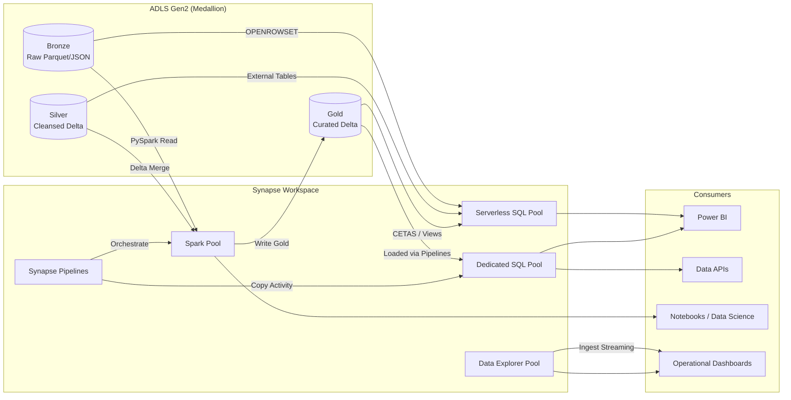
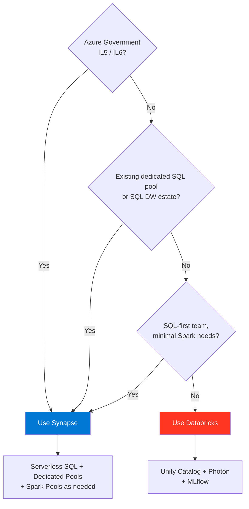
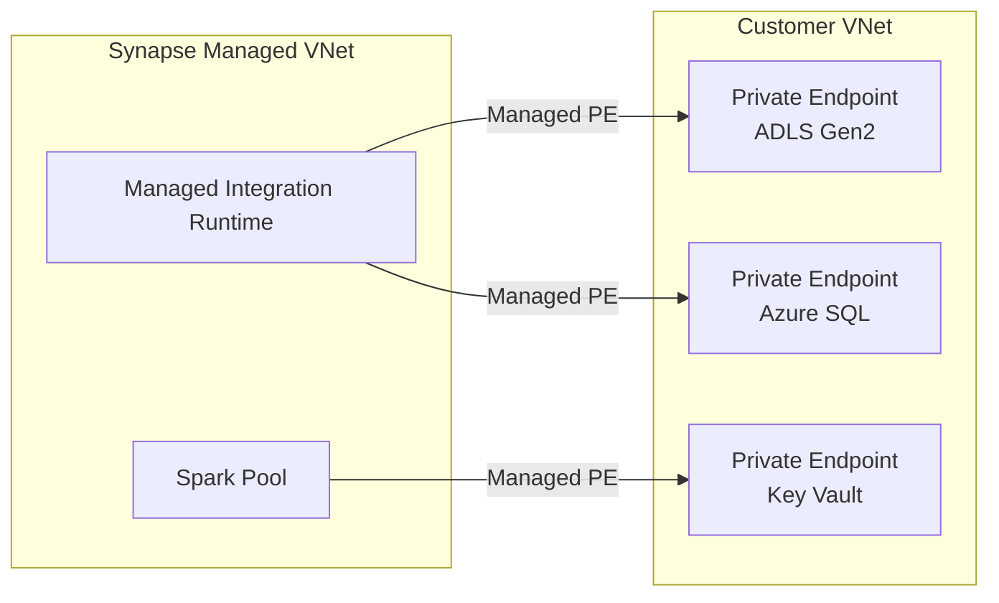
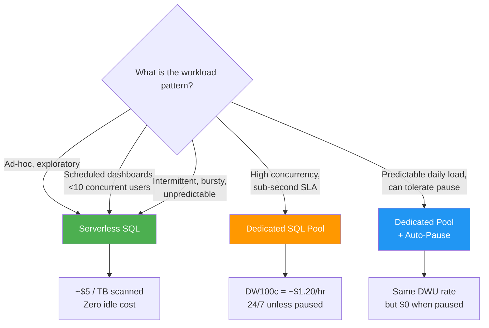

# Azure Synapse Analytics Guide

## Overview

Azure Synapse Analytics is a unified analytics service that brings together
enterprise data warehousing, big data analytics, data integration, and
visualization under a single control plane. Within CSA-in-a-Box, Synapse
serves as the primary analytics runtime for Azure Government deployments and
a complementary engine alongside Databricks in Azure Commercial.

Synapse provides five core capabilities:

| Capability              | Engine                | Billing Model             | Best For                                             |
| ----------------------- | --------------------- | ------------------------- | ---------------------------------------------------- |
| **Serverless SQL Pool** | T-SQL over ADLS       | Pay-per-TB scanned        | Ad-hoc exploration, Gold views, data virtualization  |
| **Dedicated SQL Pool**  | MPP (formerly SQL DW) | Reserved DWU capacity     | Sub-second BI, high-concurrency dashboards           |
| **Apache Spark Pool**   | Managed Spark 3.x     | Compute-hour              | ML, complex ETL, Delta Lake processing               |
| **Data Explorer Pool**  | Kusto (KQL)           | Compute-hour              | Log analytics, time-series, near-real-time ingestion |
| **Synapse Pipelines**   | ADF-compatible        | Activity runs + DIU-hours | Orchestration, data movement, scheduling             |

!!! tip "When to choose Synapse"
See the [Fabric vs. Databricks vs. Synapse decision tree](../decisions/fabric-vs-databricks-vs-synapse.md) for a structured comparison. In short: choose Synapse when you need Azure Government compliance (IL5/IL6), existing dedicated SQL pool estates, or serverless SQL-first data virtualization.

---

## Architecture

The following diagram shows how Synapse integrates with the CSA-in-a-Box
medallion architecture on ADLS Gen2 and serves downstream consumers.



---

## Serverless SQL Pool

Serverless SQL is the default entry point for data exploration in Synapse.
There is no infrastructure to provision — queries run on-demand against
files in ADLS Gen2 and you pay only for the data scanned.

### OPENROWSET Queries

Query Parquet, Delta, CSV, or JSON files directly without loading them into
a table.

```sql
-- Query Parquet files in the Silver layer
SELECT
    customer_id,
    order_date,
    total_amount
FROM OPENROWSET(
    BULK 'https://<storage>.dfs.core.windows.net/silver/sales/orders/**',
    FORMAT = 'PARQUET'
) AS orders
WHERE order_date >= '2026-01-01';
```

```sql
-- Query Delta Lake tables (specify Delta format)
SELECT *
FROM OPENROWSET(
    BULK 'https://<storage>.dfs.core.windows.net/gold/dim_customer/',
    FORMAT = 'DELTA'
) AS dim_customer;
```

### External Tables

For frequently queried datasets, create external tables to avoid repeating
OPENROWSET boilerplate. External tables also support column statistics.

```sql
-- Step 1: Scoped credential for ADLS access
CREATE DATABASE SCOPED CREDENTIAL adls_credential
WITH IDENTITY = 'Managed Identity';

-- Step 2: External data source
CREATE EXTERNAL DATA SOURCE gold_lake
WITH (
    LOCATION   = 'https://<storage>.dfs.core.windows.net/gold/',
    CREDENTIAL = adls_credential
);

-- Step 3: External file format
CREATE EXTERNAL FILE FORMAT parquet_format
WITH (FORMAT_TYPE = PARQUET);

-- Step 4: External table
CREATE EXTERNAL TABLE dbo.dim_product (
    product_id   INT,
    product_name NVARCHAR(200),
    category     NVARCHAR(100),
    unit_price   DECIMAL(10,2)
)
WITH (
    LOCATION     = 'dim_product/',
    DATA_SOURCE  = gold_lake,
    FILE_FORMAT  = parquet_format
);
```

### CETAS (CREATE EXTERNAL TABLE AS SELECT)

CETAS materializes query results back to ADLS as Parquet, enabling you to
build the Gold layer directly from serverless SQL.

```sql
CREATE EXTERNAL TABLE gold.fact_daily_sales
WITH (
    LOCATION     = 'fact_daily_sales/',
    DATA_SOURCE  = gold_lake,
    FILE_FORMAT  = parquet_format
)
AS
SELECT
    CAST(order_date AS DATE)     AS sale_date,
    product_id,
    COUNT(*)                     AS order_count,
    SUM(total_amount)            AS revenue
FROM OPENROWSET(
    BULK 'https://<storage>.dfs.core.windows.net/silver/sales/orders/**',
    FORMAT = 'PARQUET'
) AS orders
GROUP BY CAST(order_date AS DATE), product_id;
```

### Gold Layer Views

Create views on top of external tables or OPENROWSET to present a clean
semantic layer for Power BI and downstream APIs.

```sql
CREATE VIEW gold.vw_customer_lifetime_value AS
SELECT
    c.customer_id,
    c.customer_name,
    c.segment,
    COUNT(DISTINCT o.order_id) AS total_orders,
    SUM(o.total_amount)        AS lifetime_value,
    MAX(o.order_date)          AS last_order_date
FROM gold.dim_customer  c
JOIN gold.fact_orders    o ON c.customer_id = o.customer_id
GROUP BY c.customer_id, c.customer_name, c.segment;
```

### Performance Tips

| Technique                 | Impact  | Details                                                                                                 |
| ------------------------- | ------- | ------------------------------------------------------------------------------------------------------- |
| **Partition elimination** | High    | Partition data by date or region; serverless prunes partitions automatically when `WHERE` filters align |
| **File sizing**           | High    | Target 128 MB - 1 GB per Parquet file; small files cause excessive I/O overhead                         |
| **Column statistics**     | Medium  | `CREATE STATISTICS` on external tables helps the optimizer choose better plans                          |
| **Column projection**     | Medium  | Select only needed columns — Parquet is columnar, so fewer columns = less data scanned                  |
| **Row group filtering**   | Medium  | Parquet row-group statistics enable predicate pushdown; sort data on filter columns before writing      |
| **Result set caching**    | Low-Med | Repeated identical queries return cached results at no scan cost                                        |

!!! warning "Cost Model"
Serverless SQL charges **$5 per TB scanned** (may vary by region). There is no charge for idle time, but poorly written queries that scan entire containers without partition pruning can become expensive quickly. Always use `WHERE` clauses that align with your partitioning scheme.

---

## Dedicated SQL Pools

Dedicated SQL pools (formerly Azure SQL Data Warehouse) provide a
provisioned MPP engine for sub-second, high-concurrency workloads.

### When to Use

- Power BI dashboards serving 50+ concurrent users requiring sub-second response
- Star-schema data warehouses with heavy JOIN and aggregation patterns
- Workloads that need predictable latency independent of query complexity
- Azure Government environments at IL5/IL6 with high-concurrency BI

### Distribution Strategies

Choosing the right distribution is the single most impactful performance
decision for dedicated pools.

| Strategy        | Syntax                        | Best For                                                        | Watch Out                                      |
| --------------- | ----------------------------- | --------------------------------------------------------------- | ---------------------------------------------- |
| **Hash**        | `DISTRIBUTION = HASH(column)` | Large fact tables (>60M rows); choose high-cardinality join key | Data skew if chosen column has low cardinality |
| **Round-robin** | `DISTRIBUTION = ROUND_ROBIN`  | Staging tables, no dominant join pattern                        | Every query requires data movement for JOINs   |
| **Replicate**   | `DISTRIBUTION = REPLICATE`    | Small dimension tables (<1.5 GB)                                | Rebuild cost on updates; not for large tables  |

```sql
-- Hash-distributed fact table
CREATE TABLE dbo.fact_sales
WITH (
    DISTRIBUTION = HASH(customer_id),
    CLUSTERED COLUMNSTORE INDEX
)
AS SELECT * FROM staging.raw_sales;

-- Replicated dimension table
CREATE TABLE dbo.dim_date
WITH (
    DISTRIBUTION = REPLICATE,
    CLUSTERED COLUMNSTORE INDEX
)
AS SELECT * FROM staging.date_dimension;
```

### Indexing Strategies

| Index Type                          | Use Case                         | Notes                                                                                                  |
| ----------------------------------- | -------------------------------- | ------------------------------------------------------------------------------------------------------ |
| **Clustered Columnstore** (default) | Fact tables, analytics workloads | Best compression, batch-mode execution; requires >1M rows per distribution for optimal segment quality |
| **Heap**                            | Staging / temp tables            | Fastest for bulk insert; no ordering overhead                                                          |
| **Clustered Index**                 | Lookup-heavy dimensions          | B-tree for point lookups; avoid on wide fact tables                                                    |
| **Nonclustered**                    | Secondary access paths           | Adds overhead on writes; use sparingly                                                                 |

### Workload Management

Dedicated pools support workload groups and classifiers to allocate
resources across competing workloads.

```sql
-- Create a workload group for BI queries
CREATE WORKLOAD GROUP bi_reports
WITH (
    MIN_PERCENTAGE_RESOURCE = 20,
    MAX_PERCENTAGE_RESOURCE = 60,
    CAP_PERCENTAGE_RESOURCE = 60,
    REQUEST_MIN_RESOURCE_GRANT_PERCENT = 5,
    REQUEST_MAX_RESOURCE_GRANT_PERCENT = 10
);

-- Classify BI service account into the group
CREATE WORKLOAD CLASSIFIER bi_classifier
WITH (
    WORKLOAD_GROUP = 'bi_reports',
    MEMBERNAME     = 'powerbi_svc',
    IMPORTANCE     = ABOVE_NORMAL
);
```

### Auto-Pause and Geo-Backup

| Feature            | Configuration                              | Notes                                                                    |
| ------------------ | ------------------------------------------ | ------------------------------------------------------------------------ |
| **Auto-pause**     | Portal > Scale > Enable auto-pause         | Pauses after inactivity (min 60 min); first query takes ~2 min to resume |
| **Geo-backup**     | Automatic (every 8 hours to paired region) | RPO = 8 hours; can restore to any point in paired region                 |
| **Restore points** | Automatic every 8 hours + user-defined     | Retain for 7 days (automatic) or until deleted (user-defined)            |

!!! note "Auto-pause in production"
Auto-pause is excellent for dev/test pools but should be evaluated carefully for production. The ~2 minute resume time may violate latency SLAs for interactive BI dashboards.

---

## Spark Pools

Synapse Spark pools provide a managed Apache Spark environment integrated
into the Synapse workspace, sharing the same metadata store and security
boundary.

### Notebook Development

Synapse notebooks support Python, Scala, SQL, R, and .NET (C#/F#).
Notebooks can reference data through the shared Synapse metastore.

```python
# Read Delta Lake table from Gold layer
df = spark.read.format("delta").load(
    "abfss://gold@<storage>.dfs.core.windows.net/fact_sales/"
)

# Transform and write back
from pyspark.sql import functions as F

daily_summary = (
    df.groupBy(F.col("sale_date"), F.col("region"))
      .agg(
          F.count("order_id").alias("order_count"),
          F.sum("total_amount").alias("revenue")
      )
)

daily_summary.write.format("delta").mode("overwrite").save(
    "abfss://gold@<storage>.dfs.core.windows.net/fact_daily_summary/"
)
```

### Delta Lake Support

Synapse Spark has native Delta Lake support. Use Delta for all Silver and
Gold layer tables to get ACID transactions, time travel, and schema
enforcement.

```python
# Merge (upsert) pattern for slowly changing dimensions
from delta.tables import DeltaTable

target = DeltaTable.forPath(
    spark, "abfss://gold@<storage>.dfs.core.windows.net/dim_customer/"
)
source = spark.read.format("delta").load(
    "abfss://silver@<storage>.dfs.core.windows.net/customers_staging/"
)

target.alias("t").merge(
    source.alias("s"),
    "t.customer_id = s.customer_id"
).whenMatchedUpdateAll().whenNotMatchedInsertAll().execute()
```

### Integration with Synapse SQL

Spark tables created through the shared metastore are automatically
visible in serverless SQL pool, enabling cross-engine queries.

```python
# Create a managed Spark table visible to serverless SQL
daily_summary.write.format("delta").mode("overwrite") \
    .option("path", "abfss://gold@<storage>.dfs.core.windows.net/fact_daily/") \
    .saveAsTable("gold_db.fact_daily_summary")
```

```sql
-- Query the same table from serverless SQL
SELECT * FROM gold_db.dbo.fact_daily_summary
WHERE sale_date >= '2026-04-01';
```

### Configuration Tuning

| Setting                                | Recommended Value | Rationale                         |
| -------------------------------------- | ----------------- | --------------------------------- |
| `spark.executor.instances`             | 2-10 (auto-scale) | Match to data volume; start small |
| `spark.sql.shuffle.partitions`         | 2x executor cores | Avoid too many small tasks        |
| `spark.sql.files.maxPartitionBytes`    | `128m`            | Align with ADLS block size        |
| `spark.databricks.delta.optimizeWrite` | `true`            | Coalesce small files on write     |
| `spark.databricks.delta.autoCompact`   | `true`            | Background compaction             |

### Library Management

Install Python/R packages at the pool level (shared) or session level
(ad-hoc).

```yaml
# requirements.txt uploaded to Spark pool configuration
pandas==2.2.0
scikit-learn==1.4.0
azure-identity==1.15.0
great-expectations==0.18.0
```

!!! info "Session-scoped packages"
For ad-hoc exploration, use `%%configure` magic or `mssparkutils.install` to add packages at the session level without modifying pool configuration.

---

## Synapse Pipelines

Synapse Pipelines share the same underlying engine as Azure Data Factory
and support identical activities, linked services, integration runtimes,
and data flows.

### Synapse Pipelines vs. Azure Data Factory

| Aspect                  | Synapse Pipelines                         | Azure Data Factory                              |
| ----------------------- | ----------------------------------------- | ----------------------------------------------- |
| **Integration runtime** | Shared with Synapse workspace             | Standalone service                              |
| **Notebook activity**   | Native Synapse notebook execution         | Requires Databricks or HDInsight linked service |
| **SQL pool activity**   | Direct dedicated/serverless SQL execution | Requires linked service                         |
| **Data flows**          | Identical capability                      | Identical capability                            |
| **Git integration**     | Synapse workspace Git                     | ADF-specific Git                                |
| **Pricing**             | Same per-activity pricing                 | Same per-activity pricing                       |

!!! tip "When to use which"
Use Synapse Pipelines when your orchestration is tightly coupled to Synapse SQL or Spark pools. Use standalone ADF when you need a centralized orchestration layer across multiple Synapse workspaces, Databricks, or non-Synapse compute.

### Parameterized Pipeline Example

```json
{
    "name": "MedallionPipeline",
    "properties": {
        "parameters": {
            "sourceDate": { "type": "string", "defaultValue": "" },
            "layerTarget": { "type": "string", "defaultValue": "silver" }
        },
        "activities": [
            {
                "name": "BronzeToSilver",
                "type": "SynapseNotebook",
                "linkedServiceName": { "referenceName": "SynapseWorkspace" },
                "typeProperties": {
                    "notebook": { "referenceName": "bronze_to_silver" },
                    "parameters": {
                        "source_date": {
                            "value": "@pipeline().parameters.sourceDate",
                            "type": "Expression"
                        }
                    },
                    "sparkPool": { "referenceName": "csa_spark_pool" }
                }
            }
        ]
    }
}
```

---

## Synapse and CSA-in-a-Box

### Synapse as an Alternative to Databricks

Within CSA-in-a-Box, Synapse is positioned as the primary analytics engine
in scenarios where Databricks is unavailable or less suitable. The
decision is driven by three factors.



See also: [ADR-0002 (Databricks over OSS Spark)](../adr/0002-databricks-over-oss-spark.md)
and the full [decision tree](../decisions/fabric-vs-databricks-vs-synapse.md).

### Medallion Architecture on Synapse

The same Bronze/Silver/Gold pattern used with Databricks maps directly
onto Synapse engines.

| Layer       | Primary Engine                             | Storage Format       | Notes                                 |
| ----------- | ------------------------------------------ | -------------------- | ------------------------------------- |
| **Bronze**  | Synapse Pipelines (Copy Activity)          | Parquet / raw JSON   | Land source data as-is                |
| **Silver**  | Spark Pool notebooks                       | Delta Lake           | Cleanse, deduplicate, type-cast       |
| **Gold**    | Serverless SQL (CETAS) or Spark            | Delta Lake / Parquet | Aggregated, business-aligned datasets |
| **Serving** | Dedicated SQL Pool or Serverless SQL views | Columnar / views     | Optimized for BI and API consumption  |

### dbt-synapse Adapter

CSA-in-a-Box supports [dbt-synapse](https://github.com/dbt-msft/dbt-synapse)
for SQL-based transformations on dedicated pools.

```yaml
# profiles.yml
csa_synapse:
    target: dev
    outputs:
        dev:
            type: synapse
            driver: "ODBC Driver 18 for SQL Server"
            host: "<workspace>.sql.azuresynapse.net"
            port: 1433
            database: "csa_dedicated_pool"
            schema: "gold"
            authentication: "ActiveDirectoryServicePrincipal"
            tenant_id: "{{ env_var('AZURE_TENANT_ID') }}"
            client_id: "{{ env_var('AZURE_CLIENT_ID') }}"
            client_secret: "{{ env_var('AZURE_CLIENT_SECRET') }}"
```

!!! note "dbt-synapse vs. dbt-databricks"
If your CSA-in-a-Box deployment uses both engines, maintain separate dbt profiles and share model SQL through the `ref()` function. See [ADR-0013 (dbt as canonical transformation)](../adr/0013-dbt-as-canonical-transformation.md) for the canonical dbt strategy.

---

## Managed Private Endpoints

Synapse supports workspace-managed VNets for network isolation.
All outbound traffic from managed Spark pools and integration runtimes
routes through managed private endpoints.

### Configuration



| Endpoint Target                    | Status                      | Approval                          |
| ---------------------------------- | --------------------------- | --------------------------------- |
| ADLS Gen2 (storage account)        | Auto-approved (same tenant) | Automatic                         |
| Azure SQL / Synapse dedicated pool | Auto-approved (same tenant) | Automatic                         |
| Key Vault                          | Auto-approved (same tenant) | Automatic                         |
| Third-party / cross-tenant         | Pending                     | Manual approval by resource owner |

!!! warning "Managed VNet limitations"
When a workspace managed VNet is enabled, all Spark pools and integration runtimes use managed compute. You cannot use self-hosted integration runtimes within the managed VNet — deploy them in a separate workspace or use a standard ADF instance.

---

## Monitoring

### Dedicated Pool DMVs

```sql
-- Active queries and resource consumption
SELECT
    r.request_id,
    r.session_id,
    r.status,
    r.submit_time,
    r.total_elapsed_time / 1000.0 AS elapsed_sec,
    r.resource_class,
    r.command
FROM sys.dm_pdw_exec_requests r
WHERE r.status = 'Running'
ORDER BY r.submit_time;

-- Distribution data skew detection
SELECT
    tb.name                        AS table_name,
    CAST(MAX(row_count) AS FLOAT)
        / NULLIF(MIN(row_count), 0) AS skew_ratio
FROM sys.dm_pdw_nodes_db_partition_stats ps
JOIN sys.pdw_nodes_tables              nt ON ps.object_id = nt.object_id
JOIN sys.pdw_table_mappings            tm ON nt.name = tm.physical_name
JOIN sys.tables                        tb ON tm.object_id = tb.object_id
GROUP BY tb.name
HAVING MAX(row_count) > 0
ORDER BY skew_ratio DESC;
```

### Query Store

Enable Query Store on dedicated pools to track query performance over
time, identify regressions, and find optimization opportunities.

```sql
ALTER DATABASE csa_dedicated_pool
SET QUERY_STORE = ON (
    OPERATION_MODE = READ_WRITE,
    MAX_STORAGE_SIZE_MB = 1024,
    INTERVAL_LENGTH_MINUTES = 30
);
```

### Azure Monitor Integration

| Signal             | Diagnostic Setting           | Destination             |
| ------------------ | ---------------------------- | ----------------------- |
| SQL requests       | `SynapseSqlPoolExecRequests` | Log Analytics workspace |
| DMS workers        | `SynapseSqlPoolDmsWorkers`   | Log Analytics workspace |
| Wait stats         | `SynapseSqlPoolWaits`        | Log Analytics workspace |
| Spark applications | `SynapseSparkApplications`   | Log Analytics workspace |
| Pipeline runs      | `SynapsePipelineRuns`        | Log Analytics workspace |

```bicep
// Diagnostic settings (Bicep excerpt)
resource synapseDiag 'Microsoft.Insights/diagnosticSettings@2021-05-01-preview' = {
  name: 'synapse-diagnostics'
  scope: synapseWorkspace
  properties: {
    workspaceId: logAnalyticsWorkspace.id
    logs: [
      { category: 'SynapseSqlPoolExecRequests'; enabled: true }
      { category: 'SynapseSqlPoolDmsWorkers';   enabled: true }
      { category: 'SynapseSqlPoolWaits';        enabled: true }
      { category: 'SynapseSparkApplications';   enabled: true }
      { category: 'SynapsePipelineRuns';        enabled: true }
    ]
  }
}
```

---

## Cost Optimization

### Serverless vs. Dedicated Decision Tree



### Pause/Resume Automation

Automate dedicated pool pause/resume to avoid paying for idle compute
during nights and weekends.

```bash
# Pause (e.g., via Azure Automation Runbook at 8 PM)
az synapse sql pool pause \
    --workspace-name csa-synapse-ws \
    --name csa_dedicated_pool \
    --resource-group csa-analytics-rg

# Resume (e.g., at 6 AM)
az synapse sql pool resume \
    --workspace-name csa-synapse-ws \
    --name csa_dedicated_pool \
    --resource-group csa-analytics-rg
```

### Additional Cost Levers

| Lever                   | Savings                     | Implementation                                               |
| ----------------------- | --------------------------- | ------------------------------------------------------------ |
| **Reserved capacity**   | Up to 65% vs. pay-as-you-go | 1-year or 3-year commitment for dedicated pools              |
| **Result set caching**  | Eliminates repeated scans   | `ALTER DATABASE ... SET RESULT_SET_CACHING ON`               |
| **Materialized views**  | Precomputed aggregations    | `CREATE MATERIALIZED VIEW` on hot query patterns             |
| **Serverless cost cap** | Budget protection           | Set daily/weekly data-processed limits in workspace settings |
| **Spark auto-scale**    | Right-size compute          | Configure min/max nodes; pools scale down after idle timeout |

!!! tip "Related guide"
For platform-wide FinOps strategies including Synapse, see the [Cost Optimization Best Practices](../best-practices/cost-optimization.md).

---

## Security

### Authentication and Authorization

| Method                  | Use Case                             | Configuration                                                |
| ----------------------- | ------------------------------------ | ------------------------------------------------------------ |
| **Azure AD (Entra ID)** | Interactive users, SSO               | Default; workspace-level AAD integration                     |
| **Managed Identity**    | Service-to-service (ADLS, Key Vault) | System-assigned or user-assigned MI                          |
| **Service Principal**   | CI/CD, dbt, automation               | Register app in Entra ID; assign Synapse RBAC roles          |
| **SQL Authentication**  | Legacy compatibility only            | Disabled by default in CSA-in-a-Box; enable only if required |

### Synapse RBAC Roles

| Role                            | Scope            | Permissions                                 |
| ------------------------------- | ---------------- | ------------------------------------------- |
| **Synapse Administrator**       | Workspace        | Full control over all artifacts and compute |
| **Synapse SQL Administrator**   | Workspace / Pool | Manage dedicated and serverless SQL         |
| **Synapse Spark Administrator** | Workspace / Pool | Manage Spark pools and notebooks            |
| **Synapse Contributor**         | Workspace        | Create/edit artifacts; cannot manage access |
| **Synapse Artifact User**       | Workspace        | Read and execute published artifacts        |
| **Synapse Credential User**     | Workspace        | Use credentials in pipelines and notebooks  |

### Column-Level and Row-Level Security

```sql
-- Column-level security: restrict SSN visibility
GRANT SELECT ON dbo.fact_customers
    (customer_id, customer_name, segment, lifetime_value)
    TO [bi_analysts];
-- SSN column is NOT in the grant list — invisible to bi_analysts

-- Row-level security: filter by region
CREATE FUNCTION dbo.fn_region_filter(@region NVARCHAR(50))
RETURNS TABLE
WITH SCHEMABINDING
AS
    RETURN SELECT 1 AS result
    WHERE @region = USER_NAME()
       OR USER_NAME() = 'dbo';

CREATE SECURITY POLICY dbo.RegionFilter
ADD FILTER PREDICATE dbo.fn_region_filter(region)
ON dbo.fact_sales
WITH (STATE = ON);
```

### Dynamic Data Masking

```sql
-- Mask PII columns
ALTER TABLE dbo.dim_customer
ALTER COLUMN email ADD MASKED WITH (FUNCTION = 'email()');

ALTER TABLE dbo.dim_customer
ALTER COLUMN phone ADD MASKED WITH (FUNCTION = 'partial(0,"XXX-XXX-",4)');

ALTER TABLE dbo.dim_customer
ALTER COLUMN ssn ADD MASKED WITH (FUNCTION = 'default()');

-- Grant unmask to privileged role
GRANT UNMASK TO [compliance_officers];
```

!!! info "Defense in depth"
Combine column-level security (structural access control), row-level security (data-level filtering), and dynamic data masking (display-level obfuscation) for a layered approach. See the [Security & Compliance Best Practices](../best-practices/security-compliance.md) for the full defense-in-depth model.

---

## Anti-Patterns

| Anti-Pattern                                  | Problem                                                          | Correct Approach                                                   |
| --------------------------------------------- | ---------------------------------------------------------------- | ------------------------------------------------------------------ |
| Running dedicated pools 24/7 for dev/test     | Burning budget on idle compute                                   | Enable auto-pause or use serverless SQL for dev                    |
| Storing small CSV files in Bronze             | Serverless SQL scans are expensive per-file for many small files | Convert to Parquet/Delta; target 128 MB+ file sizes                |
| Round-robin distribution on fact tables       | Every JOIN requires full data movement                           | Use `HASH` distribution on the primary join key                    |
| Skipping column statistics on external tables | Serverless SQL optimizer makes poor choices                      | Create statistics on filter and join columns                       |
| Using dedicated pools for ad-hoc exploration  | Over-provisioning for unpredictable workloads                    | Use serverless SQL; switch to dedicated only for production BI     |
| Single-file Delta tables in Gold              | No partition pruning, full scan every query                      | Partition by date or key dimension; maintain reasonable file count |
| Granting `Synapse Administrator` broadly      | Excessive privilege; violates least-privilege                    | Use granular RBAC roles scoped to specific pools or artifacts      |
| Ignoring data skew on hash-distributed tables | One distribution does all the work; queries slow                 | Profile data cardinality; choose high-cardinality columns          |

---

## Do / Don't Quick Reference

| Do                                                          | Don't                                                      |
| ----------------------------------------------------------- | ---------------------------------------------------------- |
| Use serverless SQL for exploration and Gold-layer views     | Use dedicated pools for ad-hoc queries                     |
| Partition Gold tables by date or key dimension              | Store everything in a single flat folder                   |
| Set cost caps on serverless SQL consumption                 | Let serverless queries run uncapped against large datasets |
| Enable auto-pause on non-production dedicated pools         | Leave dev/test pools running 24/7                          |
| Use managed identity for ADLS access                        | Embed storage keys in connection strings                   |
| Create external tables with statistics for repeated queries | Re-run OPENROWSET ad-hoc queries in production             |
| Use Delta Lake format for Silver and Gold                   | Use CSV or uncompressed JSON for analytics layers          |
| Configure workload management for mixed workloads           | Let BI and ETL queries compete for the same resources      |
| Enable diagnostic settings to Log Analytics                 | Troubleshoot blind without telemetry                       |
| Use managed private endpoints for network isolation         | Allow public network access in production                  |

---

## Pre-Deployment Checklist

- [ ] Synapse workspace deployed via Bicep with managed VNet enabled
- [ ] ADLS Gen2 storage provisioned with Bronze/Silver/Gold containers
- [ ] Managed identity granted `Storage Blob Data Contributor` on ADLS
- [ ] Serverless SQL database created with external data sources and credentials
- [ ] Dedicated SQL pool sized appropriately (start DW100c, scale as needed)
- [ ] Spark pool configured with auto-scale (min 3 / max 10 nodes)
- [ ] Diagnostic settings streaming to Log Analytics workspace
- [ ] Managed private endpoints created and approved for ADLS, Key Vault, and SQL
- [ ] Synapse RBAC roles assigned per least-privilege principle
- [ ] Column-level and row-level security configured for PII/sensitive data
- [ ] Dynamic data masking applied to PII columns
- [ ] Cost caps configured for serverless SQL (daily data-processed limit)
- [ ] Auto-pause enabled on non-production dedicated pools
- [ ] dbt-synapse profile configured and tested (if using dbt)
- [ ] Pipeline schedules and alerting configured
- [ ] Geo-backup restore tested in paired region

---

## Cross-References

| Topic                                               | Link                                                                                      |
| --------------------------------------------------- | ----------------------------------------------------------------------------------------- |
| Synapse vs. Databricks vs. Fabric decision tree     | [fabric-vs-databricks-vs-synapse.md](../decisions/fabric-vs-databricks-vs-synapse.md)     |
| ADR-0002: Databricks over OSS Spark                 | [0002-databricks-over-oss-spark.md](../adr/0002-databricks-over-oss-spark.md)             |
| ADR-0013: dbt as canonical transformation           | [0013-dbt-as-canonical-transformation.md](../adr/0013-dbt-as-canonical-transformation.md) |
| Databricks Guide (complementary engine)             | [DATABRICKS_GUIDE.md](../DATABRICKS_GUIDE.md)                                             |
| Cost Optimization Best Practices                    | [cost-optimization.md](../best-practices/cost-optimization.md)                            |
| Security & Compliance Best Practices                | [security-compliance.md](../best-practices/security-compliance.md)                        |
| OSS Ecosystem (Trino as serverless SQL alternative) | [oss-ecosystem.md](oss-ecosystem.md)                                                      |
| APIM Data Mesh Gateway (API serving layer)          | [apim-data-mesh-gateway.md](apim-data-mesh-gateway.md)                                    |
| Disaster Recovery                                   | [DR.md](../DR.md)                                                                         |
