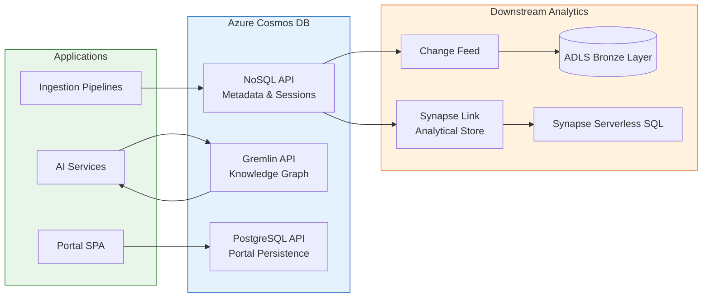
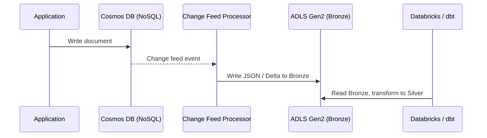
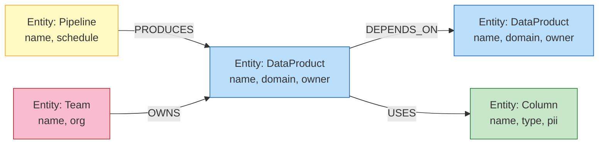
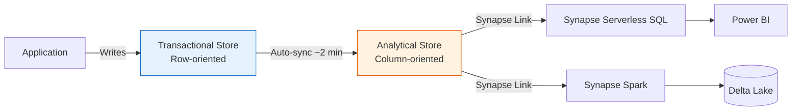

# Azure Cosmos DB Guide

## Overview

Azure Cosmos DB is a globally distributed, multi-model database service that provides single-digit millisecond latency at any scale. In CSA-in-a-Box it serves three primary roles:

1. **Operational data store** — metadata catalog, session state, marketplace product registry
2. **Graph database** — knowledge graphs for GraphRAG entity-relationship traversal
3. **Change-feed source** — CDC pipeline feeding the Bronze layer of the lakehouse

Cosmos DB exposes multiple wire-protocol APIs over the same underlying storage engine, so you choose the API that matches your access pattern rather than migrating your data model.

| API            | Wire Protocol         | Primary Use in CSA-in-a-Box                        |
| -------------- | --------------------- | -------------------------------------------------- |
| **NoSQL**      | REST / SQL-like query | Metadata store, session state, marketplace catalog |
| **MongoDB**    | MongoDB wire protocol | Lift-and-shift of existing MongoDB workloads       |
| **Gremlin**    | Apache TinkerPop      | Knowledge graphs for GraphRAG (Tutorial 09)        |
| **PostgreSQL** | PostgreSQL (Citus)    | Portal persistence, distributed HTAP               |
| **Table**      | Azure Table Storage   | Legacy Table Storage migrations                    |

!!! tip "CSA-in-a-Box Defaults"
New workloads should use the **NoSQL API** unless you have a specific reason to choose another. GraphRAG workloads use **Gremlin**. Portal persistence uses **PostgreSQL** (see [ADR-0015](../adr/0015-postgres-portal-persistence.md)).

---

## Architecture

The following diagram shows how Cosmos DB APIs map to CSA-in-a-Box use cases and downstream consumers.



---

## API Selection Guide

### Comparison Table

| Criterion             | NoSQL                                | MongoDB              | Gremlin                   | PostgreSQL (Citus)         |
| --------------------- | ------------------------------------ | -------------------- | ------------------------- | -------------------------- |
| **Query language**    | SQL-like                             | MQL                  | Gremlin traversal         | SQL                        |
| **Schema**            | Flexible JSON                        | Flexible BSON        | Vertices + Edges          | Relational                 |
| **Transactions**      | Transactional batch (same partition) | Multi-document ACID  | Per-traversal             | Full ACID                  |
| **Indexing**          | Automatic (tunable)                  | Automatic + custom   | Automatic                 | Manual (B-tree, GIN)       |
| **Max document size** | 2 MB                                 | 2 MB                 | N/A (vertex/edge)         | Row-level                  |
| **Synapse Link**      | Yes                                  | Yes                  | No                        | No                         |
| **Change feed**       | Yes                                  | Yes (change streams) | No                        | Logical replication        |
| **Best for**          | Greenfield, high-scale ops           | MongoDB migrations   | Graph traversal, GraphRAG | HTAP, relational workloads |
| **CSA-in-a-Box role** | Primary operational store            | Migration path only  | Knowledge graphs          | Portal DB                  |

### When to Use Each API

**NoSQL API** — Choose for all new operational workloads. Best SDK support, broadest feature set (Synapse Link, change feed, hierarchical partitions, priority-based execution), lowest latency in direct mode.

**MongoDB API** — Choose only when migrating an existing MongoDB application. The wire-protocol compatibility lets you point existing drivers at Cosmos DB with minimal code changes.

**Gremlin API** — Choose for graph-native workloads where you need traversal queries (shortest path, neighbors-of-neighbors, impact analysis). In CSA-in-a-Box this powers GraphRAG knowledge graphs (see [Tutorial 09](../tutorials/09-graphrag-knowledge/README.md)).

**PostgreSQL API (Citus)** — Choose when you need relational semantics with horizontal scale-out. CSA-in-a-Box uses this for portal persistence where relational integrity and JOIN support outweigh document flexibility.

---

## Partitioning Strategy

The partition key is the single most consequential design decision. You cannot change it after container creation without migrating data.

### Partition Key Selection Criteria

| Goal                  | Why It Matters                                       |
| --------------------- | ---------------------------------------------------- |
| **High cardinality**  | Millions of distinct values prevent hot partitions   |
| **Even distribution** | Uniform write/read spread across physical partitions |
| **Query alignment**   | Most queries should target a single partition        |
| **Stability**         | The value must never change for a given document     |

### Examples by Workload

| Workload            | Recommended Key                  | Avoid            | Reason                                 |
| ------------------- | -------------------------------- | ---------------- | -------------------------------------- |
| User sessions       | `/userId`                        | `/sessionStatus` | Status has 3-4 values (hot)            |
| Marketplace catalog | `/domainId`                      | `/category`      | Low cardinality                        |
| IoT telemetry       | `/deviceId`                      | `/timestamp`     | Recent timestamps create hot partition |
| Multi-tenant SaaS   | `/tenantId`                      | `/region`        | Region has <10 values                  |
| Audit log           | Synthetic: `/tenantId-yearMonth` | `/action`        | Action types are few                   |

### Hierarchical Partition Keys

For workloads where a single key produces uneven partitions (e.g., a mega-tenant), use hierarchical partition keys (up to 3 levels):

```json
{
    "partitionKey": {
        "paths": ["/tenantId", "/userId", "/sessionId"],
        "kind": "MultiHash",
        "version": 2
    }
}
```

This distributes a large tenant's data across multiple physical partitions while keeping per-user queries efficient.

### Cross-Partition Query Costs

!!! warning "Cross-Partition Queries"
A query that omits the partition key in its filter fans out to **every** physical partition. This multiplies RU cost by the number of physical partitions and adds latency. Always include the partition key in user-facing query paths.

```sql
-- Single-partition (fast, cheap)
SELECT * FROM c WHERE c.tenantId = 'acme' AND c.status = 'active'

-- Cross-partition (expensive, fan-out)
SELECT * FROM c WHERE c.status = 'active'
```

### Hot Partition Detection

Monitor the `Normalized RU Consumption` metric per partition key range. If any range consistently exceeds 70%, you have a hot partition. Remediation options:

1. Add a suffix to create a synthetic key (e.g., `/tenantId-random(0..9)`)
2. Enable hierarchical partitioning
3. Redesign the data model to split the hot entity

---

## Throughput Management

### Provisioned vs. Serverless

| Model                       | Best For                      | Billing                                | Limits               |
| --------------------------- | ----------------------------- | -------------------------------------- | -------------------- |
| **Provisioned (manual)**    | Predictable, steady workloads | Per-hour RU/s reservation              | Min 400 RU/s         |
| **Provisioned (autoscale)** | Spiky workloads, production   | 10% - 100% of max RU/s, billed at peak | Min 1,000 max RU/s   |
| **Serverless**              | Dev/test, low traffic         | Per-request RU charge                  | Max 5,000 RU/s burst |

!!! tip "CSA-in-a-Box Recommendation"
Use **serverless** for sandbox and dev environments. Use **autoscale** for staging and production. Reserve **manual provisioned** only for workloads with flat, well-understood throughput.

### RU Calculation Examples

Every operation in Cosmos DB costs Request Units (RU). Rough estimates:

| Operation                                        | Approximate RU Cost     |
| ------------------------------------------------ | ----------------------- |
| Point read (1 KB document by ID + partition key) | 1 RU                    |
| Point read (10 KB document)                      | ~3 RU                   |
| Write (1 KB document)                            | ~6 RU                   |
| Write (10 KB document)                           | ~30 RU                  |
| Query returning 5 documents (1 KB each, indexed) | ~5 RU                   |
| Cross-partition query (same result set)          | ~5 RU x partition count |

Use the [Cosmos DB Capacity Calculator](https://cosmos.azure.com/capacitycalculator/) for production sizing.

### Autoscale Configuration

```python
from azure.cosmos import CosmosClient, PartitionKey

client = CosmosClient(endpoint, credential)
database = client.create_database_if_not_exists("csa-metadata")

# Autoscale: scales between 1,000 and 10,000 RU/s
container = database.create_container_if_not_exists(
    id="sessions",
    partition_key=PartitionKey(path="/userId"),
    offer_throughput=None,              # not manual
    auto_scale_max_throughput=10000,     # max 10,000 RU/s
    default_ttl=86400                   # 24-hour TTL
)
```

### Burst Capacity

Cosmos DB accumulates unused RU/s (up to 300 seconds worth) as burst capacity. Short spikes that exceed provisioned throughput consume from this budget before throttling. No configuration required — it is automatic.

### Priority-Based Execution

For workloads mixing user-facing queries with background tasks (e.g., change feed processing), use priority-based execution to protect interactive latency:

```python
# High priority — user-facing reads
container.read_item(item="doc-1", partition_key="user-42",
                    priority_level="High")

# Low priority — background analytics
container.query_items(query="SELECT * FROM c WHERE c.type='metrics'",
                      partition_key="system",
                      priority_level="Low")
```

Low-priority requests are throttled first when the container approaches its RU limit.

---

## Data Modeling

### Embed vs. Reference

Cosmos DB is not a relational database. Denormalization is the norm, not the exception.

| Strategy                           | When to Use                                      | Trade-off                       |
| ---------------------------------- | ------------------------------------------------ | ------------------------------- |
| **Embed** (nested document)        | Data is read together, bounded size, 1:few       | Larger documents, atomic writes |
| **Reference** (separate documents) | Unbounded relationships, 1:many, shared entities | Extra round-trips, no JOINs     |

```json
// Embedded: order with line items (bounded, always read together)
{
    "id": "order-001",
    "customerId": "cust-42",
    "items": [
        { "sku": "WIDGET-A", "qty": 2, "price": 19.99 },
        { "sku": "GADGET-B", "qty": 1, "price": 49.99 }
    ],
    "total": 89.97
}

// Referenced: product catalog (shared across orders, updated independently)
{
    "id": "WIDGET-A",
    "productId": "WIDGET-A",
    "name": "Widget Alpha",
    "price": 19.99,
    "category": "widgets"
}
```

### Denormalization Patterns for Analytics

In analytics contexts, denormalize aggressively to avoid cross-document lookups:

- **Duplicate lookup fields** — store `customerName` on the order, not just `customerId`
- **Pre-aggregate** — maintain running totals in the parent document
- **Store computed fields** — `dayOfWeek`, `fiscalQuarter` at write time to avoid query-time computation

Use the change feed to keep denormalized copies consistent.

### TTL for Data Expiration

Set `defaultTtl` on the container and per-document `ttl` (in seconds) to automatically expire data at zero RU cost:

```python
# Container-level: all documents expire after 30 days unless overridden
container = database.create_container_if_not_exists(
    id="events",
    partition_key=PartitionKey(path="/deviceId"),
    default_ttl=2592000   # 30 days
)

# Document-level override: this document expires in 1 hour
item = {
    "id": "evt-999",
    "deviceId": "sensor-07",
    "payload": { ... },
    "ttl": 3600
}
container.upsert_item(item)
```

Use TTL for session state, cache documents, staging data awaiting lakehouse ingestion, and soft-delete grace periods.

---

## Change Feed to Lakehouse

The Cosmos DB change feed provides an ordered stream of inserts and updates (not deletes unless soft-delete + TTL). This is the primary CDC mechanism for feeding operational data into the Bronze layer.



### Azure Functions Trigger

The simplest integration for low-to-medium throughput:

```python
import azure.functions as func
import json, logging
from azure.storage.filedatalake import DataLakeServiceClient

app = func.FunctionApp()

@app.cosmos_db_trigger(
    arg_name="documents",
    container_name="metadata",
    database_name="csa-metadata",
    connection="CosmosDBConnection",
    lease_container_name="leases",
    create_lease_container_if_not_exists=True
)
def cosmos_to_bronze(documents: func.DocumentList):
    """Write Cosmos DB changes to ADLS Bronze layer as JSON."""
    if not documents:
        return

    datalake = DataLakeServiceClient.from_connection_string(
        conn_str=os.environ["ADLS_CONNECTION"]
    )
    fs = datalake.get_file_system_client("bronze")

    for doc in documents:
        data = json.loads(doc.to_json())
        path = f"cosmos/metadata/{data['id']}.json"
        file_client = fs.get_file_client(path)
        file_client.upload_data(json.dumps(data), overwrite=True)

    logging.info("Wrote %d documents to Bronze", len(documents))
```

### Change Feed Processor (SDK)

For higher throughput or custom processing logic, use the change feed processor directly:

```python
from azure.cosmos import CosmosClient, PartitionKey

client = CosmosClient(endpoint, credential)
database = client.get_database_client("csa-metadata")
source = database.get_container_client("metadata")
lease = database.get_container_client("leases")

def handle_changes(docs, context):
    """Process a batch of changes from the feed."""
    for doc in docs:
        # Transform and write to lakehouse
        write_to_bronze(doc)
    # Checkpoint is automatic after handler returns

source.query_items_change_feed(
    partition_key_range_id=None,  # all partitions
    is_start_from_beginning=True,
    max_item_count=100
)
```

### Exactly-Once Processing

The change feed guarantees at-least-once delivery. For exactly-once semantics:

1. **Idempotent writes** — use the document `id` as the Bronze file name (upsert semantics)
2. **Lease container** — tracks the continuation token per partition; restarts resume from the last checkpoint
3. **Deduplication downstream** — dbt Silver layer deduplicates on `id` + `_ts` (Cosmos timestamp)

---

## GraphRAG Integration

Cosmos DB Gremlin API stores the knowledge graph that powers GraphRAG entity-relationship queries. For the full tutorial, see [Tutorial 09 — GraphRAG Knowledge Graphs](../tutorials/09-graphrag-knowledge/README.md).

### Entity-Relationship Modeling



Vertices represent entities (data products, columns, pipelines, teams). Edges represent relationships (DEPENDS_ON, USES, PRODUCES, OWNS). This structure supports:

- **Impact analysis** — "What breaks if I change this column?"
- **Lineage traversal** — "Where did this data product originate?"
- **Community detection** — Identify tightly-coupled data domains

### Graph Traversal Queries

```groovy
// Find all downstream dependencies of a data product
g.V().has('dataProduct', 'name', 'customer-360')
  .repeat(out('DEPENDS_ON'))
  .until(outE('DEPENDS_ON').count().is(0))
  .path()
  .by('name')

// Find all PII columns in a domain
g.V().has('domain', 'name', 'sales')
  .out('OWNS').out('USES')
  .has('pii', true)
  .values('name')

// Impact analysis: what pipelines are affected?
g.V().has('column', 'name', 'ssn')
  .in('USES').in('PRODUCES')
  .dedup()
  .values('name')
```

### Integration with Azure OpenAI

GraphRAG combines graph traversal with LLM reasoning. The pattern:

1. **Extract** entities and relationships from documents using Azure OpenAI
2. **Store** the graph in Cosmos DB Gremlin
3. **Query** the graph for context relevant to the user's question
4. **Augment** the LLM prompt with graph-retrieved context

```python
from gremlin_python.driver import client as gremlin_client

# Connect to Cosmos DB Gremlin
gremlin = gremlin_client.Client(
    url="wss://<account>.gremlin.cosmos.azure.com:443/",
    traversal_source="g",
    username="/dbs/graphdb/colls/knowledge",
    password="<primary-key>"
)

# Retrieve context for a question
def get_graph_context(entity_name: str) -> list[dict]:
    """Traverse the knowledge graph for context around an entity."""
    query = (
        f"g.V().has('name', '{entity_name}')"
        f".bothE().otherV().path()"
        f".by(valueMap(true))"
    )
    results = gremlin.submit(query).all().result()
    return results
```

!!! info "Production Authentication"
In production, replace the primary key with a managed identity credential. See the [Security](#security) section below.

---

## Global Distribution

### Multi-Region Writes

Cosmos DB supports active-active multi-region writes. Each region accepts writes locally and replicates asynchronously.

| Topology                                   | Use Case                                            | Trade-off                                 |
| ------------------------------------------ | --------------------------------------------------- | ----------------------------------------- |
| **Single-region write, multi-region read** | Most workloads, DR with automatic failover          | Writes go to one region; reads are local  |
| **Multi-region write**                     | Active-active global apps, latency-sensitive writes | Conflict resolution required; higher cost |

!!! warning "Multi-Region Writes is Not Free DR"
Multi-region writes is for active-active scenarios where write latency matters globally. For DR alone, single-region write with automatic failover is simpler, cheaper, and avoids conflict resolution complexity.

### Consistency Levels

Cosmos DB offers five consistency levels, each a trade-off between latency, availability, and data freshness.

| Level                 | Guarantee                                    | Latency Impact                    | RU Cost    | Best For                        |
| --------------------- | -------------------------------------------- | --------------------------------- | ---------- | ------------------------------- |
| **Strong**            | Linearizable reads                           | Highest (cross-region round-trip) | 2x read RU | Financial transactions          |
| **Bounded Staleness** | Reads lag by at most K versions or T seconds | High                              | 2x read RU | Predictable max staleness       |
| **Session** (default) | Read-your-own-writes within session token    | Medium                            | 1x read RU | User-facing applications        |
| **Consistent Prefix** | Reads never see out-of-order writes          | Low                               | 1x read RU | Event streams, append-only logs |
| **Eventual**          | No ordering guarantees                       | Lowest                            | 1x read RU | Analytics, aggregations         |

!!! tip "Start with Session"
Session consistency is the default and the right choice for most workloads. Tighten to Bounded Staleness or Strong only when you have a concrete consistency requirement. Loosen to Eventual only for analytics queries that tolerate stale reads.

### Conflict Resolution

When multi-region writes are enabled, conflicts (concurrent writes to the same document in different regions) are resolved by one of:

- **Last Writer Wins (LWW)** — highest `_ts` wins (default)
- **Custom conflict resolution** — stored procedure or merge function
- **Async conflict feed** — application reads the conflict feed and resolves manually

For CSA-in-a-Box, LWW is sufficient for metadata and session workloads. Graph workloads on Gremlin use single-region write to avoid vertex/edge conflict complexity.

---

## Security

### Managed Identity (Recommended)

```python
from azure.identity import DefaultAzureCredential
from azure.cosmos import CosmosClient

# No connection strings or keys in code
credential = DefaultAzureCredential()
client = CosmosClient(
    url="https://csa-cosmos.documents.azure.com:443/",
    credential=credential
)
```

### RBAC (Data Plane)

Use Cosmos DB built-in roles instead of primary/secondary keys:

| Role                                  | Permissions                 | Assign To                          |
| ------------------------------------- | --------------------------- | ---------------------------------- |
| `Cosmos DB Built-in Data Reader`      | Read all containers         | Analytics pipelines, read replicas |
| `Cosmos DB Built-in Data Contributor` | Read + write all containers | Application managed identities     |
| `Custom role`                         | Fine-grained per-container  | Least-privilege service identities |

```bash
# Assign data contributor role to a managed identity
az cosmosdb sql role assignment create \
    --account-name csa-cosmos \
    --resource-group csa-rg \
    --role-definition-id "00000000-0000-0000-0000-000000000002" \
    --principal-id "$MI_OBJECT_ID" \
    --scope "/dbs/csa-metadata"
```

### Network Isolation

| Layer                     | Configuration                                                            |
| ------------------------- | ------------------------------------------------------------------------ |
| **Private Endpoint**      | Cosmos DB accessible only via VNet private IP                            |
| **Service Endpoint**      | Allow traffic only from specific subnets                                 |
| **IP firewall**           | Restrict to known IP ranges (fallback)                                   |
| **Disable public access** | Set `publicNetworkAccess: Disabled` after private endpoint is configured |

### Encryption

- **At rest** — enabled by default with Microsoft-managed keys; optionally use customer-managed keys (CMK) in Azure Key Vault
- **In transit** — TLS 1.2 enforced on all connections
- **Client-side encryption** — available via SDK for field-level encryption of sensitive data (Always Encrypted)

### Diagnostic Logs

Enable diagnostic settings to route to Log Analytics for auditing and troubleshooting:

```bash
az monitor diagnostic-settings create \
    --name cosmos-diagnostics \
    --resource "/subscriptions/$SUB/resourceGroups/csa-rg/providers/Microsoft.DocumentDB/databaseAccounts/csa-cosmos" \
    --workspace "/subscriptions/$SUB/resourceGroups/csa-rg/providers/Microsoft.OperationalInsights/workspaces/csa-logs" \
    --logs '[
        {"category": "DataPlaneRequests", "enabled": true},
        {"category": "QueryRuntimeStatistics", "enabled": true},
        {"category": "PartitionKeyStatistics", "enabled": true},
        {"category": "ControlPlaneRequests", "enabled": true}
    ]'
```

---

## Cost Optimization

### Environment-Tier Strategy

| Environment       | Throughput Model      | Why                                                                        |
| ----------------- | --------------------- | -------------------------------------------------------------------------- |
| **Dev / Sandbox** | Serverless            | Pay only for requests; zero cost when idle                                 |
| **Staging**       | Autoscale (low max)   | Mimics production behavior at reduced scale                                |
| **Production**    | Autoscale or Reserved | Autoscale for spiky; reserved capacity for predictable (up to 65% savings) |

### Reserved Capacity

For production workloads with predictable throughput, reserved capacity provides significant savings:

| Term               | Discount vs. Pay-as-you-go         |
| ------------------ | ---------------------------------- |
| 1-year reservation | ~20% savings                       |
| 3-year reservation | ~30-65% savings (varies by region) |

### Integrated Cache

The integrated cache (built into the Cosmos DB gateway) reduces RU consumption for repeated point reads and queries:

```python
# Enable dedicated gateway with integrated cache
# (configured at the account level via Azure Portal or Bicep)

# Reads automatically use cache when routed through dedicated gateway
item = container.read_item(
    item="doc-1",
    partition_key="user-42",
    # Staleness tolerance: accept cached data up to 60 seconds old
    session_token=None  # bypass session consistency for cache hits
)
```

### Indexing Policy Tuning

The default indexing policy indexes every path — expensive for write-heavy workloads. Exclude paths you never query:

```json
{
    "indexingMode": "consistent",
    "automatic": true,
    "includedPaths": [
        { "path": "/tenantId/?" },
        { "path": "/status/?" },
        { "path": "/createdAt/?" }
    ],
    "excludedPaths": [
        { "path": "/payload/*" },
        { "path": "/metadata/*" },
        { "path": "/_etag/?" }
    ]
}
```

!!! tip "Index What You Query"
Excluding large nested objects (e.g., `/payload/*`) from indexing can reduce write RU cost by 30-50% on document-heavy workloads.

---

## Cosmos DB Analytical Store (Synapse Link)

The analytical store is an auto-synced, fully isolated columnar store within Cosmos DB. It enables no-ETL analytics over operational data.



### Enabling Analytical Store

```bash
# Enable Synapse Link on the account (one-time, irreversible)
az cosmosdb update \
    --name csa-cosmos \
    --resource-group csa-rg \
    --enable-analytical-storage true

# Enable analytical store on a container
az cosmosdb sql container update \
    --account-name csa-cosmos \
    --database-name csa-metadata \
    --name metadata \
    --resource-group csa-rg \
    --analytical-storage-ttl -1   # -1 = infinite retention
```

### Querying from Synapse Serverless SQL

```sql
-- No ETL, no RU impact on transactional workload
SELECT
    c.domainId,
    c.status,
    COUNT(*) AS product_count,
    AVG(c.qualityScore) AS avg_quality
FROM OPENROWSET(
    'CosmosDB',
    'Account=csa-cosmos;Database=csa-metadata;Key=<read-only-key>',
    metadata
) AS c
GROUP BY c.domainId, c.status
ORDER BY product_count DESC
```

!!! info "Zero RU Impact"
Analytical store queries consume Synapse capacity, not Cosmos DB RU/s. Your transactional workload is completely unaffected.

### When to Use Analytical Store vs. Change Feed

| Scenario                           | Use Analytical Store | Use Change Feed |
| ---------------------------------- | -------------------- | --------------- |
| Ad-hoc analytics over current data | Yes                  | No              |
| Dashboard queries (Power BI)       | Yes                  | No              |
| Feed data into Delta Lake (Bronze) | No                   | Yes             |
| Event-driven downstream processing | No                   | Yes             |
| Historical trend analysis          | Either               | Either          |
| Real-time CDC to lakehouse         | No (2-min lag)       | Yes (seconds)   |

---

## Anti-Patterns

!!! danger "Do Not" - **Use Cosmos DB as a data warehouse.** It is an operational database. Use Synapse Link or change feed to push data into the lakehouse for analytical workloads. - **Pick a low-cardinality partition key.** Keys like `status`, `region`, or `category` create hot partitions. You cannot change the key later. - **Default to Strong consistency.** It doubles read RU cost and adds cross-region latency. Session consistency handles most use cases. - **Ignore indexing policy on write-heavy containers.** Default indexes every path, inflating write costs. - **Run cross-partition queries in user-facing paths.** These fan out to every physical partition, multiplying latency and RU cost. - **Use multi-region writes "for DR".** It adds conflict resolution complexity and cost. Single-write with automatic failover is the correct DR pattern.

!!! success "Do" - **Use Synapse Link** for analytics instead of querying the transactional store directly. - **Set TTL** on time-bounded data (sessions, caches, staging). TTL deletes are free. - **Use autoscale** for production workloads with variable traffic. - **Use serverless** for dev/test to avoid paying for idle RU/s. - **Monitor partition heat maps** via `Normalized RU Consumption` metric. - **Use managed identity** instead of connection strings or primary keys. - **Tune indexing policy** to exclude paths you never query. - **Use bulk operations** for batch inserts (up to 10x cheaper than individual writes).

---

## Production Readiness Checklist

- [ ] Partition key validated for cardinality, distribution, and query alignment
- [ ] Throughput model selected (serverless / autoscale / provisioned)
- [ ] Indexing policy tuned (excluded unused paths)
- [ ] TTL configured for time-bounded data
- [ ] Consistency level set appropriately (Session unless otherwise justified)
- [ ] Managed identity configured (no keys in code or config)
- [ ] RBAC data-plane roles assigned (least privilege)
- [ ] Private endpoint configured; public access disabled
- [ ] Diagnostic logs enabled (DataPlaneRequests, QueryRuntimeStatistics, PartitionKeyStatistics)
- [ ] Synapse Link enabled (if analytics queries needed)
- [ ] Change feed configured (if CDC to lakehouse required)
- [ ] Alerts set for throttling (HTTP 429), high RU consumption, and replication lag
- [ ] Backup policy reviewed (continuous backup with point-in-time restore recommended)
- [ ] Reserved capacity evaluated for production cost savings

---

## Cross-References

| Resource                                                                                    | Description                                              |
| ------------------------------------------------------------------------------------------- | -------------------------------------------------------- |
| [Pattern -- Cosmos DB](../patterns/cosmos-db-patterns.md)                                   | Partition key, consistency, throughput, and TTL patterns |
| [Pattern -- Streaming & CDC](../patterns/streaming-cdc.md)                                  | Change feed integration with Event Hubs and lakehouse    |
| [Tutorial 09 -- GraphRAG Knowledge Graphs](../tutorials/09-graphrag-knowledge/README.md)    | End-to-end GraphRAG with Cosmos DB Gremlin               |
| [ADR-0015 -- PostgreSQL Portal Persistence](../adr/0015-postgres-portal-persistence.md)     | Why portal uses Cosmos DB PostgreSQL API                 |
| [Best Practices -- Cost Optimization](../best-practices/cost-optimization.md)               | Cross-service cost strategies including Cosmos DB        |
| [Best Practices -- Performance Tuning](../best-practices/performance-tuning.md)             | Query optimization and indexing strategies               |
| [Best Practices -- Security & Compliance](../best-practices/security-compliance.md)         | Managed identity, RBAC, and network isolation            |
| [Cosmos DB Modeling](https://learn.microsoft.com/azure/cosmos-db/nosql/modeling-data)       | Official data modeling guidance                          |
| [Cosmos DB Partitioning](https://learn.microsoft.com/azure/cosmos-db/partitioning-overview) | Official partitioning documentation                      |
| [Synapse Link for Cosmos DB](https://learn.microsoft.com/azure/cosmos-db/synapse-link)      | Official analytical store documentation                  |
