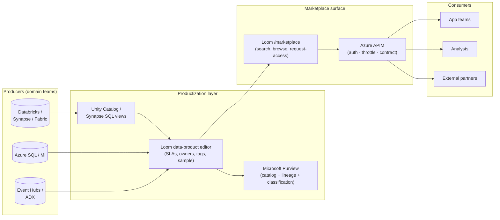

# Build an internal data marketplace on Azure

> **Comparative positioning note.** This document is written from the
> perspective of Microsoft Azure, Cloud Scale Analytics, and CSA Loom. Any
> description of third-party or competing products, services, pricing, or
> capabilities is derived from **publicly available documentation and sources**
> believed accurate at the time of writing, and is provided for **general
> comparison only**. We do not claim expertise in, or authority over, any
> non-Microsoft product or service; the respective vendor's official
> documentation is the authoritative source for their offerings, which may
> change over time. Nothing here is intended to disparage any vendor — where a
> competing product has genuine advantages, we aim to note them honestly.
> Verify all third-party details against the vendor's current official
> documentation before making decisions.

> Tutorial. End-to-end pattern for standing up an enterprise-internal
> data marketplace — the productized layer that sits on top of your
> lakehouse and lets domain teams *publish* data products and
> consumers *discover, request access, and consume* them through a
> single browse-and-buy surface.

This guide consolidates the components, the wiring sequence, and the
operational patterns. It is the closest CSA gets to "the Snowflake
Marketplace experience, but inside your Azure tenant, on your data,
under your audit boundary."

---

## What an internal data marketplace actually is

An internal data marketplace is **not a new product**. It is a
*surface* that combines three things you already have:

1. **A catalog** that knows what data exists, who owns it, what it
   means, and how sensitive it is. (Microsoft Purview.)
2. **A productization layer** that wraps raw tables / streams / APIs
   into versioned, documented, SLA-bound *data products*. (Loom
   `data-product` editor backed by Purview + Unity Catalog + your
   storage layer.)
3. **A consumption gateway** that brokers access — auth, throttling,
   request-for-access flows, billing/chargeback hooks. (Azure API
   Management.)

Get those three wired together and you have the marketplace. Get them
wrong and you have three disconnected portals.

---

## Reference architecture

The catalog (Purview) is the *system of record* for metadata. The
data-product editor (Loom) is where producers *publish*. The
marketplace UI is where consumers *discover*. APIM is where
consumption gets brokered.

---

## Prerequisites

You need these provisioned in your Azure tenant before starting:

| Service | Purpose | Required? |
|---|---|---|
| Microsoft Purview account | Catalog + lineage | **Yes** |
| ADLS Gen2 | Primary data store | **Yes** |
| Azure Databricks **or** Synapse | Compute + governance | **Yes** (one of) |
| Azure API Management | Consumption gateway | **Yes** |
| Microsoft Entra ID | Identity for producer + consumer personas | **Yes** |
| Azure Cost Management exports | Chargeback signal | Optional |
| CSA Loom console | Single-pane productization + marketplace UI | Recommended |

If you have not deployed Loom: the same pattern works without it,
you'll just be assembling the marketplace UI yourself (or using
Purview's built-in *Data Catalog* surface, which covers discovery
but not productization).

---

## Build sequence (10 steps)

### 1. Define what counts as a data product

Before any tooling, write down your **data-product contract**.
Minimum fields:

- **Name** + **owner** (Entra group, not an individual)
- **Domain** (Finance / HR / Operations / etc. — matches your data
  mesh domains)
- **Layer** (Bronze / Silver / Gold — only Gold is publishable as a
  data product)
- **SLA** — freshness, availability, query latency
- **Sensitivity** — Public / Internal / Confidential / Restricted
- **Lifecycle** — Draft / Published / Deprecated / Retired
- **Schema + sample** — a versioned schema and a sample query/result
- **Access pattern** — SQL endpoint / Delta Sharing / REST API /
  event stream

This is the contract producers commit to and consumers buy against.
The Loom `data-product` editor enforces every one of these fields.

### 2. Set up Purview and scan your sources

Connect Purview to Databricks Unity Catalog (or Synapse), ADLS, and
Azure SQL. Run the initial scan. See the [Microsoft Purview
guide](purview.md) for the canonical wiring.

The marketplace will lean on Purview for: classification (PII /
sensitive), lineage (which upstream tables feed this product), and
business glossary.

### 3. Establish your Gold-only publish rule

Producers should only publish from Gold-layer outputs. Encode this
as policy:

- **Databricks**: tag Gold catalogs with `marketplace_publishable = true`
- **Synapse**: use a dedicated `gold_marketplace` schema
- **Loom**: the `data-product` editor's create form rejects non-Gold sources at validation time

This prevents accidental publish of raw or staging data.

### 4. Define your domains in Purview + Loom

Set up your **business domains** (Finance / HR / Operations / etc.)
in Purview's data domains feature. Mirror them in Loom's
`/admin/domains` page. Domains become the marketplace's left-nav
filter and drive Purview's domain-scoped RBAC.

### 5. Wire APIM as the consumption gateway

Create one APIM Product per business domain. Each data product gets
exposed as an APIM API under its owning domain's Product. Default
policies:

- `validate-jwt` against the consumer's Entra app
- `rate-limit-by-key` per subscription
- `set-header` to forward `X-Data-Product-Id` so the backend can audit
- `trace` to Application Insights for usage analytics

See the [APIM data-mesh gateway guide](apim-data-mesh-gateway.md) for the full policy templates.

### 6. Productize your first three data products

Pick three high-value, low-controversy Gold tables. For each, in
Loom (or by hand if you're skipping Loom):

1. Create a `data-product` item in the producer's workspace
2. Fill in every contract field (step 1)
3. Run the *Publish* action — this:
   - Registers the product in Purview with the appropriate tags
   - Auto-generates the APIM API + Product entry
   - Adds it to the marketplace catalog Cosmos container
   - Sends the owner an "approve for publish" approval

Three is the right number for the pilot. More than three is a
program; fewer than three is a demo.

### 7. Build the marketplace browse surface

If you're using Loom, you already have this at `/marketplace` — it
queries Cosmos for published `data-product` items, filters by
domain / sensitivity / layer, and surfaces sample queries.

If you're not using Loom, the lighter-weight options are:

- **Purview's built-in Data Catalog** — good for technical users, weak for self-service
- **Power BI report** over the Purview metadata REST API — gives you a familiar Power BI surface
- **Custom React + APIM dev portal** — the most flexible but the most work

### 8. Implement the request-access flow

This is where most internal marketplaces stop short. The flow should
be:

1. Consumer browses, finds product, clicks **Request access**
2. Form captures: purpose, retention need, sensitivity acknowledgment
3. Approval routes to the data product's **owner** (Entra group)
4. On approve: APIM subscription key is provisioned, Entra group
   gets the consumer added, Purview's `DataReader` role is granted
   scoped to that product
5. Consumer receives the subscription key + connection snippet

Loom ships this as a Power Automate flow against Dataverse; if you
don't have Power Platform, the equivalent is a Logic App + Cosmos
queue + Entra Graph API.

### 9. Wire usage telemetry and chargeback

Every API call through APIM is one row in App Insights. Build a Power
BI dashboard over App Insights that shows:

- Calls per data product per consumer per month
- 95th percentile latency per product (drives SLA enforcement)
- Top-10 most-used / least-used products
- Anomalies in usage (volume spikes that may indicate scraping)

If you do chargeback: join APIM call counts with Azure Cost Management
exports scoped to each data product's underlying storage / compute.

### 10. Set up lifecycle management

Data products are not eternal. The marketplace needs:

- **Quarterly review** — owners reattest contract is still accurate
- **Deprecation flow** — `Published` → `Deprecated` (still callable, banner shown) → `Retired` (returns 410)
- **Versioning** — `v1`, `v2` lived side-by-side until consumers migrate
- **Breaking-change gate** — schema changes require a major-version bump and a 90-day consumer notice

Loom's `data-product` editor enforces lifecycle transitions; without
Loom, encode the lifecycle states as Purview tags and gate transitions
in your CI/CD.

---

## What this looks like in CSA Loom

If you have CSA Loom deployed, every step above maps to a
specific surface:

- **Step 1 (contract)** — `data-product` editor fields
- **Step 2 (Purview)** — `/governance/catalog` + `/governance/scans`
- **Step 3 (Gold-only)** — built into `data-product` editor validation
- **Step 4 (domains)** — `/admin/domains`
- **Step 5 (APIM)** — `apim-product` + `apim-api` + `apim-policy` editors
- **Step 6 (productize)** — `data-product` *Publish* action
- **Step 7 (browse)** — `/marketplace`
- **Step 8 (request access)** — `/marketplace/<product>/request-access`
- **Step 9 (usage)** — `/marketplace/usage` + the Power BI semantic model that ships in the *Data Marketplace* app bundle
- **Step 10 (lifecycle)** — `data-product` editor's lifecycle dropdown

The fastest path to a working internal marketplace is: deploy Loom →
install the *Data Marketplace* app (`/apps`) → run through steps
1, 2, 4 with your real domains → publish three products in step 6.

---

## Common mistakes (and what to do instead)

| Mistake | Better |
|---|---|
| Publishing Bronze / Silver tables | Gold-only rule with tooling enforcement |
| One product per table | One product per *business concept* (a product can span multiple tables) |
| Forgetting the consumer side | Build the request-access flow before you ship one product |
| Treating the marketplace as a portal project | Treat it as a *data-mesh program* with the portal as one surface |
| Mixing domains in one APIM Product | One APIM Product per domain — that's the unit of subscription |
| Letting owners be individuals | Owners must be Entra groups — individuals leave the company |
| Skipping deprecation | Deprecation is harder than publishing; design for it day one |

---

## Related

- [APIM Data-Mesh Gateway](apim-data-mesh-gateway.md) — the APIM policy templates that back the consumption layer
- [Microsoft Purview](purview.md) — catalog wiring
- [Databricks Unity Catalog](databricks-unity-catalog.md) — producer-side governance
- [API-First Data Strategy](../best-practices/api-first-data-strategy.md) — the broader philosophy this pattern fits inside
- [Data Governance Best Practices](../best-practices/data-governance.md)
- [Data Mesh Maturity Model](../research/data-mesh-maturity-model.md) — where your organization is on the journey
- [CSA Loom data-product editor](../fiab/workloads/index.md)
